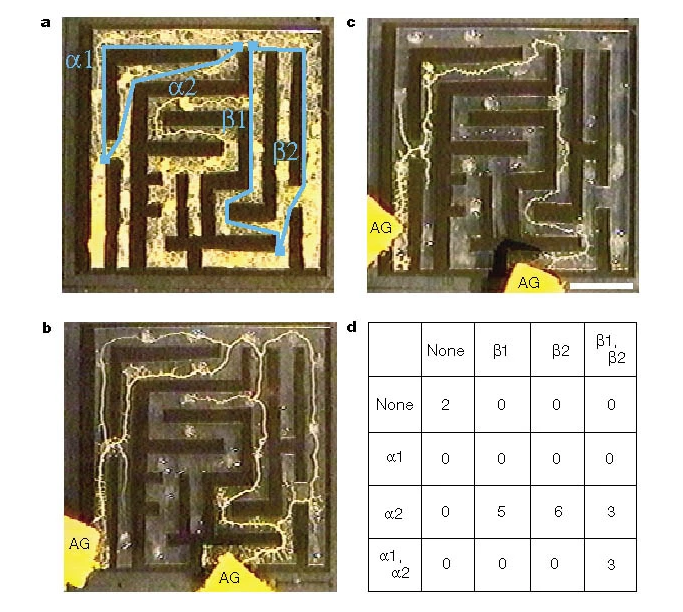

## Where we've been

- **Dog · bell · food** — nobody argues. We grant "it learned."
- **Sunflower · sun · sugar** — anticipation of dawn, but *built in*. Not learned.
- **Pea plant · fan · light** — *claimed* associative learning. Contested; a replication failed.

<!--Notice what moved as we went down the list: not the evidence so much as **how much evidence we demanded**. Our credence tracked the *material*, not the data.

*Ask:* If the same conditioning result showed up in a rat, would you have asked for as much proof?

Now a case that clears the behavioural bar cleanly — and has **no neurons at all**.-->

## A single cell with no brain

*Physarum polycephalum* — a slime mold.

- One giant **multinucleate cell**. No neurons, no synapses, no nervous system.
- Forages by growing a living network of tubes; routes are reinforced or pruned by internal **flow feedback**.
- Long filed under "fungus"; actually an amoeba.

Everything on the next slides is done by *this*.

## It solves mazes
\footnotesize
Place it between two food sources in a maze. It fills the maze, then **withdraws from dead ends** and keeps the tube along the **shortest path** connecting the food.

{height=60%}

<!-- *Ask:* That's problem-solving. Is it cognition — or just the physics of a flow network settling into a minimum?-->

*— Nakagaki, Yamada & Tóth (2000), Nature*

## It designs networks that rival engineers

Arrange oat flakes as the cities of Greater Tokyo. The mold grows a network that **approximates the real rail system** — balancing total tube length, transport efficiency, and **fault tolerance** against accidental breaks.

Those are the exact tradeoffs human planners spend months negotiating.

<!-- *Ask:* We assume optimization implies a designer with a goal. Does this?-->

*— Tero et al. (2010), Science*

## But is it *learning*?

The sunflower failed this test. The slime mold does not.

- **Habituation** — made to cross a bridge laced with a *harmless* bitter substance, it hesitates at first, then stops reacting over days — and recovers if left alone. Habituation is a textbook elementary form of learning.
- **Anticipation** — shocked with cold at fixed intervals, it slows *before* the next shock — and still slows once at the expected time when the shock is withheld.

<!-- *Ask:* "Learning needs a nervous system." Here it is without one. So is the rule wrong, or was the behaviour never learning? -->

*— Boisseau, Vogel & Dussutour (2016); Saigusa et al. (2008)*

## Memory — without a brain ...

and outside the body

It avoids ground it has already covered by **sensing the extracellular slime it left behind**. The record of where it has been is written into the *environment*, not stored in a head.

<!-- *Ask:* We locate cognition "in the brain." What do we do with a memory that lives outside the organism? -->

*— Reid, Latty, Dussutour & Beaton (2012), PNAS*

## So: Does it Think?

**Which definition are you using?**

- **Functional** — cognition is what a system *does* (solve, learn, remember). → It qualifies.
- **Substrate** — cognition is a property of certain *stuff / architecture* (nervous systems). → It doesn't.

## Is a mathematical model of the slime mold computational cognitive (neuro)science?

A mathematical model of slime mold shortest path computation.

\href{https://arxiv.org/html/1106.0423v3}{Math Model}

Can an  organism *be* an algorithm?

To answer "does the slime mold think?" do you have to decide if **the computation it runs is cognition?**

*— Tero et al. (2010); Bonifaci, Mehlhorn & Varma (2012)*

## Our four test cases compared

"X learns that Y predicts Z" hides four separate claims. Line the cases up against them:

```{=latex}
\scriptsize
```

| Does the case have… | Dog | Sunflower | Pea | Slime mold | LLM |
|---|---|---|---|---|---|
| a real Y→Z contingency | yes | yes | yes | yes | yes |
| behaviour that tracks it | yes | yes | *claimed* | yes | yes |
| acquisition by experience | yes | **no** (built-in) | *claimed* | yes | train: yes / run: no |
| an internal representation | yes? | a clock? | *claimed* | external? | *contested* |

```{=latex}
\normalsize
```

## 

- The **top two rows are trivial.** A thermostat passes.
- **Acquisition** is *learning*. Is the sunflower learning? No. The dog and slime mold? Yes.
- **Representation** —  this is where we assume people live and where cognition is defined. But then don't we have to grant the pea plant and slime mold cognitive status?gs, one word.)*

## The Assignment

Write your answer to the question, 

"Does a slime mold think?"

One page maximum. As long as I can read it you are good. No worries about spelling or grammar, but don't be careless. I am not looking for a particular answer. I will be reading for well reasoned responses. 

## References
```{=latex}
\tiny
```

Nakagaki, T., Yamada, H., & Tóth, Á. (2000). Intelligence: Maze-solving by an amoeboid organism. *Nature*, 407, 470.

Tero, A., Takagi, S., Saigusa, T., Ito, K., Bebber, D. P., Fricker, M. D., Yumiki, K., Kobayashi, R., & Nakagaki, T. (2010). Rules for biologically inspired adaptive network design. *Science*, 327(5964), 439–442.

Saigusa, T., Tero, A., Nakagaki, T., & Kuramoto, Y. (2008). Amoebae anticipate periodic events. *Physical Review Letters*, 100(1), 018101.

Reid, C. R., Latty, T., Dussutour, A., & Beaton, M. (2012). Slime mold uses an externalized spatial "memory" to navigate in complex environments. *Proceedings of the National Academy of Sciences*, 109(43), 17490–17494.

Boisseau, R. P., Vogel, D., & Dussutour, A. (2016). Habituation in non-neural organisms: evidence from slime moulds. *Proceedings of the Royal Society B*, 283(1829), 20160446.

Bonifaci, V., Mehlhorn, K., & Varma, G. (2012). Physarum can compute shortest paths. *Journal of Theoretical Biology*, 309, 121–133.

*Arc context (earlier cases):*

Gagliano, M., Vyazovskiy, V. V., Borbély, A. A., Grimonprez, M., & Depczynski, M. (2016). Learning by association in plants. *Scientific Reports*, 6, 38427.

Markel, K. (2020). Lack of evidence for associative learning in pea plants. *eLife*, 9, e57614.

Atamian, H. S., Creux, N. M., Brown, E. A., Garner, A. G., Blackman, B. K., & Harmer, S. L. (2016). Circadian regulation of sunflower heliotropism, floral orientation, and pollinator visits. *Science*, 353(6299), 587–590.

```{=latex}
\normalsize
```
