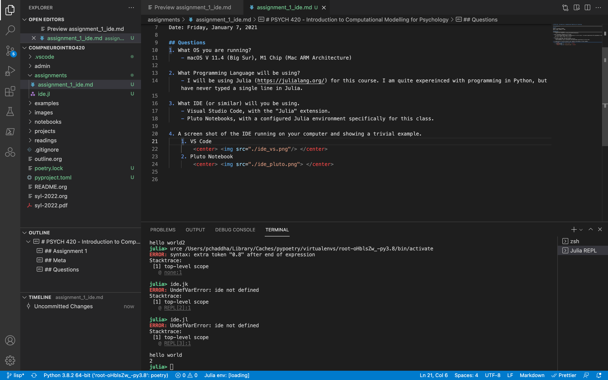

# PSYCH 420 - Introduction to Computational Modelling for Psychology

## Assignment 1

## Meta
Author: Parmandeep Chaddha   
Date: Friday, January 7, 2021  

## Questions
1. What OS you are running?
    - macOS V 11.4 (Big Sur), M1 Chip (Mac ARM Architecture)

2. What Programming Language will be using?
    - I will be using Julia (https://julialang.org/) for this course. I am quite expereinced with programming in Python, but have never typed a single line in Julia.

3. What IDE (or similar) will you be using.
    - Visual Studio Code, with the "Julia" extension.
    - Pluto Notebooks, with a configured Julia environment specifically for this class.

4. A screen shot of the IDE running on your computer and showing a trivial example.
    1. VS Code
        
  

    2. Pluto Notebook
        See next page.