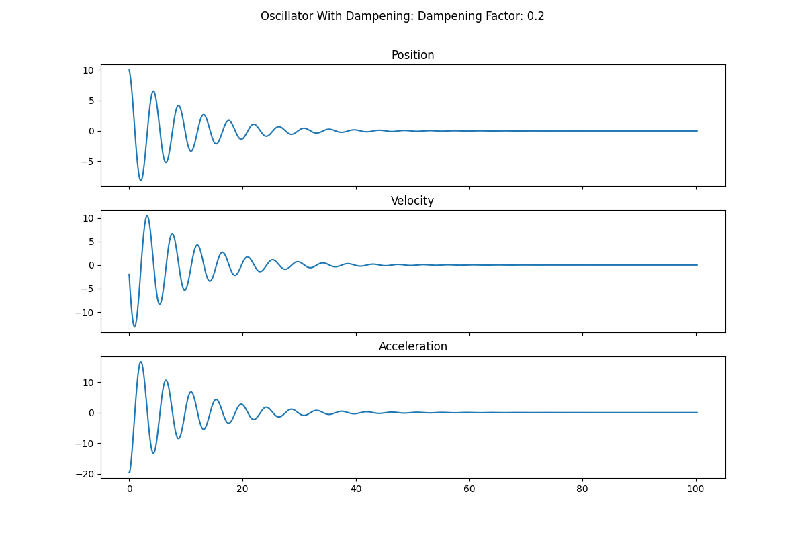
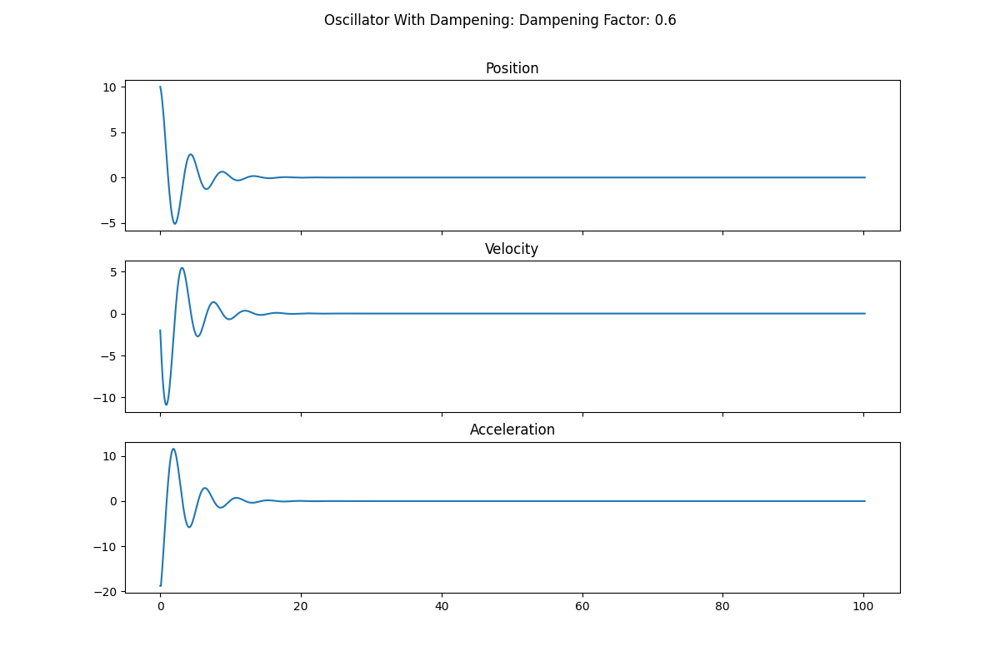
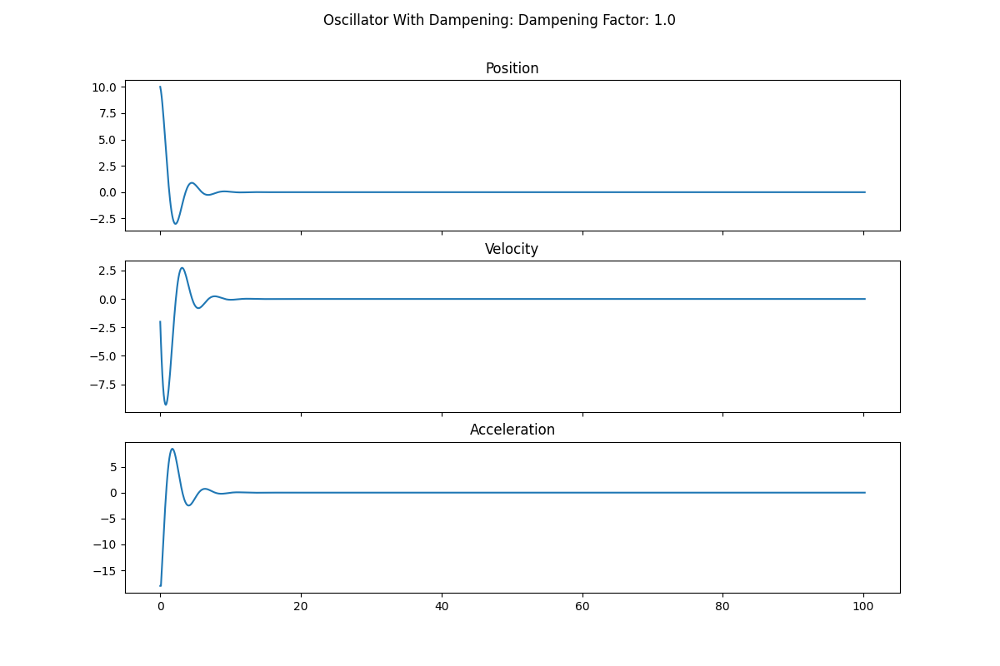

# Assignment 3

## Meta
Author: Parmandeep Chaddha  
Date: Jan 22, 2022  

## Objective
Provide the code for the damped oscillator.


## Implementation
### Julia
The Julia implementation for the damped oscillator is below. The `DampedOscillatorClass.jl` file creates the damped oscillator `struct` and provides methods/functions for operating on that structure. The `assignment_3_sciprt.jl` creates oscillators with various dampening factors, and plots thier positions against time.
- `DampedOscillatorClass.jl`
    ```Julia
    module DampedOscillatorClass

    using Plots

    export DampedOscillator, releaseSpring, initializeOscillator, plotSpring

    struct DampedOscillator
        springConstant::Float64
        dampeningConstant::Float64
        deltaT::Float64
        positions::Vector{Float64}
        velocities::Vector{Float64}
        accelerations::Vector{Float64}
        times::Vector{Float64}
    end


    """
    _updateAcceleration(osc)
    Appends a new entry into osc.accelerations for the current time step.
    This function shoud not be directly called. Instead use releaseSpring.
    """
    function _updateAcceleration(osc:: DampedOscillator)
        acc = -1 * osc.positions[end] * osc.springConstant - osc.dampeningConstant * osc.velocities[end]
        push!(osc.accelerations, acc)
    end


    """
    _updateVelocity
    Appends a new entry into osc.velocities for the current time step.
    This function shoud not be directly called. Instead use releaseSpring.
    """
    function _updateVelocity(osc:: DampedOscillator)
        vel = osc.velocities[end] + osc.accelerations[end]*osc.deltaT
        push!(osc.velocities, vel)
    end


    """
    _updatePosition
    Appends a new entry into osc.positions for the current time step.
    This function shoud not be directly called. Instead use releaseSpring.
    """
    function _updatePosition(osc:: DampedOscillator)
        pos = osc.positions[end] + osc.velocities[end]*osc.deltaT
        push!(osc.positions, pos)
    end


    """
    initializeOscillator(initialPosition,initialVelocity,springConstant,dampeningConstant)

    Initializes a DampedOscillator structure with the appropriate values and types given the above inputs.
    """
    function initializeOscillator(
        initialPosition::Float64,
        initialVelocity::Float64,
        springConstant::Float64,
        dampeningConstant::Float64,
        deltaT::Float64,
    )
        positions=[initialPosition]
        velocities=[initialVelocity]
        times=[0.]
        accelerations=[]

        osc = DampedOscillator(
            springConstant,
            dampeningConstant,
            deltaT,
            positions,
            velocities,
            accelerations,
            times
        )

        _updateAcceleration(osc)
        return osc
    end


    """
    releaseSpring(osc, stopTime)

    Calcualte the acceleration, velocity, and position of the oscillator at each time step until stopTime is reached
    """
    function releaseSpring(osc::DampedOscillator, stopTime::Float64)
        if (stopTime<osc.deltaT)
            ErrorException("Time must be larger than $(osc.deltaT)")
        end

        currentTime = osc.times[end]
        while (currentTime <= stopTime + osc.deltaT)
            currentTime += osc.deltaT
            push!(osc.times, currentTime)
            _updateAcceleration(osc)
            _updateVelocity(osc)
            _updatePosition(osc)
        end
    end


    """
    plotSpring(osc, which)

    Plots a time series of either the position, velocity, or acceleration for the input oscillator.
    """
    function plotSpring(osc::DampedOscillator, which::String = "position")
        if which=="position"
            y = osc.positions
            yLabel = "Position (m)"
        elseif which == "velocity"
            y = osc.velocities
            yLabel = "Velocity (m/s)"
        else
            y = osc.accelerations
            yLabel = "Acceleration (m/s^2)"
        end

        plot(osc.times, y, lab="Dampening Factor: $(osc.dampeningConstant)")
        plot!(
            title = "$(yLabel) versus Time (s) for a Dampening Oscillator",
            xlabel = "Time (s)",
            ylabel = yLabel
        )
        dampeningConstantName = replace(string(osc.dampeningConstant), "."=>"_")
        savefig("./assignment3/julia_plots/$(yLabel)_with_dampening_$(dampeningConstantName).png")
    end

    end # MODULE
    ```
- `assignment_3_script.jl`
    ```Julia
    include("DampedOscillatorClass.jl")

    using .DampedOscillatorClass

    initialPosition = 10.0 # meters
    initialVelocity = 0.0 # meters
    springConstant = 3.0 # Newtons / Meter
    deltaT = 0.1 # second 
    runTime = 25. # seconds

    dampeningConstants = 0.1:0.1:1.0 # Include 1.0

    for dampeningConstant in dampeningConstants
        osc = initializeOscillator(
            initialPosition,
            initialVelocity,
            springConstant,
            dampeningConstant,
            deltaT
        )

        releaseSpring(osc, runTime)

        plotSpring(osc, "position")
    end
    ```

### Python
```Python
    """" Damped Oscillator

    Author: Parmandeep Chaddha
    Date: Jan 20, 2022
    """
    from pathlib import Path
    import matplotlib.pyplot as plt

    class DampedOscillator(object):
        def __init__(self,
            initial_position: float,
            initial_speed: float,
            spring_constant: float,
            delta_t: float,
            dampening: float,
        ):
            self.spring_constant: float = spring_constant
            self.delta_t: float = delta_t
            self.dampening: float = dampening
            self.positions: list = [initial_position]
            self.speeds: list = [initial_speed]
            self.accelerations: list = []
            self.times: list = [0]

            self._update_acceleration()

        def release_spring(self, time: float):
            if time < self.delta_t:
                raise ValueError(f"Time should be larger than {self.delta_t}!")
            current_time = 0
            while current_time < time + (self.delta_t):
                current_time += self.delta_t
                self.times.append(current_time)
                self._update_acceleration()
                self._update_velocity()
                self._update_position()

        def _update_acceleration(self):
            acc: float = (-1 * self.positions[-1] * self.spring_constant
                - self.dampening * self.speeds[-1])
            self.accelerations.append(acc)

        def _update_velocity(self):
            vel: float = self.speeds[-1] + self.accelerations[-1]*self.delta_t
            self.speeds.append(vel)

        def _update_position(self):
            pos: float = self.positions[-1] + self.speeds[-1]*self.delta_t
            self.positions.append(pos)

        def plot_spring(self, save_path: Path = None):
            fig, axs = plt.subplots(3, 1, figsize=(12, 8), sharex=True)
            axs[0].plot(self.times, self.positions)
            axs[0].set_title("Position")

            axs[1].plot(self.times, self.speeds)
            axs[1].set_title("Velocity")

            axs[2].plot(self.times, self.accelerations)
            axs[2].set_title("Acceleration")

            fig.suptitle(f'Oscillator With Dampening: Dampening Factor: {self.dampening}')
            if save_path is not None:
                plt.savefig(save_path)
            plt.show()

    if __name__ == "__main__":
        sprint_constant: float = 2
        initial_position: float = 10
        initial_velocity: float = -2
        delta_t = 0.1
        total_time: float = 100.0

        for dampening in range(1, 15, 1):

            dampening = dampening / 10

            save_path = Path(f"./juliapsych420/assignment3/oscillator_damped_{dampening}.png")

            spring = DampedOscillator(
                initial_position,
                initial_velocity,
                sprint_constant,
                delta_t,
                dampening
            )
            spring.release_spring(total_time)
            spring.plot_spring(save_path)
```

## Results

### Julia Graphs
- Dampening 0.2

- Dampening 0.6

- Dampening 1.0


### Python Graphs
- Dampening 0.2

- Dampening 0.6

- Dampening 1.0

