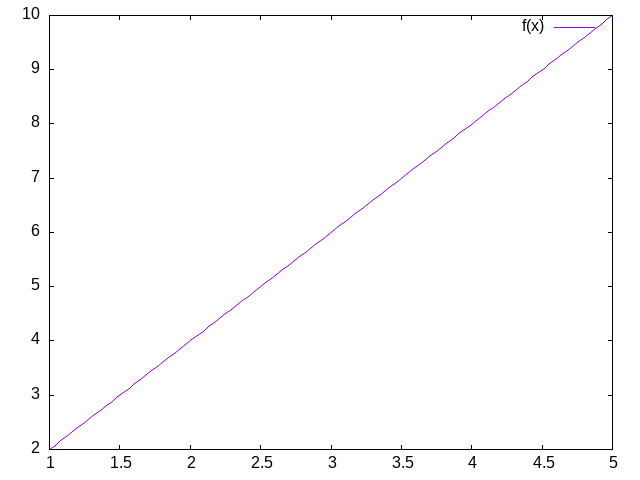
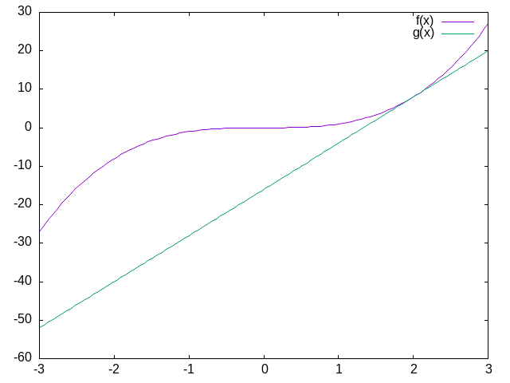

#+STARTUP: nofold hideblocks
#+options: toc:nil
#+Latex_Header: \usepackage{mdframed}
#+latex_header: \usepackage{hyperref}
#+latex_header: \usepackage{amsthm}
#+latex_header_extra: \newmdenv[linecolor=red,frametitle=Class Discussion]{cdbox}
#+latex_header_extra: \newmdenv[linecolor=red,frametitle=Further Class Discussion]{fcdbox}
#+latex_header_extra: \newtheorem{definition}{Definition}
#+bibliography: /home/britt/gitRepos/masterBib/bayatt.bib
#+cite_export: csl /home/britt/gitRepos/brittsite/assets/chicago-fullnote-bibliography.csl
#+Title: CMPS 03
#+author: Britt Anderson
#+date: Winter 2025

#+begin_src latex
  \begin{cdbox}
Why are \emph{differential equations} an important technique for computational modelling in psychology and neuroscience?
\end{cdbox}    
#+end_src

* Dynamics

Spiking neuron models rely on differential equation to capture the evolution of voltage as a function of time. Dynamics is the study of things changing over time, and neural dynamics gives us important insights into brain and neuronal activity normally and as a consequence of disease.

An interest in dynamical systems has been a part of computational neuroscience since the days of Hodgkin and Huxley (more on them later). But with the development of cheaper and more powerful computing capacities their use as expanded practically and theoretically. It is increasingly feasible to simulate complex models in high dimensions. This advance parallels the use of multiple electrode recordings that yield high dimensional data.

To ground our understanding with the use of differential equations in computational neuroscience we will produce simple, single neuron simulations of the integrate and fire variety. An excellent and concise summary of these ideas, one that I drew upon heavily for this course is [cite:@Terman_2005]. 

** Beginning to Think Dynamically

Assume you have a derivative that is equal to \( x - x^3 \) (see Figure [[xminusxcubed]]). What would it mean to "solve" this equation?

#+begin_src gnuplot :file xminusxcubed.png
  reset
  set xrange[1:4]
  f(x) = x - x**3
  plot f(x) 
#+end_src

#+Name: xminusxcubed
#+Caption: A plot of  \( f(x) = x - x^3 \)
#+RESULTS:
[[file:xminusxcubed.png]]

What you want is some /function/ of the variable $x$ that will equal what you get when you take its derivative. For this function that is easy enough. You simply integrate. But what if we think of $x$ as dynamic. It is not fixed. It varies with time, like the voltage inside a neuron, the air temperature, or the strength of a memory trace. Then your equation becomes, \( \frac{dx}{dt} = x - x^3 \). Integrate that.[fn:1] In this case we can find an analytical[fn:2] solution. But we don't have to do much to our equations to make such solutions very difficult or impossible. For most of the use practical use cases in computational neuroscience we do not solve these equations analytically. Rather, we use the computer to approximate their behavior. Most of the equations in neuroscience, and biology generally for that matter, are well behaved enough that we can get away with this.

We will now review the action potential and lay the ground work for writing our own code to simulate a neuron's firing. 

** The Action Potential

#+begin_src latex 
    \begin{cdbox}
      \begin{itemize}
  \item{10 minutes to brush up on what an action potential is.}
  \item{Then be able to draw one.}
  \item{What are the axes?}
  \item{What ion causes the upward deflection?}
  \item{What causes the repolarization?}
  \item{Who discovered the action potential?}
  \item{Who won the Nobel Prize for characterizing the ionic events of the action potential experimentally and building a mathematical model?}
    \end{itemize}
    \end{cdbox}
#+end_src

#+begin_src latex
  \begin{fcdbox}
  How is an action potential like a flush toilet?
  \end{fcdbox}
#+end_src

** A Mathematical Aside
I often find that psychology students let mathematical notation get in their way of understanding. The unfamiliar symbols lead people to skip the most important part of computational papers. The most important thing to learn is that mathematical notation is just like an emoji: a concise way to express a more complex idea. Once you learn the "slang" you can look beyond the characters. Here is an example of how simple math can start to look forbidding when notated.

What does \( \sum_{\forall x \in \left\{ 1 , 2 , 3 \right \}} x = 6 \) really mean?

Another confusing feature of mathematical notation is that there are often many ways to say the same thing and different mathematical communities have different conventions. But just because you cannot speak French  you do not assume the French are really saying something different. So, when faced with a strange mathematical expression be open to the idea that it is just another way to say something you are already familiar with.

For example, 
\(\frac{dx}{dt}\) \(\dot{x}\) \(x{'}\) \(f{'}(x)\) are all different ways of talking about derivatives and derivatives are at the heart of differential equations. 

** Derivatives are Slopes
#+begin_src latex
  \begin{cdbox}
1. What is a slope?
2. When in doubt return to definition.
3. Deriving the definition of a derivative.
4. What is the definition of a derivative?
\end{cdbox}
#+end_src

*** Your computer is a tool for exploration

#+begin_src gnuplot :file twox.png
  reset
  set xrange[1:5]
  f(x) = 2*x
  plot f(x) 
#+end_src

#+Name: slope2
#+Caption: What is the slope of this line?
#+RESULTS:

#+begin_src gnuplot :file slopecurve.png
    reset
    set xrange[-3:3]
    f(x) = x**3
    g(x) = 12*x - 16
    plot f(x) with lines linestyle 1, \
         g(x) with lines linestyle 2
#+end_src

#+Name: slopecurve
#+Caption: What is the slope of this curve? And what is missing from that question that you need to know to give an answer?
#+RESULTS:

*** To approximate the derivative of a curve at a point draw a straight line close by

You pick two points that are "close enough" and you get an answer that
is "close enough." If your answer isn't "close enough" then you move
your points closer, until /in the limit/ there is an infinitesimal
distance between them.

IAMHERE add derivative definition
#+begin_src latex
  \begin{definition}
      This is a test.
      \end{definition}
#+end_src

# *Definition 2.1* (derivative). /= _h /

# ​*** Digression: Writing Math in Documents The current standard tool for
# nicely typeset math is LaTeX. You can use this in jupyter notebooks and
# even some in
# [[https://support.microsoft.com/en-us/office/linear-format-equations-using-unicodemath-and-latex-in-word-2e00618d-b1fd-49d8-8cb4-8d17f25754f8][Word]].
# However, the most powerful way is just to write the document as a simple
# text file with the .tex ending and use TeX post-processors. This is
# easiest in Linux, but isn't too hard for both Windows and OSX. Here I
# use LaTeX fragments in side an "org" file compiled by emacs using other
# programs on my computer.

# [[https://faculty.math.illinois.edu/\(\sim\)hildebr/tex/latex-start.html][Some
# Resources]]

# ​**** Using Derivatives to Solve Problems With a Computer

# ​***** What is a square root? :class\(\_\)exercise:

# What is the *solution* to $y=x'1362$ if I tell you what $y$ is?

* Footnotes
[fn:2] What does "analytical" mean here? 

[fn:1] It is not /that/ hard, and Claude.AI (as of <2024-12-19 Thu>) can do it for you. But it is substantially harder than before.  

# The dynamical systems approach is the same idea as we used to implement our spiking neuron models. We think of  @$["x"] as itself a function: @$["x(t)"]. Then as /t} changes we will also change @$["x"].

# @section{Fixed Points}

# @quote{Give me a place to stand, and I shall move the world. ---Archimedes}

# Fixed points are the points in a function where it no longer changes. It becomes /fixed}. We have already used fixed points, at least informally, to determine certain starting parameters for our Hodgkin & Huxley model. We assumed that the system evolved to some point in time where the derivative of a function with time was zero. Then we could infer or compute the form that our parameter (e.g. the ɑ or β) took. This is the determinant of a fixed point: a point where the derivative is zero. If the derivative is describing how your function changes over time, then when the derivative is zero the function does not change and so that point is fixed.

# You can learn a lot about a system by looking at its *fixed points}.

# @subsection{Class Exercise}

# For the function above what are the fixed points and are they *stable} or *unstable}? Solve your equation for all the values of @$["x"] that make the derivative zero. That will give you the fixed points. What do you think is meant by the term /stability}?

# @;Here they are @$["\{0, 1, -1\}"].

# Informally, you can assess stability by looking nearby the fixed points to see if they are pushed toward or away from the fixed point. Which of these three are stable or unstable?

# @examples[#:no-prompt
#           #:label "Stability From Vector Fields:"
# #:eval plot-eval
#           (begin
#             (define (dx/dt=x-x^3 x y) (vector (- x (expt x 3.0)) 0))
#             (plot (vector-field dx/dt=x-x^3   -0.2 0.2 -0.2 0.2)))]

# @examples[#:no-prompt
#           #:label "A more realistic 2D example:"
#           #:eval plot-eval
#           (plot (vector-field (λ (x y) (vector (+ x y) (- x y))) -2 2 -2 2))]

# @subsection{Extended Class Activity}

# Another example taken from @~cite[dynamics-tutorial] is @$$["x' = \\lambda + x^2."] We can use this equation to demonstrate the idea of a */bifurcation}}.

# A bifurcation is the description of a point in the plot of a function where some aspect of function behavior changes in a way we regard as important. The trick here is to change one's perspective. We have been considering our functions as functions of time, which they are, but in the case of this function we also have a parameter expressed by the λ. This too is free to change, just like our time variable. Consider your integrate and fire neuron. For some injections of currents nothing happens. It just reaches and holds a steady value. But as we increase the level we reach a point where we get repetitive firing. It /oscillates/. Or recall how the behavior of your model changed when you adjusted the membrane time constant: τ. You could now think about how the entire @$["v(t)"] function changes as you change τ. If there was some abrupt shift in function behavior you would have a bifurcation. To make this concrete consider the fixed points and stability of this equation. 

# /What are the fixed points of this equation?}

# /Are they stable?}

# If you have had some calculus you may remember that you could find the maxima or minima of a function by the location of the points where the derivative was zero. You were either on top of a mountain or in the depths of a valley.

# @examples[#:no-prompt
#           #:eval plot-eval
#           (hc-append
#            (plot-pict (function sqr -2 2))
#            (plot-pict (function (lambda (x) (- (sqr x) ))-2 2)))]

# Imagine that these two plots are plots of the derivative. To see how the derivative is changing, you can visually take the derivative of this derivative by imagining the tangent lines, that is the approximations to the slope that we used before. Trace these imaginary lines around the graph from left to right and observe that in one case they go from minus to positive and in the other from positive to minus. Which is which? 

# More precisely you can calculate the derivative of your derivative and find its value at the fixed point. If it is greater than zero you are unstable. Less than zero and you are stable. If it exactly equals zero the behavior is not clear.

# For this classroom activity find the fixed points for this equation as a function of lambda. Note the values for lambda might equal 0 or lambda could be greater or less than zero. Often it is more helpful to consider regions of values than just some odd assortment of numbers you pull from a hat. Consider your fixed points as functions of lambda. 

# Plot the values of x for all its fixed points as a function of lambda. What does  the look like. What goes on the x axis? Y axis?

# @examples[#:no-prompt
#           #:eval plot-eval
#           (begin 
#             (define (hopf-fixed-example l) (list (list l (- (sqrt (* -1 l)))) (list l (sqrt (* -1 l)))))
#             (define (hopf-fixed-example-deriv x) (* 2 x))
#             (define ls-to-plot (range -5 -0.05 0.05))
#             (define fixed-points (append* (map hopf-fixed-example ls-to-plot)))
#             (define-values (r g) (partition (lambda (x) (positive? (hopf-fixed-example-deriv (second x)))) fixed-points))
#             (plot (list
#                    (point-label (vector 0 0) "bifurcation point" #:anchor 'right)(points r #:color "red" #:label "unstable")
#                    (points g #:color "green" #:label "stable")) #:x-label "lambda" #:y-label "fixed-points"))]

# This is a so-called */saddle node}}.

# Now try to do the same for the function: @$$["x' = \\lambda~x - x^2."]
# Find the fixed points for the */transcritical}} bifurcation and plot the stability. It is probably easier if just use pen and paper (or ipad). Use your calculus to find the fixed points and the derivatives for stability.

# @margin-note{It is important to recognize that the λ here is not the same as for the λ calculus. There are only so many symbols and the mathematicians tend to recycle and re-use.}

# Then are many more types of bifurcations that are classified based on these types of graphs.
# Some, such as the "Hopf" can only be observed in higher dimensions where the ideas of a */phase}} space and plot become common terms. 

# @subsection{From Lines to Planes}

# The extrapolation we want to make from the 1D case is that the geometry of our "particle" is  moving in a plane. It turns out for all ordinary differential equations @margin-note{Ordinary differential equations have only a single independent variable.} no matter how high their dimensionality this spatial metaphor will be useful.

# For two dimension (dependent variables @$["x"] and @$["y"]) and two functions of those two variables, we need to consider the derivatives of each. How x changes with time (@$["x'"]) is a function of both x and y. The same for how y changes (@$["y'"]). For this two dimensional case the phase *plane* is the x - y plane.

# At the initial time (t_0) the "particle" is somewhere (x(t_0), y(t_0)). As t grows the position of the particle changes. It move in the x - y plane. How do we know where it goes next? We have the derivatives that describe how it changes over time, and we use those just as we did to propragate velocity in the Hodgkin-Huxley model. 

# One approach:
# @itemlist[#:style 'ordered
#           @item{Determine the fixed points.}
#           @item{Draw the /nullclines}.}]

# A nullcline is the line in your phase space when one of the derivatives of your dependent variables is zero. For example, if you had a system of equations like:

# @$$["\\begin{align*}
#    x' &= y - x^2 + x \\\\
#    y' &= x - y
#    \\end{align*}"]

# Consider when $x'$ is zero. That would mean when @$["y = x^2 - x"]. Now you determine what the y nullcline is for this system of equations. Then plot them with Racket's plot functions. The look at the graph and determine where the fixed points.

# @;{
# @examples[#:no-prompt
#           #:eval plot-eval
#           (plot (list (axes)
#                       (function (lambda (x) (- (expt x 2.0) x)) -4 4 #:color "red")
#                       (function (lambda (x) x) #:color "green")))]
# }

# @subsection{Dealing with the Non-linear}

# Make it linear. Locally everything is linear. To find out the stability of a complex system where the graphical depiction doesn't give you all the answers you take your non-linear system and linearize in the neighborhood of the fixed points. This is very similar to what we have already done, but disguises this process with new terminology and a more complex notation for tracking the multiple variables we need to reference. All I will do here is introduce some of the words, but their application will have to wait. 

# Continuous functions (those without breaks and jumps) can be decomposed into an expansion of terms that multiply the powers of their independent variable by coefficients. When you progress through the algebra you end up with an expansion that involves derivatives of increasing order and factorials. For most of the functions that are of biological or psychological relevance the magnitude of the terms decreases quickly enough that all the orders beyond x or @$["x^2"] can usually be ignored. Such expansions are called a */Taylor}} series. When applied to a system of equations you get a matrix, which we will look at more shortly in the section on neural networks. The */Jacobian}} is really just a bunch of second derivatives that we use like above to determine the stability of regions in our phase space via looking at the */eigenvalues}} of this phase space. @margin-note{The terms here are so you know what to look up if you want to learn more on your own. The book on Neuronal Dyanmics referenced earlier and the Tutorial book with Terman's chapter are both useful sources.}

# @section{Neuronal Dyanmics Applied to Spiking Neuron Models}

# The Hodgkin and Huxley model is quite complex. There are simpler versions of spiking neuron models that still yield much of the important features of the H-H model. Having fewer variables and fewer equations they are more tractable mathematically and more understandable via inspection. Having a spike generation process they are more applicable to real neurons than the even simpler integrate and fire model.

# A popular reduced model is the @hyperlink["https://en.wikipedia.org/wiki/Morris%E2%80%93Lecar_model"]{Morris Lecar}. It is an idealized version of a neuron with two ionic conductances and one leak current. Only one of the ionic currents changes slowly enough to matter (the other is instantaneous). There can also be an applied current. By varying the, in this version of the terminology, φ value one can change the behavior of the neuron and use the above methodologies for @hyperlink["https://web.archive.org/web/20120402093059/http://pegasus.medsci.tokushima-u.ac.jp/~tsumoto/work/nolta2002_4181.pdf"]{studying how that affects neuronal spiking dynamics}. As a preview demonstration consider these two plots. 

# @examples[#:eval plot-eval
#           (require "./code/morris-lecar.rkt")
#           ;;(require plot)@; needs uncommenting if you are doing in DrRacket
#           (hc-append
#            (try-a-new-phi 0.03)
#            (poor-mans-phase-plot 0.03))]

# @generate-bibliography[#:sec-title "Dynamics Bibliography"
#                        #:tag "ref:dyn"]

