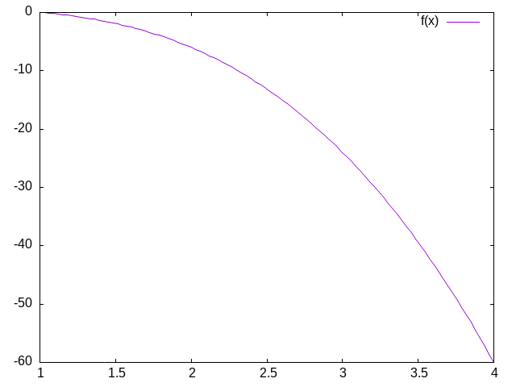
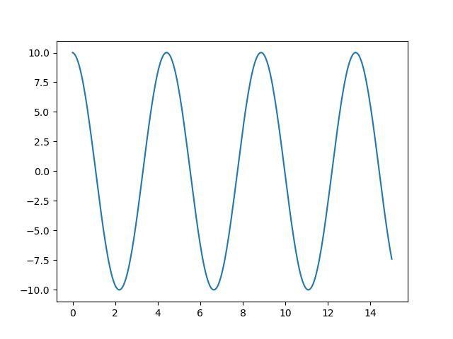
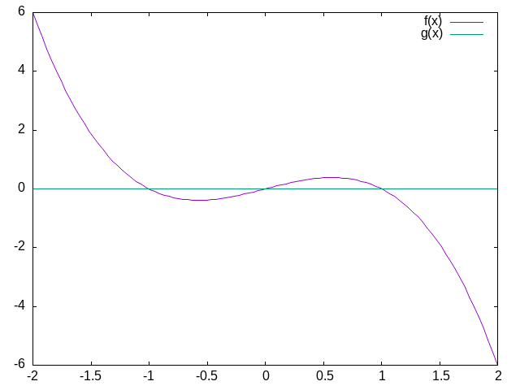
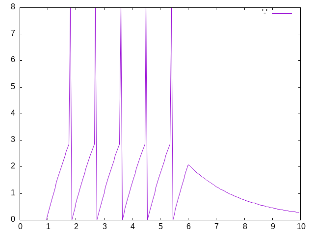
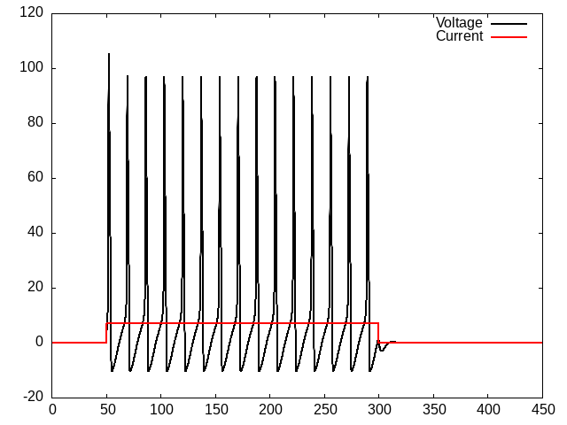

#+STARTUP: nofold hideblocks
#+options: toc:nil
#+Title: CMPS 04
#+author: Britt Anderson
#+date: Winter 2025
#+latex_header: \usepackage{hyperref}
#+latex_header: \usepackage{amsmath}
#+latex_header: \usepackage{amsthm}
#+LATEX_HEADER: \usepackage{mdframed}
#+Latex_header: \usepackage{tcolorbox}
#+Latex_header: \usepackage{svg}
#+latex_header: \usepackage[T1]{fontenc}
#+LATEX_HEADER: \renewenvironment{quote}{\begin{mdframed}[backgroundcolor=gray!10]}{\end{mdframed}}
#+latex_header_extra: \newtheorem{definition}{Definition}
#+latex_compiler: xelatex
#+HTML_HEAD: 
#+bibliography: /home/britt/gitRepos/masterBib/bayatt.bib
#+cite_export: csl /home/britt/gitRepos/brittsite/assets/chicago-fullnote-bibliography.csl

** Dynamics
#+Begin_quote
Why are *differential equations* an important technique for computational modelling in psychology and neuroscience?
#+end_quote

Spiking neuron models rely on differential equation to capture the evolution of voltage as a function of time. Dynamics is the study of things changing over time, and neural dynamics gives us important insights into brain and neuronal activity normally and as a consequence of disease.

An interest in dynamical systems has been a part of computational neuroscience since the days of Hodgkin and Huxley (more on them later). But with the development of cheaper and more powerful computing capacities their use as expanded practically and theoretically. It is increasingly feasible to simulate complex models in high dimensions. This advance parallels the use of multiple electrode recordings that yield high dimensional data.

To ground our understanding with the use of differential equations in computational neuroscience we will produce simple, single neuron simulations of the integrate and fire variety. An excellent and concise summary of these ideas, one that I drew upon heavily for this course is [cite:@Terman_2005]. 

*** Beginning to Think Dynamically

Assume you have a derivative that is equal to \( x - x^3 \) (see Figure [[xminusxcubed]]). What would it mean to "solve" this equation?

#+begin_src gnuplot :file ./images/xminusxcubed.png
  reset
  set xrange[1:4]
  f(x) = x - x**3
  plot f(x) 
#+end_src

#+Name: xminusxcubed
#+Caption: A plot of  \( f(x) = x - x^3 \)
#+RESULTS:

What you want is some /function/ of the variable $x$ that will equal what you get when you take its derivative. For this function that is easy enough. You simply integrate. But what if we think of $x$ as dynamic. It is not fixed. It varies with time, like the voltage inside a neuron, the air temperature, or the strength of a memory trace. Then your equation becomes, \( \frac{dx}{dt} = x - x^3 \). Integrate that.[fn:1] In this case we can find an analytical[fn:2] solution. But we don't have to do much to our equations to make such solutions very difficult or impossible. For most of the use practical use cases in computational neuroscience we do not solve these equations analytically. Rather, we use the computer to approximate their behavior. Most of the equations in neuroscience, and biology generally for that matter, are well behaved enough that we can get away with this.

We will now review the action potential and lay the ground work for writing our own code to simulate a neuron's firing. 

*** The Action Potential

#+Begin_quote 
How is an action potential like a flush toilet?
#+end_quote

#+begin_quote
- 10 minutes to brush up on what an action potential is.
- Then be able to draw one.
- What are the axes?
- What ion causes the upward deflection?
- What causes the repolarization?
- Who discovered the action potential?
- Who won the Nobel Prize for characterizing the ionic events of the action potential experimentally and building a mathematical model?
#+end_quote

*** A Mathematical Aside
I often find that psychology students let mathematical notation get in their way of understanding. The unfamiliar symbols lead people to skip the most important part of computational papers. The most important thing to learn is that mathematical notation is just like an emoji: a concise way to express a more complex idea. Once you learn the "slang" you can look beyond the characters. Here is an example of how simple math can start to look forbidding when notated.

What does \( \sum_{\forall x \in \left\{ 1 , 2 , 3 \right \}} x = 6 \) really mean?

Another confusing feature of mathematical notation is that there are often many ways to say the same thing and different mathematical communities have different conventions. But just because you cannot speak French  you do not assume the French are really saying something different. So, when faced with a strange mathematical expression be open to the idea that it is just another way to say something you are already familiar with.

For example, 
\(\frac{dx}{dt}\) \(\dot{x}\) \(x{'}\) \(f{'}(x)\) are all different ways of talking about derivatives and derivatives are at the heart of differential equations. 

*** Derivatives are Slopes
#+Begin_quote
1. What is a slope?
2. When in doubt return to definition.
3. Deriving the definition of a derivative.
4. What is the definition of a derivative?
#+end_quote

**** Your computer is a tool for exploration

#+begin_src gnuplot :file ./images/twox.png
  reset
  set xrange[1:5]
  f(x) = 2*x
  plot f(x) 
#+end_src

#+Name: slope2
#+Caption: What is the slope of this line?
#+RESULTS:
[[file:./images/twox.png]]

#+begin_src gnuplot :file ./images/slopecurve.png
    reset
    set xrange[-3:3]
    f(x) = x**3
    g(x) = 12*x - 16
    plot f(x) with lines linestyle 1, \
         g(x) with lines linestyle 2
#+end_src

#+Name: slopecurve
#+Caption: What is the slope of this curve? And what is missing from that question that you need to know to give an answer?
#+RESULTS:
[[file:./images/slopecurve.png]]

**** To approximate the derivative of a curve at a point draw a straight line close by

You pick two points that are "close enough" and you get an answer that
is "close enough." If your answer isn't "close enough" then you move
your points closer, until /in the limit/ there is an infinitesimal
distance between them.

#+Name: dxdy-define
#+begin_quote
*Definition of a Derivative*

\( \frac{dx}{dy} = \frac{f(x + \Delta x) - f(x)}{x+\Delta x - x} \)
#+end_quote

*** Digression:
To write math for publication you will probably need to know a little bit of LaTeX. LaTeX versions can be found for all sorts of environments and operating systems. To get started try [[https://marketplace.visualstudio.com/items?itemName=James-Yu.latex-workshop][writing LaTeX in VS Code]]. A guide for word processor users can be found [[https://ctan.math.washington.edu/tex-archive/info/latex4wp/latex4wp.pdf][here]]. However, in the short term the easiest way to get started may be to use the free [[https://www.overleaf.com/][Overleaf account]] you have as a UWaterloo student. This is great for collaboration as it lets you share and edit a document jointly, like a google doc.

****  Using Derivatives to Solve Problems With a Computer
​What is a square root? You might want to review our earlier exercise to see how the derivative is playing a role in our solution. 

*** Practice Simulating With DEs

**** Frictionless Springs

We want to code neurons, but to get there we should feel comfortable with the underlying tool or we won't be able to adapt it or re-use it for some new purpose. We will start with a very simple and concrete example: the frictionless spring.

\( \frac{d^2 s}{dt^2} = -P~s \)

where 's' refers to space, 't' refers to time, and 'P' is a constant, often called the spring constant, that indicates how stiff or springy the spring is. 

Imagine that you knew this derivative. It would tell you how much space the spring head would move for a given, very small, increment of time. We could then just add this to our current position to get the new position and repeat. This method of using a derivative to iterate forward is sometimes called the [[https://en.wikipedia.org/wiki/Euler_method][Euler method]].

Returning to our definition of the derivative:

\( \frac{s(t + \Delta t) - s(t)}{\Delta t} = velocity \approx \frac{d s}{d t} \)

But our spring equation is not given in terms of the velocity it is given in terms of the acceleration which is the second derivative. Therefore, to find our new position we need the velocity, but we only have the acceleration. However, if we knew the acceleration and the velocity we could use that to calculate the new velocity. Unfortunately we don't know the velocity, unless ... , maybe we could just assume something. Let's say it is zero because we have started our process where we have stretched the spring, and are holding it, just before letting it go. We have asserted an /initial value/.

How will our velocity change with time?

\( \frac{v(t + \Delta t) - v(t)}{\Delta t} = acceleration \approx \frac{d v}{d t} = \frac{d^2 s}{d t^2} \)

And we have a formula for this. We can now bootstrap our simulation.

Note the similarity of the two functions. You could write a helper function that was generic to this pattern of /old value + rate of change times the  time step/, and just used the pertinent values.

How do we know the formula for acceleration? We were given it!

#+begin_src python :session *spring* :results graphics output file :file ./images/spring.jpg :exports both
  import localcode.spring as s
  s.plot_spring()
#+end_src

#+Name: oscillator-plot
#+Caption: Spring constant of 2 with a starting position of 10.
#+RESULTS:

***** Now You Try
*Damped Oscillators*

Provide the code and a plot for the damped oscillator. It has the formula of

\( \frac{d^2 s}{dt^2} = -P~s(t) - k~v(t) \)

*** Dynamical Systems

Sometimes a variable can be a function. This is not literally true, but sometimes we think of a value like "x" as a location in a graph, but we know that in some situations the value of "x" may change with time. Thus we can also think of "x" as "x(t)" where the value of x in this case depends on time.  This dynamical systems approach is the idea as we use to implement our spiking neuron models. We think of  $x$ as a function. Sometimes it may be time, but often it will be voltage.

**** Fixed Points

#+begin_quote
Give me a place to stand, and I shall move the world. ---Archimedes (paraphrase)
#+end_quote

Fixed points are the points in a function where it no longer changes. It becomes /fixed/.

#+begin_mdframed
What is the derivative at a fixed point?
#+end_mdframed

We will use the ideas of fixed points, at least informally, to determine certain starting parameters for our Hodgkin & Huxley model. We will assume that the system evolved to some point in time where the derivative of a function with time was zero. Then we will infer our parameter based on that assumptioni. 

You can learn a lot about a system by looking at its fixed points

#+begin_mdframed
Class Exercise
What are the fixed points for a function where \( \frac{dx}{dt} = x - x^3\)?
#+end_mdframed

For the function above what are the fixed points and are they /stable/ or /unstable/? What do you think is meant by the term /stability/?

**** Comment :noexport:
Here they are 0, 1, -1

@examples[#:no-prompt
          #:label "Stability From Vector Fields:"
#:eval plot-eval
          (begin
            (define (dx/dt=x-x^3 x y) (vector (- x (expt x 3.0)) 0))
            (plot (vector-field dx/dt=x-x^3   -0.2 0.2 -0.2 0.2)))]

@examples[#:no-prompt
          #:label "A more realistic 2D example:"
          #:eval plot-eval
          (plot (vector-field (λ (x y) (vector (+ x y) (- x y))) -2 2 -2 2))]

Need to fix the plotting
	  
**** Class Activity

Informally, you can assess stability by looking nearby the fixed points to see if they are pushed toward or away from the fixed point. Which of these three are stable or unstable?

#+begin_src gnuplot :file ./images/xminusxcubed-extendedrange.png
  reset
  set xrange[-2:2]
  f(x) = x - x**3
  g(x) = 0
  plot f(x) with lines linestyle 1, \
       g(x) with lines linestyle 2
#+end_src

#+RESULTS:

**** Comment :noexport:
Again needs editing
Another example taken from dynamics-tutorial is \(x' = \lambda + x^2\). We can use this equation to demonstrate the idea of a /bifurcation/

A bifurcation is the description of a point in the plot of a function where some aspect of function behavior changes in a way we regard as important. The trick here is to change one's perspective. We have been considering our functions as functions of time, which they are, but in the case of this function we also have a parameter expressed by the λ. This too is free to change, just like our time variable. Consider your integrate and fire neuron. For some injections of currents nothing happens. It just reaches and holds a steady value. But as we increase the level we reach a point where we get repetitive firing. It /oscillates/. Or recall how the behavior of your model changed when you adjusted the membrane time constant: τ. You could now think about how the entire v(t) function changes as you change $\tau$. If there was some abrupt shift in function behavior you would have a bifurcation. To make this concrete consider the fixed points and stability of this equation. 

/What are the fixed points of this equation?

/Are they stable?

If you have had some calculus you may remember that you could find the maxima or minima of a function by the location of the points where the derivative was zero. You were either on top of a mountain or in the depths of a valley.

          (hc-append
           (plot-pict (function sqr -2 2))
           (plot-pict (function (lambda (x) (- (sqr x) ))-2 2)))]

Imagine that these two plots are plots of the derivative. To see how the derivative is changing, you can visually take the derivative of this derivative by imagining the tangent lines, that is the approximations to the slope that we used before. Trace these imaginary lines around the graph from left to right and observe that in one case they go from minus to positive and in the other from positive to minus. Which is which? 

More precisely you can calculate the derivative of your derivative and find its value at the fixed point. If it is greater than zero you are unstable. Less than zero and you are stable. If it exactly equals zero the behavior is not clear.

For this classroom activity find the fixed points for this equation as a function of lambda. Note the values for lambda might equal 0 or lambda could be greater or less than zero. Often it is more helpful to consider regions of values than just some odd assortment of numbers you pull from a hat. Consider your fixed points as functions of lambda. 

Plot the values of x for all its fixed points as a function of lambda. What does  the look like. What goes on the x axis? Y axis?

# @examples[#:no-prompt
#           #:eval plot-eval
#           (begin 
#             (define (hopf-fixed-example l) (list (list l (- (sqrt (* -1 l)))) (list l (sqrt (* -1 l)))))
#             (define (hopf-fixed-example-deriv x) (* 2 x))
#             (define ls-to-plot (range -5 -0.05 0.05))
#             (define fixed-points (append* (map hopf-fixed-example ls-to-plot)))
#             (define-values (r g) (partition (lambda (x) (positive? (hopf-fixed-example-deriv (second x)))) fixed-points))
#             (plot (list
#                    (point-label (vector 0 0) "bifurcation point" #:anchor 'right)(points r #:color "red" #:label "unstable")
#                    (points g #:color "green" #:label "stable")) #:x-label "lambda" #:y-label "fixed-points"))]

# This is a so-called */saddle node}}.

# Now try to do the same for the function: @$$["x' = \\lambda~x - x^2."]
# Find the fixed points for the */transcritical}} bifurcation and plot the stability. It is probably easier if just use pen and paper (or ipad). Use your calculus to find the fixed points and the derivatives for stability.

# @margin-note{It is important to recognize that the λ here is not the same as for the λ calculus. There are only so many symbols and the mathematicians tend to recycle and re-use.}

# Then are many more types of bifurcations that are classified based on these types of graphs.
# Some, such as the "Hopf" can only be observed in higher dimensions where the ideas of a */phase}} space and plot become common terms. 

# @subsection{From Lines to Planes}

# The extrapolation we want to make from the 1D case is that the geometry of our "particle" is  moving in a plane. It turns out for all ordinary differential equations @margin-note{Ordinary differential equations have only a single independent variable.} no matter how high their dimensionality this spatial metaphor will be useful.

# For two dimension (dependent variables @$["x"] and @$["y"]) and two functions of those two variables, we need to consider the derivatives of each. How x changes with time (@$["x'"]) is a function of both x and y. The same for how y changes (@$["y'"]). For this two dimensional case the phase *plane* is the x - y plane.

# At the initial time (t_0) the "particle" is somewhere (x(t_0), y(t_0)). As t grows the position of the particle changes. It move in the x - y plane. How do we know where it goes next? We have the derivatives that describe how it changes over time, and we use those just as we did to propragate velocity in the Hodgkin-Huxley model. 

# One approach:
# @itemlist[#:style 'ordered
#           @item{Determine the fixed points.}
#           @item{Draw the /nullclines}.}]

# A nullcline is the line in your phase space when one of the derivatives of your dependent variables is zero. For example, if you had a system of equations like:

# @$$["\\begin{align*}
#    x' &= y - x^2 + x \\\\
#    y' &= x - y
#    \\end{align*}"]

# Consider when $x'$ is zero. That would mean when @$["y = x^2 - x"]. Now you determine what the y nullcline is for this system of equations. Then plot them with Racket's plot functions. The look at the graph and determine where the fixed points.

# @;{
# @examples[#:no-prompt
#           #:eval plot-eval
#           (plot (list (axes)
#                       (function (lambda (x) (- (expt x 2.0) x)) -4 4 #:color "red")
#                       (function (lambda (x) x) #:color "green")))]
# }

# @subsection{Dealing with the Non-linear}

# Make it linear. Locally everything is linear. To find out the stability of a complex system where the graphical depiction doesn't give you all the answers you take your non-linear system and linearize in the neighborhood of the fixed points. This is very similar to what we have already done, but disguises this process with new terminology and a more complex notation for tracking the multiple variables we need to reference. All I will do here is introduce some of the words, but their application will have to wait. 

# Continuous functions (those without breaks and jumps) can be decomposed into an expansion of terms that multiply the powers of their independent variable by coefficients. When you progress through the algebra you end up with an expansion that involves derivatives of increasing order and factorials. For most of the functions that are of biological or psychological relevance the magnitude of the terms decreases quickly enough that all the orders beyond x or @$["x^2"] can usually be ignored. Such expansions are called a */Taylor}} series. When applied to a system of equations you get a matrix, which we will look at more shortly in the section on neural networks. The */Jacobian}} is really just a bunch of second derivatives that we use like above to determine the stability of regions in our phase space via looking at the */eigenvalues}} of this phase space. @margin-note{The terms here are so you know what to look up if you want to learn more on your own. The book on Neuronal Dyanmics referenced earlier and the Tutorial book with Terman's chapter are both useful sources.}

# @section{Neuronal Dyanmics Applied to Spiking Neuron Models}

# The Hodgkin and Huxley model is quite complex. There are simpler versions of spiking neuron models that still yield much of the important features of the H-H model. Having fewer variables and fewer equations they are more tractable mathematically and more understandable via inspection. Having a spike generation process they are more applicable to real neurons than the even simpler integrate and fire model.

# A popular reduced model is the @hyperlink["https://en.wikipedia.org/wiki/Morris%E2%80%93Lecar_model"]{Morris Lecar}. It is an idealized version of a neuron with two ionic conductances and one leak current. Only one of the ionic currents changes slowly enough to matter (the other is instantaneous). There can also be an applied current. By varying the, in this version of the terminology, φ value one can change the behavior of the neuron and use the above methodologies for @hyperlink["https://web.archive.org/web/20120402093059/http://pegasus.medsci.tokushima-u.ac.jp/~tsumoto/work/nolta2002_4181.pdf"]{studying how that affects neuronal spiking dynamics}. As a preview demonstration consider these two plots. 

# @examples[#:eval plot-eval
#           (require "./code/morris-lecar.rkt")
#           ;;(require plot)@; needs uncommenting if you are doing in DrRacket
#           (hc-append
#            (try-a-new-phi 0.03)
#            (poor-mans-phase-plot 0.03))]

** Modeling the Action Potential
*** Integrate and Fire Neuron

In this section we take a look at the history and math of the computational model of neuron firing called "Integrate and Fire" (I&F).  The I&F model uses math essentially the same as the spring example.

#+begin_mdframed
Is the integrate and fire model used much in modeling in the present time? [[https://scholar.google.com/scholar?as_ylo=2020&q=%22integrate+and+fire%22+neuron&hl=en&as_sdt=7,39][answer]]
#+end_mdframed

**** History of the Integrate and Fire Model
***** Louis Lapicque - Earlier Computational Neuroscientist

[[https://link.springer.com/content/pdf/10.1007/s00422-007-0190-0.pdf"][Modern Commentary on Lapique's Neuron Model]]

#+Name: lapiqueLab
#+Caption: La Pique Laboratory at the Sorbonne Paris
[[file:images/Lapicque_laboratoire.png]]

[[https://doi.org/10.1007/s00422-007-0189-6][Original Lapique Paper (translated)]]
                                                                                        
[[https://fr.wikipedia.org/wiki/Louis_Lapicque][Brief Biographical Details of Lapicque]]

***** Lord Adrian and the All-or-None Action Potential
One of the first demonstrations of the all-or-none nature of the neuronal action potential was made by Lord Adrian. Lord Adrian was an interesting scientific figure. He asserted that some of his prowess at electrophysiology stemmed from his interest in and training in fencing.

#+begin_mdframed
1. When was the action potential demonstrated?
2. What was the experimental animal used by Adrian?
[[https://www.ncbi.nlm.nih.gov/pmc/articles/PMC1420429/pdf/jphysiol01990-0084.pdf]]
#+end_mdframed

#+begin_mdframed
Want more details? There is an excellent free book available [[https://lcnwww.epfl.ch/gerstner/SPNM/SPNM.html][Spiking Neurons]] They also have another more modern book out too [[http://neuronaldynamics.epfl.ch/online/index.html][Neuronal Dynamics]]
#+end_mdframed

While Hodgkin and Huxley provided the first robust computational model of the neuronal action potential their model is quite complex, as we will soon see. Is all that complexity necessary? That of course depends on the nature of the scientific question, and if we are primarily interested in whether a spike has or has not occurred, and not the ionic events that produced the spike, we may find our experimental questions dealt with much more concisely by a much simpler model of neuronal spiking: the leaky integrate and fire model.

The formula for the leaky integrate and fire neuron is:

\(\tau \frac{dV(t)}{dt} = -V(t) + R~I(t) \)

In the next sections we will describe how this simplification came to be, and use it as the basis for learning some of the elementary electrical laws and relations upon which it is based. 

**** Electronics Background
The following questions are the ones we need answers to to derive our integrate and fire model.

#+begin_mdframed
1. What is Ohm's Law?
2. What is Kirchoff's Point Rule?
3. What is Capacitance?
4. What is the relation between current and charge?
#+end_mdframed

*Ohm's Law* (empirically observed): $V = IR$

What is the relationship between current and charge?
Current: The derivative of charge with respect to time, $$I = \frac{dQ}{dt}$$

What is *Kirchoff's Point Rule*

Current sums to zero: All the current sources going to a node in a circuit must sum to zero.

What is capacitance?

Capacitance is a source of current. A capacitor is a sandwich of two conducting surfaces with a non-conducting body in between. If you a charge to one side, the electrons gather there. They can't leap the gap, so they exert an attraction for particles of the opposite charge on the other side of the gap. If you suddenly stop the charge then charge races around and you discharge a current.

Explain the relationship, mathematically, between capacitance, charge, and voltage.

$C = Q/V$ The volume of charge, per unit area, divided by the voltage that produces this imbalance in charge.

What happens when you differentiate this equation with respect to time and treat the capacitance as a constant?
 $C \frac{dV}{dt} = \frac{dQ}{dt} = I$

***** Formula Discussion Questions
To understand our formula clearly we should review the meaning of the key symbols and notation.

What does \(\frac{dV}{dt}\) mean?
What does \( \frac{1}{\tau}\) mean?
Why does the voltage term on the right have a negative sign?
What is \(I(t)\)?

Answers:

It is the derivative. It is the how the voltage changes as a function of how time changes.

It is the membrane time constant and can be related to the membrane capacitance. Since it is a constant, with a clever choice of units you can assume it to be one and make it disappear.

To get the intuition of a model you don't always have to compute things. You can also get some qualitative behaviour just by looking at it. The larger the voltage the more negative becomes its rate of change and vice versa. It drives everything back to some point at which the rate of change to an equilibrium point. We will come back to this notion of a fixed point or attractor.

It is the current term. $I$ is the common abbreviation for current. Why? I don't know, can someone help?

To derive our equation we need to put all these fact together. 
          
We recall that just like we used the derivative to help us figure out where the spring would be some small increment of time into the future, we use the same approach to compute our future voltage. That future voltage will also include a term that reflects an additional current that we have "experimentally" injected. 

#+begin_mdframed
Can you tell why, looking at the integrate and fire equation, if we don't reach the firing threshold, we see an exponential decay?
#+end_mdframed

Deriving the IandF Equation

\begin{align*}
I &= I_R + I_C & (a) \\
&= I_R + C\frac{dV}{dt} & (b)\\
&= \frac{V}{R} + C\frac{dV}{dt} & (c)\\
RI  &= V + RC\frac{dV}{dt} & (d) \\
\frac{1}{\tau} (RI-V)  &= \frac{dV}{dt} & (e)\\
\end{align*}

a: Kirchoff's point rule,

b: the relationship between current, charge, and their derivatives

c: Ohm's law

d: multiply through by R

e: rearrange and define \(\tau\)

**** Coding up the Integrate and Fire Neuron

Most of the integrate and fire implementation is conceptually and practically identical to the spring example. You assume a starting voltage (initial state) and then you update that voltage using the differential equation for how voltage changes with time \(\frac{dV}{dt}\)

There is one critical difference though. Unlike real neurons the Integrate and Fire neuron model does not have a natural threshold and spiking behavior. You pick a threshold and everyone time your voltage reaches that threshold you designate a spike and reset the voltage.

What I added below is a strictly cosmetic amendment that changes the first value after the threshold to a number much higher than the threshold so that when plotted it creates the visual appearance of a spike.

Additional Activities:

Adding a refractory period to the Integrate and Fire model.

Try altering the input current to see how that affects the number of spikes and the regularity of their spiking.

Next, change the form of the input current to be something other than a constant. I suggest trying a sine wave.

#+begin_src lisp :exports both :results graphics file "./images/iandf.png"
  (load "/home/britt/gitRepos/compNeuroIntro420/codeLib/cl/iandf.lisp")
  (in-package #:MYTEST)
  (iandf-plot "./images/iandf.png" (run-iandf-sim))
#+end_src

#+Name: fig-iandf-lisp
#+Caption: Illustration of Integrate and Fire Code from [[file:~/gitRepos/compNeuroIntro420/codeLib/cl/iandf.lisp][Codelib]]
#+RESULTS:

*** Integrate and Fire Homework

The Integrate and Fire homework has two components. One practical and one theoretical.

Practically, submit an integrate and fire program. Do something to show that you had something to do with the coding and you understand what is happening.

Theoretically, look at [[https://redwood.berkeley.edu/wp-content/uploads/2018/08/mainen-sejnowski.pdf][this article (pdf)]] and tell me how you feel our integrate and fire model compares to these actual real world spiking data when both are give constant input. What are the implications for using the integrate and fire model as a model of neuronal function? 

*** Hodgkin and Huxley Model

**** Background and Motivation

Hodgkin and Huxley, the people as well as their model, provide a nice example for how to structure one's education to enable one to do work that combines mathematics, models, and empirical data. Each was a scientist from one side of the aisle who sought training from the other.

Another lesson taught by the Hodgkin and Huxley model is a meta lesson: you may not understand in the beginning what your true problem even is. You need to be prepared for it to appear, and when it does to be able to attack it with the methods appropriate to its nature. Rather than being the person with a hammer and seeing everything as a nail, you need to carry a Swiss Army knife.

***** Biographical Sources
To learn more about these remarkable individuals and their careers you can consult the biographies of the Nobel Foundation. The Nobel Prize organization keeps biographies of all recipients [[https://www.nobelprize.org/prizes/medicine/1963/hodgkin/biographical/][Hodgkin]],  [[https://www.nobelprize.org/prizes/medicine/1963/huxley/biographical/][Huxley]].

This [[https://www.ncbi.nlm.nih.gov/pmc/articles/PMC3424716/pdf/tjp0590-2571.pdf][article (pdf)]] is a nice summary of the work done by Hodgkin and Huxley. You might look for how long it took Huxley to calculate his simulation of one action potential numerically using essentially the same method we will be using. Compare how long it takes you to how long it took him. 
 
***** Model Description (detailed)
I will not be describing the Hodgkin and Huxley model in detail as there are many other sources that do an excellent job and are online and freely available. One recommended source is Gersnter's [[https://lcnwww.epfl.ch/gerstner/SPNM/node14.html#table-HH1][book's chapter]]. Gerstner goes into more detail than I do. If you have problems getting things to work, or just want a more detailed mathematical explanation this is an excellent resource. 
   
***** Comments and Steps in Coding the Hodgkin Huxley Model
 
Some introductory reminders and admonitions:
 
The current going in to the cell is intended to represent what an electrophysiologist would inject in their laboratory setting, or what might be changed by the input from other neurons. 
The total current coming out of the neuron is the sum of the capacitance (due to the lipid bilayer), and the resistance (due to the ion channels).
This is *Kirchoff's* rule implemented in the Hodgkin and Huxley model.

Recall that in the Integrate and Fire model we lumped all our ionic
events together into one term:

\( \tau \frac{dV(t)}{dt} = -V(t) + R~I(t)\)
 
The Hodgkin and Huxley model is basically the same as the Integrate and Fire model. What differs is that total conductance is decomposed into three parts where we have a resistance /for each ion channel/.
The rule for currents in parallel is to apply Kirchoff's and Ohm's laws realizing that they all experience the same voltage, thus the currents sum. The Hodgkin and Huxley model has components for Sodium (Na), Potassium (K), and negative anions (still lumped as "leak" l).

\( \sum_i I_R(t) = \bar{g}_{Na} m^3 h l(V(t) - E_{Na}) + \bar{g}_{K} n^4 (V(t) - E_{K}) + \bar{g}_{L} (V(t) - E_{L})\)

\( I_{tot} = I_r + I_C \)

By the same logic as for the integrate and fire \( I_C = c~\frac{dV}{dt} \).

\( I_{tot} = \bar{g}_{Na} m^3 h (V(t) l- E_{Na}) + \bar{g}_{K} n^4 (V(t) - E_{K}) + \bar{g}_{L} (V(t) - E_{L}) + c~\frac{dV}{dt} \)

If you rearrange terms you can get the \(\frac{dV}{dt}\) on one side of the equation by itself.

\(c~\frac{dV}{dt} = I_{tot} - (\bar{g}_{Na} m^3 h (V(t) - E_{Na}) + \bar{g}_{K} n^4 (V(t) - E_{K}) + \bar{g}_{L} (V(t) - E_{L})) \)

***** Test your understanding

You cannot program what you don't understand. A major headache in any programming task comes from starting to write your code too soon. Your time to completion will often be shorter if you delay starting the writing of your code until you can confirm a solid understanding of the intent of your code and the flow of the algorithm you are implementing. It is a mistake to think that programming will bring understanding. Programming may bring you new insights or help you extend your understanding, but it cannot turn a confused implementation into a working one. Sometimes you think you understand something, and in the act of coding you find that you really do not. Or else that there are elements of the original problem that were under specified. At this point you should stop writing code, and go back to the blackboard to work through what it is you are trying to do. Make your coding about implementing an idea. Do not expect it to deliver the idea. 

So, in that light, and before you start coding, ask yourself,

- What are the \( \bar{g}_*\) terms?
- What are the \( E_{*} \) terms?
- What do m, n, and h represent?
- Where did these equations come from?
   
***** It's Differential Equations All the Way Down
Although the Hodgkin and Huxley model uses the same mathematics as the Integrate and Fire model, and we will use the same Euler's method to step forward and calculate model terms that evolve over time, this model is more complex in two ways that make the coding more intricate. First, it has multiple derivatives and derivatives at multiple levels. Each of the /m/, /n/, and /h/ terms are also changing and regulated by a differential equation. They are dependent on voltage. For example, \( \dot{m} = \alpha_m (V)(1 - m) - \beta_m (V) m \).

***** Test Your Understanding
- Each of the m, n, and h terms have their own equation of exactly the same form, but with their unique alphas and betas (that is what the subscript means).
- What does the V in parentheses mean?
-When they were finally sequenced (decades later), what do you think was the number of sub-units that the sodium and potassium channels were found to have?

***** Getting Started
You will need to make some assumptions to get your initial conditions. 

If you allow \( t \rightarrow \infty \mbox{, then } \frac{dV}{dt}=? \)
- You assume that it goes to zero; that is, you reach steady state. Then you can solve for some of the constants.
- Where do the constants come from?
- They come from experiments, and you use what you are given.
- Assume the following constants - they are set to assume a resting potential of zero (instead of what and why doesn't this matter)?
- These constants also work out to enforce a capacitance of 1.

****** Constants

#+Name: hh-constants
#+Caption: Constant Values to Use for our Hodgkin-Huxley Model
| *Constant* | *Value* |
|------------+---------|
| ena        |     115 |
| gna        |     120 |
| ek         |     -12 |
| gk         |      36 |
| el         |    10.6 |
| gl         |     0.3 |

**Warning**
These constants are adjusted to make the resting potential 0 and the capacitance 1.0. If you want your model to have a biological resting potential you will need to adjust these values, but when you think about it the scale is rather arbitrary. What does water freeze at 0 or -32? Well it depends on the scale: centigrade or fahrenheit. Same for neurons. Why not use a scale that makes the math simpler. Focus on the relative behavior not some absolute, and rather arbitrary, numbers.

***** Alpha and Beta Formulas

# \( \alpha_{n}(V_{m})={\frac {0.01(10-V_{m})}{\exp {\big (}{\frac{10-V_{m} \){10} \){\big )}-1} \)

# \( \alpha_{m}(V_{m})={\frac {0.1(25-V_{m})}{\exp {\big (}{\frac {25-V_{m} \){10} \){\big )}-1} \)

# \( \alpha _{h}(V_{m})=0.07\exp {\bigg (l}{\frac {-V_{m} \){20} \){\bigg )} \)

# \( \beta _{n}(V_{m})=0.125\exp {\bigg (l}{\frac {-V_{m} \){80} \){\bigg )} \)

# \( \beta _{m}(V_{m})=4\exp {\bigg (}{\frac {-V_{m} \){18} \){\bigg )} \)

# \( \beta_{h}(V_{m})={\frac {1}{\exp {\big (}{\frac {30-V_{m} \){10} \){\big)}+1} \)

Programming Concept: Hash Tables. Often when writing a more complex program you will have collections of values that go together conceptually. If you declare each as its own variable your functions that need the entire collection can require very long strings of arguments. It is often convenient to group such variables into a collection type recognized by your programming language. Python dictionaries are one approach. R and other languages may make it easier to use /objects/. In Racket we might use a hash table name-value pairs.

Updating the Voltage

Look back at the \( \frac{dv}{dt} \) formula for the Integrate and Fire equation and try to see the similarities. Although this function looks more complex it is still the basic Euler Method we used from the Integrate and Fire model. In fact, if you look at the source code for the @code{update} function you will see it is literally the one from the Integrate and Fire model.

Note that the looping constructs can also be called "folds". This term is seen more often in "functional" languages.

**** Demonstrating the Hodgkin-Huxley Model

#+begin_src lisp :exports both :results graphics file "./images/handh.png"
  (load "/home/britt/gitRepos/compNeuroIntro420/codeLib/cl/hh.lisp")
  (in-package :hh)
  (handh-plot "./images/handh.png" sim-dat)
#+end_src

#+RESULTS:

**** Hodgkin and Huxley Homework

Your homework will require you to write the code for a Hodgkin-Huxley Neuron and then modify it.  You will provide at least two plots in addition to your code. You will need to adapt the model to fit this paper[cite:@Hafez_2020]. These authors analyzed a series of inherited channelopathies (where ion channels are altered due to mutation) via simulation. In these conditions empirical measurements had been made on actual patients. The authors adapted the Hodgkin and Huxley model to permit them to explore the effects of such altered conductance on neuronal excitability. For this home work you will need to adapt the /n/ equation to be as follows:

\( \frac{dn}{dt} = \gamma_\tau (\gamma_\alpha \alpha_n (v - \Delta V)(1 - n) - \gamma_\beta \beta_n (v- \Delta V)n) \)

Then you must select one of the sets of \gamma from their [[https://link.springer.com/article/10.1007/s10827-020-00766-1/tables/1][Table 1]] and plot the neuronal activity.

To start implement the new /n/ channel and set all the \gamma s to 1. This should work exactly like the old model. Generate a plot showing that it does. For the second plot generate the same plot with your altered $\gamma$ values.

*** Footnotes
[fn:2] What does "analytical" mean here? 

[fn:1] It is not /that/ hard, and Claude.AI (as of <2024-12-19 Thu>) can do it for you. But it is substantially harder than before.  

