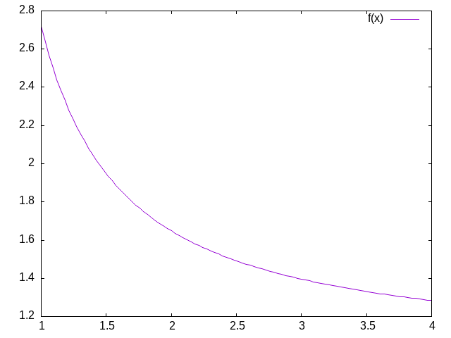

#+STARTUP: nofold hideblocks
#+options: ':nil *:t -:t ::t <:t H:3 \n:nil ^:t arch:headline
#+options: author:t broken-links:nil c:nil creator:nil
#+options: d:(not "LOGBOOK") date:t e:t email:nil expand-links:t f:t
#+options: inline:t num:t p:nil pri:nil prop:nil stat:t tags:t
#+options: tasks:t tex:t timestamp:t title:t toc:t todo:t |:t
#+date: Winter 2025
#+title: CPMS 01
#+author: Britt Anderson
#+email: britt@uwaterloo.ca
#+language: en
#+select_tags: export
#+exclude_tags: noexport
#+creator: Emacs 30.0.92 (Org mode 9.7.11)
#+latex_class: article
#+latex_class_options:
#+latex_header:
#+latex_header: \usepackage{svg}
#+Latex_Header: \usepackage{mdframed}
#+latex_header: \usepackage{hyperref}
#+latex_header_extra: \newmdenv[linecolor=red,frametitle=Class Discussion]{cdbox}
#+latex_header_extra: \newmdenv[linecolor=red,frametitle=Further Class Discussion]{fcdbox}
#+description:
#+keywords:
#+subtitle: One
#+latex_footnote_command: \footnote{%s%s}
#+latex_engraved_theme:
#+latex_compiler: pdflatex
#+bibliography: /home/britt/gitRepos/masterBib/bayatt.bib
#+cite_export: csl /home/britt/gitRepos/brittsite/assets/chicago-fullnote-bibliography.csl

**  Is Cognition Computation?
*** Reviewing Last Week's Exercises and Assignments
1. Reading Discussions
2. Sharing Posters
3. Revisiting some of our [[file:zero.org::#zero-high-level][key questions]] from last week. 

*** Some Additional Questions For Computational Cognition:
  1. Is the brain a computer?
  2. What does it mean for something to be computable?
  3. What is the computational theory of mind, and what does it mean for us practically?

*** What Is Cognition?
:PROPERTIES:
:CUSTOM_ID: abc123
:ID:       264cc60d-3fbf-40cd-ba21-a299803df658
:END:
The technical challenges for modeling in psychology are mastering the mathematics and programming necessary to formally express an idea and to implement a simulation to examine the consequences. The conceptual challenge is to decide what it is you are modeling. And it appears that there is no consensus on what is cognition[cite:@bayne19_what_is_cognit].\marginpar{\raggedright Which of these opinions, if any, do you agree with and why?}.

In the late 1800s Ebbinghaus, using creative, and for their time, [[https://youtu.be/TGGr5Uc8_Bw][innovative, Herculean methodologies]], demonstrated that the proportion of items retained in memory declines predictably over time. The form of the forgetting curve is exponential. 

\marginpar{\raggedright Is a mathematical formula that reproduces an observed behavioral pattern a model?}

#+Name: forgetting-curve
#+caption: By The original uploader was Icez at English Wikipedia.
file:figs/Forgetting_curve_decline.svg

#+begin_src gnuplot :file my-data-plot.png
  reset
  set xrange[1:4]
  f(x) = exp(1.0 / x)
  plot f(x) 
#+end_src

#+Name: exponential-function
#+Caption: Plot of \( e^{\frac{1}{x}} \).
#+RESULTS:

What can we infer from the similarity between Figure [[exponential-function]] and Figure [[forgetting-curve]]?

*** Cognition is ... ?

As revealed in [cite:@bayne19_what_is_cognit] there are a wide array of views on what is cognition\marginpar{\raggedright Which of these opinions, if any, do you agree with and why?}.

*** Is Cognition Computational?
  1. Is there anything a human can think that a computer cannot compute?
  2. What does it mean for a function to be "computable"?
  3. What does it mean to say that cognition is computational?
  4. What implications does the answer have for modeling cognition?

**** Introduction
Is there a difference between computational cognitive neuroscience and cognitive computational neuroscience? The former seems to suggest that we are interested in explaining cognition directly from the actions of neurons and then using computational tools as adjuncts to aid this attempt. On the other hand, when you reverse the order it seems as if you are trying to explain thinking via the computational accounts of neuronal function. The latter seems to require a clear link between notions of computation and models of thinking. To use Marr's three levels as a scaffold[cite:@McClamrock_1991]\marginpar{\raggedright This reference is an older one, and not the original, but it does use LISP as its example, which is the classic example of good old fashioned AI.}; we are taking neurons as our implementation, positing algorithms for them, and assuming that computational principles populate the level of our cognitive abstractions. Measures of success depend on the meanings of terms.

Behind all of this is the idea that if you want to understand /mind/ you need to first develop a /theory/. Explanations offered in words only are really more proto-theories than theories because of their imprecision. To express a theory clearly and unambiguously you need to /formalize/ it. Either you express it as /math/ or you can /code/ it. Let's explores the distinction between computation as implementation and computation as the basis for mind\marginpar{\raggedright What are Marr's three levels?}.

***** Computing in Minds and Computers

One definition of whether something is computable is whether there exists a Turing Machine that can compute it. Although most of us learned the name "Turing" in the context of whether a computer has human intelligence, the so-called /Turing test/, the model of Turing computability emerged from thinking about humans computing[cite:@Turing_2004][fn:5]

****** What is a Turing machine? Some Background and Details
[[https://turingarchive.kings.cam.ac.uk/publications-lectures-and-talks-amtb/amt-b-12][Turing machines]] are quite simple implements. While one can build a physical Turing machine, the more usual sense of the term is for a hypothetical computer that is comprised of:
  1. a finite alphabet,
  2. a finite set of states,
  3. the capacity to read and write to a single location in memory, and the ability to adjust the memory location immediately left or right or to make no move at all, and
  4. a set of instructions (or "machine table") that translates the combination of the current state and the current symbol to a new state and one of the acceptable actions.

******* Classroom Activity
Let's develop pseudo-code for the implementing a Turing Machine

****** The Lambda Calculus
  
Another model of computation is the /lambda calculus/[fn:1].

The lambda calculus was developed as a theory of functions. [[https://news.stanford.edu/news/2011/october/john-mccarthy-obit-102511.html][John McCarthy]] invented the computer programming language Lisp as a theoretical exercise for working on the theory of computable functions. He felt the Turing machine was too mechanical and too awkward for this sort of theoretical work. He wanted a better tool; a better metaphor. He adopted the lambda of the lambda calculus and the ~eval~ function to take in lisp programs and execute them. Later one of his [[https://en.wikipedia.org/wiki/Steve_Russell_(computer_scientist)][collaborators]] observed that it was relatively straightforward to implement this theoretical language as a real programming language. A bit more of the history this development can be found [[https://lwn.net/Articles/778550/][here]]. To get more details see [cite/t:see @michaelson11_lambd].

******* Some Details and Interesting Facts about the Lambda Calculus
1. There is not just one lambda calculus.
2. To have the lambda calculus you need to specify your algebra. What are the rules for reducing things (i.e. your computations), what are the allowed symbols, and what do things mean? A "lambda calculus" is a way of handling "lambda expressions."[fn:3]

******* Into the Weeds

*Terms* are either /simple variables/ e.g. $x$ or $y$ or /composite terms/ like \( \lambda~v~t_1 \). Having two terms next to each other \( t_1~t_2 \) means "apply" $t_1$ to $t_2$. The meaning of a term like \( \lambda~v~.~ t_1 \) is the value returned by the lambda abstraction. The meaning part is sometimes designated in writing by formulas using arrows, such as \(t_1~\rightarrow~t_2 \).[fn:2]

Functions have the form \lambda <name> . <body> . Note the "dot". This separates the name from the body of expressions that it names. <body> is also an expression (note the recursion that is built in).\marginpar{\raggedright What are recursive functions?}

Some "axioms" you supply, or that [[https://plato.stanford.edu/entries/church/][Alonzo Church]] did are:
- Beta reduction
  apply the function, e.g. (\lambda x.M) N = M[x:N] this latter is just a way of saying that you will substitute the value "N" everytime you see an "x" in whatever expression "M" is.
- Alpha conversion
  essentially you are just renaming variables
- Eta reduction
  Is a way of getting rid of things that don't change anything. If for example \(f(x) = g(x)\) then you could just save yourself some ink and write: f = g. A more technical way of saying things, that we will not go into, is that you can free yourself of free variables, that is if there is no "x" in "f" then \(f = \lambda x.(f x) \).
  
Your goal is often the *normal* form. A lambda term that cannot be reduced anymore. Think of it like simplifying an equation. It helps you get to the essentials, and can make it easier to compare things to see when they are the same. 

The equivalent of the halting problem for the Turing machine is the reaching of a /normal form/ in the  lambda calculus. 

******* Some Opportunities for Practice
- Write the lambda expression for the identity function?
  - But first we better decide what the identity function is?
- Apply the identity function to itself.
- What is the identity function in whatever language you are hoping to use?
- An interesting lambda expression is the "self-application" expression: \( \lambda~s . (s~s) \).
  - With pencil and paper try to:
    - apply this to the identity,
    - apply the identity to the self-application,
    - apply the self-application to itself. What is its termination status?

****** What are the differences?
We have seen Turing Machines and a Lambda Calculus. They look very different. Another model of computation that I have mentioned, but not presented is [[https://plato.stanford.edu/entries/recursive-functions/][recursive function theory]]. It looks different still.

#+begin_export latex
\begin{cdbox}[backgroundcolor=lightgray]
What does it mean for our idea that the mind is a "computer" if there are three different models of computation?
\end{cdbox}
#+end_export

Always question assumptions: [[https://en.wikipedia.org/wiki/Church%E2%80%93Turing_thesis][Church-Turing Conjecture]] . 
#+begin_export latex
\begin{fcdbox}[backgroundcolor=lightgray]
1. Are Turing machines /digital?

2. Is this an important distinction?

3. Does this mean that analog computations are omitted?

4. Would an analog paradigm be a better match to modeling mental activity?
\end{fcdbox}
#+end_export

***** Classical Computational Theory of Mind
#+begin_export latex
\begin{cdbox}[backgroundcolor=lightgray]
Does a computational theory of mind mean that minds are \href{https://plato.stanford.edu/entries/multiple-realizability}{multiply realizable} ?
\end{cdbox}
#+end_export

 The classical computational theory of mind says that in all important ways the mind is like a Turing machine. If we want to  model (or emulate) functions of mind one way would be to build a Turing machine. However, this can be a practical challenge, and one can question the insight gained from this approach. Still given the theoretical and practical prominence given to Turing computability it behooves us to know what a Turing machine truly is.
 
For something to be computatble the Turing machine that computes it must halt. So, we would like to know before we run our machine whether it will halt or not. Unfortunately, the answer to the halting problem is that we cannot know in advance, and in general, whether a Turing machine will halt. Computabilty is therefore /undecidable/.

***** Programming a Turing Machine: the Busy Beaver

In my experience the only way to really come to grips with what a Turing machine is is to program one yourself. For this exercise we will program a Turing machine to solve an elementary version of the Busy Beaver problem. This is a famous problem, because it is easy to state and woefully difficulty to answer. In fact it is [[https://jeremykun.com/2012/02/08/busy-beavers-and-the-quest-for-big-numbers/][incomputable]].

The following is a slightly formatted version of the [[https://en.wikipedia.org/wiki/Turing_machine#Description][Wikipedia description of a Turing machine]].
1. A Turing machine has n "operational" states plus a Halt state, where n is a positive integer, and one of the n states is distinguished as the starting state.
2. The machine uses a single two-way infinite (or unbounded) tape.
3. The tape alphabet is {0, 1}, with 0 serving as the blank symbol.
4. The machine's transition function takes two inputs:
   1. the current non-Halt state,
   2. the symbol in the current tape cell,
   3. and produces three outputs:
      1. a symbol to write over the symbol in the current tape cell (it may be the same symbol as the symbol overwritten),
      2. a direction to move (left or right@";" that is, shift to the tape cell one place to the left or right of the current cell), and
      3. a state to transition into (which may be the Halt state).

We will use it to guide us to write a simple instance that computes a solution to the Busy Beaver problem. A n-state Turing machine has \( (4n + 4)2n \)states. The formula is (symbols × directions × (states + 1))(symbols × states). The transition function (how to figure out where to go next may be seen as a finite look-up table. Each row of the table is a 5-tuple: (current state, current symbol, symbol to write, direction of shift, next state). Our goal with the Busy Beaver problem is to run our machine to produce as long a series of uninterrupted ones as we can and then *halt*.

What it means to "run" a Turing machine is to start in the starting state with the current tape cell being any cell of a blank (all-0) "tape", and then iterate the transition function. If the Halt state is entered then the number of 1s remaining on the tape is called the machine's score. Different transition rules will give us different outputs, so we can score our machine based on its performance. 

To restate in a more general way, the n-state busy beaver (BB-n) game is a contest to find an n-state Turing machine having the largest possible score — the largest number of 1s on its tape after halting. A machine that attains the largest possible score among all n-state Turing machines is called an n-state busy beaver, and a machine whose score is merely the highest so far attained (perhaps not the largest possible) is called a champion n-state machine.[fn:4]

****** A Busy Beaver Warm-Up

A simple version of the Busy Beaver problem, and one you can do by hand with pencil and paper, is the n=2 version. Create a Turing Machine with the following transition rules:

Here is the transition table for our machine:

| Machine Tuple In | Machine Tuple Out |
|------------------+-------------------|
| a0               | b1r               |
| a1               | b1l               |
| b0               | a1l               |
| b1               | h1r               |

****** Busy Beaver Problem Demo Code in Racket
Why Racket? Because I don't want you to copy my code. I want you to see the structure of how I approach the problem with this language so you can build your own version in another language.

#+Name: tm-struct
#+caption: Making a Structure for Our Turing Machine
#+begin_src racket :exports code
(struct turing-machine (state tape head-location) #:transparent #:mutable)]
#+end_src

#+Name: tape-movement
#+caption: Moving our TM Along the Tape
#+begin_src racket :exports code
(define (move-left temp-tm )
   (let ([loc (turing-machine-head-location temp-tm)]
         [lst (turing-machine-tape temp-tm)])
      (if (= loc 0)
	  (set-turing-machine-tape! temp-tm (cons 0 lst))
	  (set-turing-machine-head-location! temp-tm (- loc 1)))))
  
(define (move-right temp-tm )
   (let ([loc (turing-machine-head-location temp-tm)]
         [lst (turing-machine-tape temp-tm)])
     (when (= (+ loc 1) (length lst))
       (set-turing-machine-tape! temp-tm (append lst (list 0))))
     (set-turing-machine-head-location! temp-tm (+ loc 1))))

(define (move tm dir)
  (cond
    [(equal? dir 'left) (move-left tm)]
    [(equal? dir 'right) (move-right tm)]
    [else (error "illegal direction")]))
#+end_src

#+Name:helper-fxns
#+Caption: Helper Functions
#+begin_src racket :eval never :exports code
(define (tm-equal-state-value tm state value)
  (and (equal? (turing-machine-state tm) state)
       (= (list-ref (turing-machine-tape tm) (turing-machine-head-location tm)) value)))

(define (upd-tape-location tm value)
  (set-turing-machine-tape! tm (list-set (turing-machine-tape tm) (turing-machine-head-location tm) value)))

(define (pretty-print-tm tm)
  (display (format "state:~a, tape: ~a, head: ~a\n" (turing-machine-state tm) (turing-machine-tape tm) (turing-machine-head-location tm))))]
#+end_src

#+Name:rules
#+Caption: Rules are the Critical Part of This Machine
#+begin_src racket :eval never :exports code
(define (rule tm) ;;state value
    (cond
      ((tm-equal-state-value tm 'a 0)
       (set-turing-machine-state! tm 'b)
       (upd-tape-location tm 1)
       (move tm 'right))
      ((tm-equal-state-value tm 'a 1)
       (set-turing-machine-state! tm 'b)
       (upd-tape-location tm 1)
       (move tm 'left))
      ((tm-equal-state-value tm 'b 0)
       (set-turing-machine-state! tm 'a)
       (upd-tape-location tm 1)
       (move tm 'left))
      ((tm-equal-state-value tm 'b 1)
       (set-turing-machine-state! tm 'h)
       (upd-tape-location tm 1)
       (move tm 'right))))
#+end_src

#+Name: n2run
#+Caption: An n=2 run through
#+begin_src racket :eval never :exports code
(define (busy-beaver-2-do tm)
  (pretty-print-tm tm)
  (do ([i 0 (+ i 1)])
    ((equal? (turing-machine-state tm) 'h)
     (display (format "Loops equaled ~a\n" i)))
    (rule tm)
    (pretty-print-tm tm))
  tm)
#+end_src

#+Name: testing
#+Caption: Testing The TM Busy Beaver
#+begin_src racket :eval never :exports code
(begin
  (require "./code/tm.rkt")
  (define initial-turing-machine (turing-machine 'a (list 0) 0))
  (define working-tm (struct-copy turing-machine initial-turing-machine))
  (busy-beaver-2-do initial-turing-machine))]
#+end_src

**** Busy Beaver Homework
See Dropbox on Learn

You might find the [[https://github.com/brittAnderson/compNeuroIntro420/blob/w2025/rb/code/tm.rkt][racket source]] useful for hints.

*** Planning for next time
See if you can get a sense of what /functionalism/ means. 

*** Footnotes

[fn:5] A nice short version of this history can be found in this [[https://link.springer.com/content/pdf/10.1007/978-3-642-31933-4.pdf][pdf]].
 
[fn:4] Much of this description of the Busy Beaver problem is lightly edited Wikipedia material. 

[fn:3] The \lambda of lambda calculus doesn't really mean anything.It just signals that you have a lambda expression. Its creation as the symbol for the function calculus was an accident of notation and the limits of older typewriters.
 
[fn:2] Want to try implementing the lambda calculus yourself? Here is a [[https://flownet.com/ron/lambda-calculus.html][blog post]] on doing this in the computer language Common Lisp. 

[fn:1] And yet another is the /theory of recursive functions/ 
