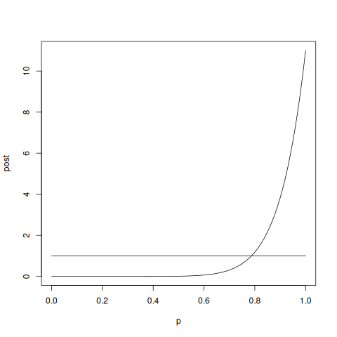
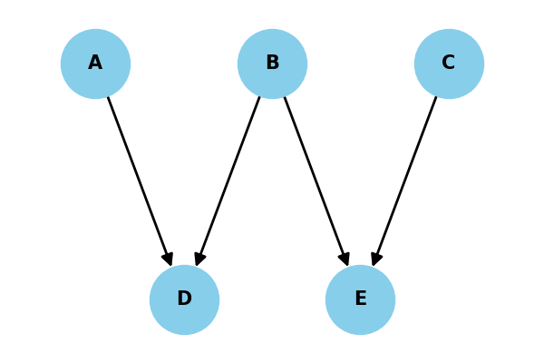
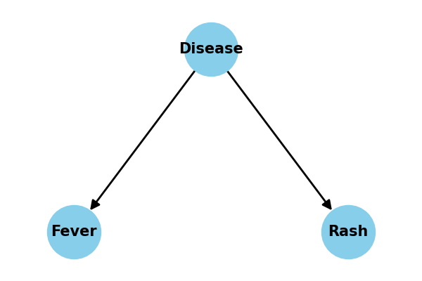
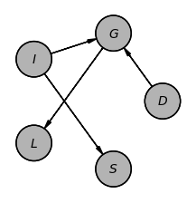

#+STARTUP: nofold hideblocks
#+options: toc:nil
#+Title: CMPS 06
#+author: Britt Anderson
#+date: Winter 2025
#+latex_header: \usepackage{hyperref}
#+latex_header: \usepackage{amsmath}
#+latex_header: \usepackage{amsthm}
#+LATEX_HEADER: \usepackage{mdframed}
#+Latex_header: \usepackage{tcolorbox}
#+Latex_header: \usepackage{svg}
#+latex_header: \usepackage[T1]{fontenc}
#+LATEX_HEADER: \renewenvironment{quote}{\begin{mdframed}[backgroundcolor=gray!10]}{\end{mdframed}}
#+latex_header_extra: \newtheorem{definition}{Definition}
#+latex_compiler: xelatex
#+HTML_HEAD: 
#+bibliography: /home/britt/gitRepos/masterBib/bayatt.bib
#+cite_export: csl /home/britt/gitRepos/brittsite/assets/chicago-fullnote-bibliography.csl

* Probability and Boolean Logic

** Are we optimal?

*** Ellsberg Paradox[cite:@Moscati_2024]

Imagine that you are faced with an urn. You know that it contains 30 red marbles and 60 marbles that are either yellow or black in some combination.

If I offered you the following bet which would you chose?
- I will pay you $100 if you draw a red marble
- Or I will pay you $100 if you draw a black marble.

Consider a different bet.
- I will pay $100 for if you draw either a red or yellow marble,
- Or I will pay $100 for either a black or yellow marble.

Which of these two bets would you prefer to take?

Most people in the first scenario prefer to bet on red. This implies
that the value of red choice is in some sense worth more to them, i.e.

p(Red) \(>\) p(Black).

In the second scenario, most prefer the black and
yellow combination, i.e.

p(Black) +p(Yellow) \(>\) p(Red) + p(Yellow),

but since the number of yellow balls, whatever it may be, is the same,
we can remove these (we may subtract whatever we want from one side of
an equation as long as we subtract it from the other side as well). This
leaves us with the conclusion that

p(Black) \(>\) p(Red),

contradicting
what we apparently believed from our choice of bets in the first
scenario.

The usual explanation for this paradox is ambiguity aversion[cite:@Halevy_2007].

*** St. Petersburg Paradox

Let's try another example: A casino offers a game of chance for a single
player in which a fair coin is tossed at each stage. The pot starts at 1
dollar and is doubled every time a head appears. The first time a tail
appears, the game ends and the player wins whatever is in the pot. Thus
the player wins 1 dollar if a tail appears on the first toss, 2 dollars
if a head appears on the first toss and a tail on the second, 4 dollars
if a head appears on the first two tosses and a tail on the third, 8
dollars if a head appears on the first three tosses and a tail on the
fourth, and so on. How much would YOU pay to play this game?

What is the expected value of playing the game? Expected value is
closely related to the idea of an average or the mean. You weight each
outcome by its probability. What is the outcome here?

Your winning is \(2 \times \; \mbox{number of coin tosses} \; - 1\) and
you have to multiply this by the probablity of each:
\(1/2 \times \; \mbox{number of coin tosses}\).

Put it altogether and you get:

Expected Value of the Game
\(= 1/2 \times 1 + 1/4 \times \;  2 + 1/8 \times \; 4 ...\) which is
equal to infinity. Why don't we choose play this game at any cost?

*** Comment                                                        :noexport:
Hopefully at this point can get them to talk about utility, and
distrust, and other things, but the point is that it is probability that
gives us the language to express these ideas.

So, how can we formalize our ideas about probability? Make comment
distinguishing probability from statistics. How can we use them in our models. 

** Some of the Mathematical Jargon of Probability 
*** Probability as Counting

Probability theory can be thought of as measuring the size of a set.
What is the probability that a coin in my pocket is a nickle? That
depends on the size of the set that is the set of all coins that are in
my pocket and how many coins are in the subset of coins that are nickles
and that are in my pocket. Those two numbers are counting measures.
Their ratio is a probability. Below, I briefly consider these ideas,
sets and measures, more generally.

**** Set Terminology
:PROPERTIES:
:CUSTOM_ID: set-terminology
:END:
Set theory is a subdivision of mathematics, and sets have allowed
mathematicians to formalize their knowledge of many common mathematical
concepts including probability, logic, computability, and even the
concept of infinity (e.g. it allows us to prove that some infinities are
bigger than others). Even though mathematical sets can be used for very
complex exercises, they are basically an extension of our intuitive idea
of a set gathered from real world collections (like a dining room set).

The basic terms important for understanding sets are,

- Set:  :: An unordered collection of elements

- Element:  :: An indivisible thing.

- Membership:  :: Denoted by \(\in\), it means is a member of or belongs
  to. For example, orange \(\in\) Fruit.

- Union:  :: Denoted by \(\cup\). Everything thrown together. For
  example
  \(\left\{1,2,3\right\} \cup \left\{3,4,5\right\} = \left\{1,2,3,4,5\right\}\).

- Intersection:  :: Denoted by \(\cap\). Only those elements that are in
  both sets. For example
  \(\left\{1,2,3\right\} \cap \left\{3,4,5\right\} = \left\{3\right\}\).

- Cardinality:  :: This is the size of a set, and it is what we use as
  our counting measure. It is usually represented using the same symbol
  used to show absolute value (\(\left |{S}\right |\)). This makes sense
  when you think of absolute value as the "size" of a number; -3 is
  still three units big, the negative sign just says which way to go on
  the number line when we lay out the units.

Other concepts can be defined from combinations of these basic ideas.

** Probability as a Measure of Set Size
:PROPERTIES:
:CUSTOM_ID: probability-as-a-measure-of-set-size
:END:
Previously I mentioned the idea of a metric. A related concept is that
of /measure/. I have used this word a number of times, and you probably
inferred its meaning from conventional uses. A measure tells you how big
something is. A teaspoon is a measure and there are three teaspoons in a
tablespoon. A mathematical measure is essentially the same idea. Where
metrics quantify distances, measures quantify size.

Individual outcomes, the elements of our set of interest, are often
symbolized by a lower case omega \(\omega\) while the entire set of all
possible outcomes is symbolized by a capital omega \(\Omega\).

Just as there is more than one kind of metric, there is more than one
variety of measure (e.g. volume, area, Lebesgue). With sets we can often
use the counting measure to quantify a set's size. The size of a set is
the number of things it contains. To see how we can use this to derive a
probability consider the trivial question: what is the probability of
flipping a fair coin and having it land "heads."

To answer this question we need to define a /probability space/. A
probability space is a mathematical object that has three different
parts. One part is the set of all possible outcomes. Another part is the
measure that we use for quantifying the size of sets. And last we have a
collection of all the subsets (we will call each of these subsets an
/event/) that together comprise all the possible subsets of our set of
all possible outcomes.

I have simplified things somewhat. It could be worse.

To figure out a probability, we compute the measure of our event of
interest (the size of the subset of possible qualifying outcomes) and
compare it to the size of the set of all possible outcomes. For the
simple situation currently under consideration there are only two
possible outcomes: head = H, or tail = T. The subset containing our
event is \(\left \{ H\right\}\). It has measure 1. The measure of the
set of all possible outcomes \(\left \{ H, T\right\}\) is two, and the
ratio is \(1/2\), thus our probability is 0.5.

To repeat, for the mathematician, probability is a measure on the sizes
of sets. If that is too abstract for you then buckle up. For the
mathematician a random variable is a function. Remember functions are
machines for turning inputs into outputs. The functions that are random
variables take the abstract little entities that are our outcomes and
turn them into real numbers on the number line. We can then define
events by reference to these numbers. For example, an event could be the
subset of all outcomes whose value after being crunched by a random
variable function was between two values. Things like this are
represented by notations that look like:
\[Prob(1 \le X < 2) = | \{ \omega \in \Omega \mbox{ s.t. } X ( \omega ) \le 1 \; \& \; X ( \omega ) < 2 \} |.\]
All this says is that our probability of observing some random variable
have a value between one and two is equal to the measure of the subset
of all possible outcomes that when run through the random variable
machine \(X\) have a value between one and two. Usually this complicated
way of stating the obvious is not necessary, but it can be very helpful
to return to this definition when considering complex cases just as it
was useful to return to the definition of the derivative when trying to
understand how we could numerically simulate simple differential
equations.

*** Exercise Class
:PROPERTIES:
:CUSTOM_ID: exercise-class
:END:
By writing out all possible \(\omega\)'s, determine the probability of
getting 2 or more heads from four flips of a fair coin.

** Conditional Probability
:PROPERTIES:
:CUSTOM_ID: conditional-probability
:END:
Tell them a little bit about the notation and what it means.

When we say that something is conditional, we mean that it depends on
something else. A child gets their allowance if they clean their room.
The allowance is conditional on the clean room variable being TRUE. The
notation for conditional probability typically uses a "pipe": "|". It is
defined as, \[P(B|A) =  \frac{P(B\cap A)}{P(A)}.\]

Give them the visual.

To continue with our set based view of probability, the equation of
conditional probability means that we compare the measure of the subset
of outcomes that are in both subsets \(B\) and \(A\) divided by the
measure of the subset of outcomes that belong to the subset after the
pipe, in this case \(A\). You can also think of this visually.

#+caption:  Joint and Conditional Probability --- Set View. The
rectangle represents all possible outcomes. The event defined by \(A\)
is the subset of outcomes for which \(A\) is true. Similarly for \(B\).
The overlap defines their /joint/ probability and the ratio of the
measure of their intersection to the measure of \(A\) defines the
conditional probability of \(B\) given \(A\).
<<fig:condprob>>

#+begin_center
#+end_center

#+begin_center

Exercise: Compute a Conditional Probability

#+end_center

Demonstrate your understanding of the formula for conditional
probability, by computing the probability of getting two or more heads
in four flips given that there cannot be two heads in a row. The use of
the word "given" is a common equivalent to the the phrase "conditional
on". It may be helpful to actually write out all the possible
\(\omega\)s and circle the subsets defined by the events.

** Bayes' Rule
:PROPERTIES:
:CUSTOM_ID: bayes-rule
:END:
A little bit about the history? Reverend Bayes? Posthumous publication.

Bayesian probability is commonly used in psychology and neuroscience,
but it is used in two largely different ways. One way that Bayesian
probability is used is to expand the types of statistical tests that are
employed when performing data analysis. This is often referred to as
/Bayesian inference/. The other way that Bayesian probability is used is
as a model for how /rational/ actors use information.

In the method of /maximum likelihood/ we try to figure out what is the
most likely underlying hypothesis that would explain the data we
observe. What we do with Bayesian probability is to expand this
calculation to weight the possible hypotheses by how likely we thought
they were before we observed any data.

Imagine that you see a cloud on the horizon. It is a dark cloud, the
kind you would normally associate with rain. How likely is it that it
will rain? What if you are in Saudi Arabia? What if you are in Britain?
Your answers should be very different in the two locations. Rain is much
more likely in Britain, and therefore your /posterior/ estimate of rain
should be greater when you are in Britain, even when observing the same
cloud. This is the intuition behind Bayesian probability. Observations
and their implications are combined with prior estimates.

As a formula Bayes Rule is, \[P(H|O) =  P(O|H)P(H)/P(O)
\label{eqn:baye}\]

where the \(O\) represents our observations and the \(H\) represents our
hypotheses. Note that which one is on top, the \(O\) or \(H\), flips
between the right and left hand side of the equation. We are interested
in how our belief in the various hypotheses changes given our
observations. To determine this we can multiply how likely the
observations would have been assuming particular hypotheses (this term
is sometimes called the /likelihood/ and may be written
\(\mathcal{L}(O,H)\)) by how likely they were to start with (this is
called the /prior/). What we get out of this calculation, since it comes
after we modify the prior, is the /posterior/.

Frequently, one may see statements of Bayes Rule that look like
\[P(H|O) \propto  P(O|H)P(H).\label{eqn:bayeApprx}\] Note that we do not
have an equal sign, but a sign for "proportional to." When using Bayes
rule in practice we are usually trying to estimate the probability of
our hypothesis given some data. The data does not change, so the
\(P(O)\) is the same for all estimates of the parameters of \(H\).
Therefore, the ordering of all the posteriors does not change simply
because we divide them all by the same constant number. Our most
probable values for \(H\) will still be the most probable, and so we can
often ignore the term \(P(O)\).

Bayes' rule is basically an instruction on how to combine evidence. We
should weight our prior beliefs by our observations. It is important to
remember what the \(P\)'s mean in the equation. These are distributions,
not simple numbers but functions. This means that if our prior belief is
very concentrated, and our likelihood very broad, we should (and the
equation determines that we will) give more weight to the prior (or vice
verse). We wait the evidence based on its quality. Much work in
psychology is devoted to determining if this optimal method of evidence
combination is actually the way humans think.

Efforts to incorporate this idea into psychology:
[[http://www.cambridge.org/gb/knowledge/isbn/item1119492/?site_locale=en_GB][Perception as Bayesian Inference]]

Example of using Bayesian Inference. A classical problem associated with
LaPlace (alot of the example here comes from the site:
[[https://web.archive.org/web/20150418143843/www.bayesian-inference.com/sunriseproblem][The sunrise problem in code]] and a [[https://www.freecodecamp.org/news/will-the-sun-rise-tomorrow-255afc810682/][folksy version]]).

Here is some R code for demonstrating this. I can type these live.

#+begin_src R :session *sunrise* :results graphics file output :file ./images/sunrise.png :exports both
prior.successes <- 0
prior.failures <- 0
alpha <- prior.successes+1
beta <- prior.failures+1
prior.mu <- alpha/(alpha+beta)
prior.mu
successes <- 1
failures <- 0
p <- seq(from = 0, to = 1, by = 0.01)
p
prior <- dbeta(p,alpha,beta)
plot(prior,type = "l")
post <- dbeta(p,alpha + successes,beta+failures)
plot(post, type = "l")
post.mu <- (alpha + successes )/ (alpha + successes + beta + failures)
post.mu
successes = 10
post <- dbeta(p, alpha + successes, beta+failures)
plot(x = p,post, type = "l")
lines(x=p,y=prior)
#+end_src

#+Name: sunrise
#+Caption: Simple coded example of how an event's calculated probability rises with the number of repeated observations. 
#+RESULTS:

** Humans Are Not Rational
:PROPERTIES:
:CUSTOM_ID: humans-are-not-rational
:END:
A lot of recent psychological work evaluates the idea of us as ideal or
optimal learners; that we use probability in a perfect way. But are we
really?

While Bayesian models are common, and there are many areas where near
optimal behavior is observed, there are a number of observations that
challenge the claim that humans are probabilistically sophisticated. In
fact, we can easily be shown to be inconsistent. The Ellsberg paradox
above is one example of this, but there are many others. One of the
benefits of having some familiarity with the language of probability is
that it allows one to construct probabilistic models, but another
advantage is that it gives one the basis for constructing and evaluating
experiments designed to test the ability of humans to reason under
uncertainty. A famous example of this comes from the /conjunction
fallacy/.

#+begin_center
Exercise: Conjunction Fallacy

#+end_center

Poll a group of your friends on the following question:

"Linda is 31 years old, single, outspoken, and very bright. She majored
in philosophy. As a student, she was deeply concerned with issues of
discrimination and social justice, and also participated in anti-nuclear
demonstrations."

Which is more probable?

1. Linda is a bank teller.

2. Linda is a bank teller and is active in the feminist movement.

Many people choose bank teller and feminist. Consider this response from
the point of view of probability, sets, and counting. For the sets of
all people and all occupations there is a set of events that correspond
to bank teller and to feminist. Since not all bank tellers are feminists
the intersection of the subsets feminist and bank teller must be no
larger than the subset of bank teller alone. Thus, the size (measure) of
the conjunction bank teller /and/ feminist is less than bank teller by
itself. Thus, the probability of the first statement is larger than the
second. So why do people routinely pick the second?

There is a large body of research following up on the observation of the
conjunction fallacy. One popular account holds that the conjunction
fallacy arises from humans equating the probability of an outcome with
its /typicality/; the more typical something is, the more probable we
estimate it to be. We feel that for someone with Linda's earlier social
preferences, the characteristic of being a feminist is more typical, and
so we rate it as more probable. For developing computational modeling
skills it is not critical what the answer is to the conjunction fallacy.
What is critical, is that it is only from our familiarity with the
axioms of probability and what it actually means mathematically that we
can perceive human responses as a possible fallacy. Without this
computational vocabulary we cannot detect the paradox nor design
experiments or models to explain it.

At this point, I could go on to the Boolean section if time permits, but
I am not writing that up now. Our goal for next week will be to get
everyone working with the psychopy to make a simple Posner task, the
then we can think about doing some random walk analysis and ez diffusion
the week after, and I can try to fit the Boolean material in there
somewhere.

** Bayes Networks[fn:1]

Bayes nets are a way to graphically represent what we take to be the relational, usually causal, structure between pieces of an overall probabilistic puzzle. They are customarily represented like a graph and the edges have directions. Hence you will frequently see them referred to as *DAGs* (Directed Acyclic Graphs).

Often they appear like this:

#+begin_src python :results graphics file output :file ./images/Basic.png :exports results :session *dags*
import networkx as nx
from matplotlib import pyplot as plt

Basic = nx.DiGraph()

# First row nodes
Basic.add_nodes_from(['A', 'B', 'C'])
# Second row nodes
Basic.add_nodes_from(['D', 'E'])

# Add edges
Basic.add_edges_from([
    ('A', 'D'),
    ('B', 'E'),
    ('B', 'D'),
    ('C', 'E')
])

# Define positions for nodes
pos = {
    # First row nodes
    'A': (0, 1),
    'B': (1, 1),
    'C': (2, 1),
    # Second row nodes
    'D': (0.5, 0),
    'E': (1.5, 0)
}

# Create figure and axis
plt.figure(figsize=(6, 4))

# Draw the graph
nx.draw(Basic, pos, 
        with_labels=True,  # Show node labels
        node_size=3000,    # Increase node size
        node_color='skyblue',
        font_size=15,
        font_weight='bold',
        arrowsize=20,      # Increase arrow size
        width=2)           # Increase edge width

# Add a title
plt.title("Causal Bayesian Network", fontsize=16)

# Show the plot
plt.tight_layout()
ax = plt.gca()
ax.margins(0.20)
plt.axis("off")
plt.savefig("./images/Basic.png")
#+end_src

#+Name: basic-bayes-net
#+Caption: A simple Bayes Net. In this example there is an influence of nodes A and B on D and of B and C on E. Associated to each edge, but not shown, is a probability distribution. 
#+RESULTS:

It is common to conflate Bayesian Statistics with Bayes Nets since they are named similarly, but in fact they are quite different. We use Bayesian statistics to infer certain things about our data, but we use Bayes Nets to represent. We may be representing our beliefs about the interrelationship about the nodes, and that the accuracy of that structure may be something we can test via /interventions/. Or we may simply be using it as a way to understand certain phenomena, such as /explaining away/.

Another notion common to a Bayes Net is that of efficiency. When you have a large number of variables the joint probabilty distribution can grow to be quite large. For example in Figure [[basic-bayes-net]] we would have to represent the complete joint probability of factors A, B, C, D, \& E as \( P(A)~P(B|A)~P(C|B,A)~P(D | C,B,A)~P(E|D,C,B,A) \), but since we know the structure is simpler we can actually represent the joint probability as \( P(D|A,B)~P(E|B,C)~P(A)~P(B)~P(C) \). We have many fewer terms to estimate. The advantage of this representation increases with the number of nodes and the sparsity of dependencies. 

A strong assumption of these models is the *Markov Assumption*. It says that we only ever need to go one node back. For example, it says that if you know the relation between a parent and child, then you never need worry about the grandparents since their /only/ contribution (under this assumption) is via the parent. In practice this works out well, usually, but it is not necessarily always the case. 

Graphs like these allow you to read off when two variables will be independent given your knowledge of other variables. For example consider the case where you have a disease that causes two symptoms: fever and rash. We imagine a structure like Figure [[disease-bayes-net]].

#+begin_src python :results graphics file output :file ./images/Disease.png :exports results :session *dags*
Disease = nx.DiGraph()

# First row nodes
Disease.add_nodes_from(['Disease'])
# Second row nodes
Disease.add_nodes_from(['Fever', 'Rash'])

# Add edges
Disease.add_edges_from([
    ('Disease', 'Fever'),
    ('Disease', 'Rash')
])

# Define positions for nodes
pos = {
    # First row nodes
    'Disease': (1, 1),
    # Second row nodes
    'Fever': (0.5, 0),
    'Rash': (1.5, 0)
}

# Create figure and axis
plt.figure(figsize=(6, 4))

# Draw the graph
nx.draw(Disease, pos, 
        with_labels=True,  # Show node labels
        node_size=3000,    # Increase node size
        node_color='skyblue',
        font_size=15,
        font_weight='bold',
        arrowsize=20,      # Increase arrow size
        width=2)           # Increase edge width

# Add a title
plt.title("Causal Bayesian Network (Disease)", fontsize=16)

# Show the plot
plt.tight_layout()
ax = plt.gca()
ax.margins(0.20)
plt.axis("off")
plt.savefig("Disease.png")
#+end_src

#+Name: disease-bayes-net
#+Caption: A Bayes Net representation of how a disease leads to two symptoms.
#+RESULTS:

If we know the disease status then the presence of fever and rash independent. The only way they influence each other is indirectly by both being caused by the disease. However, if we do /not/ know the disease status then knowing that a person has rash increases the probability they also have fever, because our imputed probability of disease is affected by knowing the status of the rash even though the causal influence goes in the opposite direction.

This is an example of *d-separation*. There are three basic cases to worry about. When two nodes are connected by a direct series of links then knowing any of the links in between them separates them and makes them independent. This is also the case when there is a common ancestor, as in the disease example. The tricky case that takes some time to think through is when the two nodes have a common descendant. It that case it is knowing the descendant that renders the ancestors independent.

ToDo: add a numerical explaining away example. For now can use the one from Prof. Goldwater's slides.

** Tutorial Experiments with Bayes Nets and Python

*** PGMPY
    [[https://github.com/pgmpy/pgmpy][PGMPY]] is a python library that does quite a bit more than just Bayes Nets [cite:@Ankan2024]. In fact, you can use it for structural equation modeling if that is your interest. We will barely scratch the surface, but you will end up knowing that it exists, and some of the elemental aspects of how to install it and use it in a minimal instance.

   
*** Installation
    Many python libraries have been written with particular versions of python in mind. You have to make sure that you have a python version installed that is compatible with the libraries you plan to use. PGMPY's compatabilty can be found on the [[https://pgmpy.org/started/install.html][installation page]].  One of the strength's of virutal environments is that they enable you to have multiple installed versions of python on your computer at any one time. When creating a virtual environment with =uv= you can specify which version  of python you want used for that environment, e.g. ~uv venv --python=3.10~. If after *activation* you then ~uv pip install pgmpy~ you will pull in a lot of rather large python dependencies. Be patient.

    
*** Bayesian Networks
    [[https://pgmpy.org/models/bayesiannetwork.html][Bayesian Networks]] (the library uses the full spelling) are a class in the pgmpy library. And an empty network can be initiated by,

    #+begin_src python :eval never :exports code
      from pgmpy.models import BayesianNetwork as bn
      G = bn()
    #+end_src

    Such a network can be grown by adding nodes or edges. In keeping with its identity as a Bayes Net the edges also carry conditional probability information.

    

#+begin_quote
*Classroom Activity*

The classroom activity will be to explore a simple Bayesian Network Model from the [[https://pgmpy.org/detailed_notebooks/2.%20Bayesian%20Networks.html][tutorial examples]] in the pgmpy library. As a first step explore the same networks available at [[https://www.bnlearn.com/bnrepository/]]. The library has a function to allow you rapidly import those examples. Try it. Below I show how. 

#+end_quote

#+begin_src python :session *dags* :exports both :results graphics file output :file ./images/cancer.png :python "/home/britt/gitRepos/compNeuroIntro420/w2025/.venv/bin/python"

  from pgmpy.utils import get_example_model
  cancer_model = get_example_model('cancer')
  cmd = cancer_model.to_daft()
  cmd.render()
  cmd.savefig("cancer.png")
#+end_src

#+Name: cancer-daft
#+Caption: This is a graphical plot of the example cancer model. Note that getting the pictures to show up can be problematic depending on which environment you choose to work in. For this example I used ~daft~. More options can be found on the Plotting Models page at the pgmpy library home page. If you use the ~nx.draw~ function you can also use matplotlib directly. 
#+RESULTS:
[[file:cancer.png]]

#+Name: BN-example-student
#+Caption: This is an example taken from the tutorial notebooks of the PGMPY library.
#+begin_src python :session *student* :exports both :results graphics file output :python "/home/britt/gitRepos/compNeuroIntro420/w2025/.venv/bin/python" :file ./images/students.png

    from pgmpy.models import BayesianNetwork
    from pgmpy.factors.discrete import TabularCPD
    
    # Defining the model structure. We can define the network by just passing a list of edges.
    model = BayesianNetwork([('D', 'G'), ('I', 'G'), ('G', 'L'), ('I', 'S')])

    # Defining individual CPDs.
    cpd_d = TabularCPD(variable='D', variable_card=2, values=[[0.6], [0.4]])
    cpd_i = TabularCPD(variable='I', variable_card=2, values=[[0.7], [0.3]])

    # The representation of CPD in pgmpy is a bit different than the CPD shown in the above picture. In pgmpy the colums
    # are the evidences and rows are the states of the variable. So the grade CPD is represented like this:
    #
    #    +---------+---------+---------+---------+---------+
    #    | diff    | intel_0 | intel_0 | intel_1 | intel_1 |
    #    +---------+---------+---------+---------+---------+
    #    | intel   | diff_0  | diff_1  | diff_0  | diff_1  |
    #    +---------+---------+---------+---------+---------+
    #    | grade_0 | 0.3     | 0.05    | 0.9     | 0.5     |
    #    +---------+---------+---------+---------+---------+
    #    | grade_1 | 0.4     | 0.25    | 0.08    | 0.3     |
    #    +---------+---------+---------+---------+---------+
    #    | grade_2 | 0.3     | 0.7     | 0.02    | 0.2     |
    #    +---------+---------+---------+---------+---------+

    cpd_g = TabularCPD(variable='G', variable_card=3,
                       values=[[0.3, 0.05, 0.9,  0.5],
                               [0.4, 0.25, 0.08, 0.3],
                               [0.3, 0.7,  0.02, 0.2]],
                      evidence=['I', 'D'],
                      evidence_card=[2, 2])

    cpd_l = TabularCPD(variable='L', variable_card=2,
                       values=[[0.1, 0.4, 0.99],
                               [0.9, 0.6, 0.01]],
                       evidence=['G'],
                       evidence_card=[3])

    cpd_s = TabularCPD(variable='S', variable_card=2,
                       values=[[0.95, 0.2],
                               [0.05, 0.8]],
                       evidence=['I'],
                       evidence_card=[2])

    # Associating the CPDs with the network
    model.add_cpds(cpd_d, cpd_i, cpd_g, cpd_l, cpd_s)

    # check_model checks for the network structure and CPDs and verifies that the CPDs are correctly
    # defined and sum to 1.
    model.check_model()
    sd = model.to_daft()
    sd.render()
    sd.savefig("students.png")
#+end_src

#+RESULTS: BN-example-student

#+begin_src python :session *student* :exports both :results output :python "/home/britt/gitRepos/compNeuroIntro420/w2025/.venv/bin/python" :warnings False
# CPDs can also be defined using the state names of the variables. If the state names are not provided
# like in the previous example, pgmpy will automatically assign names as: 0, 1, 2, ....

cpd_d_sn = TabularCPD(variable='D', variable_card=2, values=[[0.6], [0.4]], state_names={'D': ['Easy', 'Hard']})
cpd_i_sn = TabularCPD(variable='I', variable_card=2, values=[[0.7], [0.3]], state_names={'I': ['Dumb', 'Intelligent']})
cpd_g_sn = TabularCPD(variable='G', variable_card=3,
                      values=[[0.3, 0.05, 0.9,  0.5],
                              [0.4, 0.25, 0.08, 0.3],
                              [0.3, 0.7,  0.02, 0.2]],
                      evidence=['I', 'D'],
                      evidence_card=[2, 2],
                      state_names={'G': ['A', 'B', 'C'],
                                   'I': ['Dumb', 'Intelligent'],
                                   'D': ['Easy', 'Hard']})

cpd_l_sn = TabularCPD(variable='L', variable_card=2,
                      values=[[0.1, 0.4, 0.99],
                              [0.9, 0.6, 0.01]],
                      evidence=['G'],
                      evidence_card=[3],
                      state_names={'L': ['Bad', 'Good'],
                                   'G': ['A', 'B', 'C']})

cpd_s_sn = TabularCPD(variable='S', variable_card=2,
                      values=[[0.95, 0.2],
                              [0.05, 0.8]],
                      evidence=['I'],
                      evidence_card=[2],
                      state_names={'S': ['Bad', 'Good'],
                                   'I': ['Dumb', 'Intelligent']})

# These defined CPDs can be added to the model. Since, the model already has CPDs associated to variables, it will
# show warning that pmgpy is now replacing those CPDs with the new ones.
model.add_cpds(cpd_d_sn, cpd_i_sn, cpd_g_sn, cpd_l_sn, cpd_s_sn)
model.check_model()

model.get_cpds()
print(model.get_cpds('G'))

#+end_src

#+RESULTS:
#+begin_example
WARNING:pgmpy:Replacing existing CPD for D
WARNING:pgmpy:Replacing existing CPD for I
WARNING:pgmpy:Replacing existing CPD for G
WARNING:pgmpy:Replacing existing CPD for L
WARNING:pgmpy:Replacing existing CPD for S
+------+---------+---------+----------------+----------------+
| I    | I(Dumb) | I(Dumb) | I(Intelligent) | I(Intelligent) |
+------+---------+---------+----------------+----------------+
| D    | D(Easy) | D(Hard) | D(Easy)        | D(Hard)        |
+------+---------+---------+----------------+----------------+
| G(A) | 0.3     | 0.05    | 0.9            | 0.5            |
+------+---------+---------+----------------+----------------+
| G(B) | 0.4     | 0.25    | 0.08           | 0.3            |
+------+---------+---------+----------------+----------------+
| G(C) | 0.3     | 0.7     | 0.02           | 0.2            |
+------+---------+---------+----------------+----------------+
#+end_example

** Footnotes

[fn:1] Much of the tutorial material about Bayes Nets was taken from the [[https://www.inf.ed.ac.uk/teaching/courses/cm/lectures/cm15_bayesnet.pdf][nice lecture slides (pdf)]] of Prof. [[https://homepages.inf.ed.ac.uk/sgwater/][Sharon Goldwater]] of the University of Edinburgh.  
