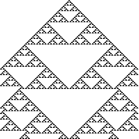
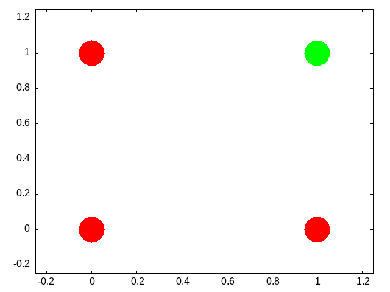
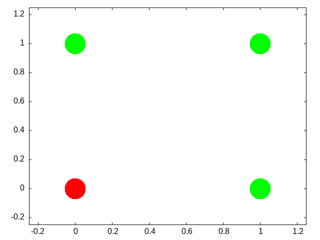
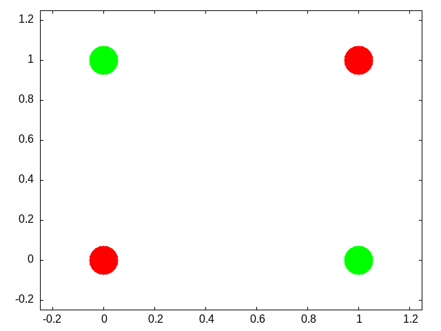

 #+STARTUP: nofold hideblocks
#+options: toc:nil
#+Latex_Header: \usepackage{mdframed}
#+latex_header: \usepackage{hyperref}
#+latex_header: \usepackage{amsmath}
#+latex_header: \usepackage{amsthm}
#+latex_header_extra: \newmdenv[linecolor=red,frametitle=Class Discussion]{cdbox}
#+latex_header_extra: \newmdenv[linecolor=red,frametitle=Further Class Discussion]{fcdbox}
#+latex_header_extra: \newtheorem{definition}{Definition}
#+bibliography: /home/britt/gitRepos/masterBib/bayatt.bib
#+cite_export: csl /home/britt/gitRepos/brittsite/assets/chicago-fullnote-bibliography.csl
#+Title: CPMS04
#+author: Britt Anderson
#+date: Winter 2025

** Neural Networks

Our goal here is to understand the basic mathematical objects and their notation that underlie neural networks. We want to have enough of a grasp to be able to code simple versions of them by hand. If you ever build a big model you will undoubtedly want to use the well established standard libraries, but for making design decisions, thinking about aberrant behavior, or even just conceiving the kind of network you want to build an how it will match your problem, you want a more fundamental and practical grasp of the pieces you will be putting together.

Our distal goal is to code the Hopfield Network, and ideally the Kohonen self-organizing map, but along the way we will first learn about vectors, matrices, scalar products, the perceptron, and learning rules. 

*** John Hopfield
To motivate our learning, and to put a human face on the project these two links give you a glimpse of Hopfield talking about his work at the 2024 Nobel Prize lectures, and a nice long podcast that gives a slow, throurough, tutorial discussion of what it is all about. We will come back to this later, but for now start listening. There is an associated homework. 

**** Nobel Prize
[[https://youtu.be/8SffhDk4mdU?feature=shared][John Hopfield's Nobel Lecture]]

**** Podcast on the Hopfield Network
This [[https://theoreticalneuroscience.no/thn22/][theoretical neuroscience podcast]] gives a nice long look at the Hopfield Network. It works up to its creation, its abstraction, and it social impact on shaping the field of computational neuroscience. It is long, but, if you make your way through it you will have a good overview of the model before you start coding it.

\begin{cdbox}
\begin{itemize}
\item{What is a neural network?}
\item{What mathematics are needed to build a neural network?}
\item{How can neural networks help us understand cognition?}
\end{itemize}
\end{cdbox}

*** Cellular Automata
\marginpar{\raggedright Match these features to facts about neurons. Extend them to what you believe will be their application in neural networks.} As a first illustration of some of the key ideas we will execute a simple cellular automata rule. What I hope to emphasize through this exercise is that whenever you can get the computer to do a repetitive task do so. It will do it much better than you. And even if it takes you days to get the program right for many task you will quickly save the time in the long run. Second, we are using a simple rule (as you will shortly see). But even though the rule is local it yields impressive global structure. And very slight tweaks in this local rule can lead to large macroscopic changes. While the variation in our rule is very limited the array of behaviors we can observe is vast. 

**** Drawing Cellular Automata

1. Pick a number between 0 and 255 inclusive. Tell it to me when I ask.
2. Compute your rule. You write the configurations on top, and you write the base two representation of your number below. Like this for rule number 110.
   
   | 111 | 110 | 101 | 100 | 011 | 010 | 001 | 000 |
   |-----+-----+-----+-----+-----+-----+-----+-----|
   |   0 |   1 |   1 |   0 |   1 |   1 |   1 |   0 |
3. Using your rule and your piece of graph paper start implementing your rule after coloring a single square in the middle of the top row "black" (equals 1).
4. Drop down one row and working from left to right color in the squares based on the three squares in the row above them.
5. The idea is something like this:
   #+Name: fig-grid
   #+Caption: An illustration of which three squares in the row above influence the coloring of your grid. 
   [[file:~/gitRepos/compNeuroIntro420/rb/images/grid.png]]
6. Do this for several rows. 

*What you probably noticed*

This process is tedious and mistake prone. One good reason for translating your theoretical ideas into code is so that you are not tripped up by such rote errors. Another thing to notice is that your "rule" is like a computer function. There is an input (the colors of the three squares above), processing, and an output of what color. In addition to this mechanical intuition a function can also be conceived as a set of pairs. The first element of the pair is the input, and the second element of the pair is the output.

#+Name: 22-cl-png
#+Caption: Invocation of Common Lisp Code for Generating a PNG file of Rule 22
#+begin_src lisp :results graphics file :file "~/gitRepos/compNeuroIntro420/w2025/images/r22.png" :exports both
  (load "/home/britt/gitRepos/compNeuroIntro420/codeLib/cl/cellular-automata.lisp")
  (in-package :CA)
  (rule-num-to-png 22 "./images/r22.png")
#+end_src

#+Name: r22-png
#+Caption: Rule 22
#+RESULTS: 22-cl-png

*Lessons Learned*
- Repetitive actions are hard. We (humans) make mistakes following even simple rules for a large number of repeated steps. Better to let the computer do it since that is where its strengths lie.
- Complex global patterns can emerge from local actions. Each neuron is only responding to its immediate right and left yet global structures emerge.
- These characteristics seem similar to brain activity. Each neuron in the brain is just one of many. Whether a neuron spikes or not is a consequence of its own state and its inputs (like the neighbors in the grid example).
- From each neuron making a local computation, global patterns of complex activity can emerge.
- Maybe by programming something similar to this system we can get insights into brain activity.

\begin{cdbox}
 There are [[file:~/gitRepos/compNeuroIntro420/codeLib/cl/cellular-automata.lisp][common lisp]], [[file:~/gitRepos/compNeuroIntro420/codeLib/rkt/ca.rkt][racket]], versions of this code. Can you write your own? Can you write code to automate your rule?
\end{cdbox}

*** More Lessons from Cellular Automata

Complex entities may have simple representations if the right language for expression can be found. Concision and repeatability are by-products. 

There are also more dynamic versions of this idea. The "[[https://en.wikipedia.org/wiki/Conway%27s_Game_of_Life][Game of Life]]" is one of the more famous.

Following up on the analogy to neurons, one humanity's most brilliant examples: John von Neumann, was working on a [[https://complexityexplorer.s3.amazonaws.com/supplemental_materials/5.6+Artificial+Life/The+Computer+and+The+Brain_text.pdf][book]] (see also the [[http://www.ams.org/bull/1958-64-03/S0002-9904-1958-10214-1/S0002-9904-1958-10214-1.pdf][commentary]]) about automata and the brain at the time of his death.

*** Linear Algebra
Show me the math!

The math at the heart of neural networks and their computer implementation is *linear algebra*. For us, the section of linear algebra we are going to need is mostly limited to vectors, matrices and how to add and multiply them.

\begin{cdbox}
What makes linear algebra linear?
\end{cdbox}

**** Important Objects and Operations
  - Vectors
  - Matrices
  - Scalars
  - Addition
  - Multiplication (scalar and matrix)
  - Transposition
  - Inverse

\begin{fcdbox}
Give a definition or description of each of these objects and operations.
\end{fcdbox}

#+begin_src lean :eval never :export source
def matA : Array (Array Int8) := #[#[1,2],#[3,4]] 

def matB : Array (Array Int8) := #[#[3,4],#[1,2]]

def addMat (m n : Array (Array Int8)) :=
  m.zipWith n
    (fun rm rn => rm.zipWith rn
      (fun a b => a + b))

#eval addMat matA matB

#+end_src

\begin{fcdbox}
Can you demonstrate that matrix multiplication is not commutative?
\end{fcdbox}

**** Thinking Abstractly
There are in fact many ways to think about what a vector is. It can be thought of as a column (or row of numbers). More abstractly it is an object (arrow) with magnitude and direction. Most abstractly it is anything that obeys the requirements of a [[https://en.wikipedia.org/wiki/Vector_space][vector space]]. 

For particular circumstances one or another of the different definitions may serve our purposes better. In application to neural networks we often just use the first definition, a column of numbers, but the second can be more helpful for developing our geometric intuitions about what various learning rules are doing and how they do it.  

Similarly, we may consider a matrix as a collection of vectors or it may be more convenient to think of it as a rectangular array of numbers.

\begin{cdbox}
What is the library or packge in the programming language that you will use for this course that has vectors and matrix functions?
\end{cdbox}

**** Common Notational Conventions for Vectors and Matrices

Vectors tend to be notated as /lower case/ letters, often in bold, such
as \textbf{a}. They are also occasionally represented with little
arrows on top such as \( \overrightarrow{\textbf{a}} \).

Matrices tend to be notated as /upper case/ letters, typically in bold,
such as \( \mathbf{M} \).

Good things to know: what is an inner product? How does it differ from a scalar product. Can you write code in your preferred language for the inner product?

*** Neural Networks Redux

*** What is a Neural Network?

What is a Neural Network? It is a brain inspired computational approach
in which "neurons" compute functions of their inputs and pass on a
/weighted/ proportion to the next neuron in the chain.

#+name:nn
#+caption: Simple schematic of the basics of a neural network. This is an image for a single neuron. The input has three elements and each of these connects to the same neuron ("node 1"). The activity at those nodes is filtered by the weights, which are specific for each of the inputs. These three processed inputs are combined to generate the output from this neuron. For multiple layers this output becomes an input for the next neuron along the chain.
[[file:~/gitRepos/compNeuroIntro420/rb/images/nn.png]]

**** Non-linearities
The spiking of a biological neuron is non-linear. You will see this in both the integrate and fire and Hodgkin and Huxley models you're going to program. For our neural networks we will usually use a /threshold/. When the threshold exceeds a certain value our activity will jump (or step) to a new value.

\begin{equation}
\mbox{if } I_1 \times w_{1,1} + I_2 \times w_{2,1} + I_3 \times w_{3,1} > \Theta \mbox{ then } Output = 1
\end{equation}

What this equation shows is that Inputs ("I"'s) are passed to a neuron (also called a node or sometimes unit). Those inputs have something like a synapse. That is designated by the w's for weights. Those weights are how tightly the input and internal activity of our artificial neuron are coupled. The reason for all the subscripts is to try and help you see the similarity between this equation and the inner product and matrix multiplication rules you just worked on programming. The activity of the neuron is a sort of internal state, and then, based on the comparison of that activity to the threshold, you can envision the neuron spiking or not, meaning it has value 1 or 0. Mathematically, the weighted sum is fed into a threshold function that compares the value to a threshold ( \( \Theta \) ), and passes on the value 1 if it is greater than the threshold and 0 (sometimes -1) for the inactive state.

To prepare you for the next steps in writing a simple perceptron (the earliest form of artificial neural network), you should try to answer the following questions.

\begin{cdbox}
Questions:
\begin{itemize}
\item{What, geometrically speaking, is a plane?}
\item{What is a hyperplane?}
\item{What is linearly separability and how does that relate to planes and hyperplanes?}
\end{itemize}
\end{cdbox}

One of our first efforts will be to code a /perceptron/ to solve the XOR problem. In order for this to happen you should know a bit about /Boolean/ functions and what an XOR problem actually is. 

***** Examples of Boolean Functions and How They Map onto our Neural Network Intuitions

- The "AND" Operation/Function ::
  #+Name: and
  #+caption: The /and/ operation is true when both its inputs are true.
  #+begin_src gnuplot :var data="and.txt" :file my-and.png
    reset
    set nokey
    set nocolorbox
    set palette model RGB defined ( 0 "red", 1 "green" )
    set xrange[-0.25:1.25]
    set yrange[-0.25:1.25]
    plot data u 1:2:3 with points ps 7 pt 7 lc palette variable
#+end_src

#+RESULTS: and

- The "OR" Operation/Function ::
  #+Name: or
  #+caption: The /or/ operation is true when either or both of its inputs are true.
  #+begin_src gnuplot :var data="or.txt" :file my-or.png
    reset
    set nokey
    set nocolorbox
    set palette model RGB defined ( 0 "red", 1 "green" )
    set xrange[-0.25:1.25]
    set yrange[-0.25:1.25]
    plot data u 1:2:3 with points ps 7 pt 7 lc palette variable
#+end_src

#+RESULTS: or

- The "XOR" Operation/Function ::
  #+Name: xor
  #+caption: The /xor/ operation one and only one of its inputs are true.
  #+begin_src gnuplot :var data="xor.txt" :file my-xor.png
    reset
    set nokey
    set nocolorbox
    set palette model RGB defined ( 0 "red", 1 "green" )
    set xrange[-0.25:1.25]
    set yrange[-0.25:1.25]
    plot data u 1:2:3 with points ps 7 pt 7 lc palette variable
#+end_src

#+RESULTS: xor

\begin{cdbox}
Can you draw the truth tables that match each of these graphs?
\end{cdbox}

This short [[https://doi.org/10.1038/nbt1386][article]] provides a nice example of linear separability and some basics of what a neural network is. 

**** Exercise XOR

  Using only *not*, *and*, and *or* operations draw the diagram that allows you to compute in two steps the *xor* operation. You will need this logic to code up a perceptron.

**** Connections
Can neural networks encode logic? Is the processing zeros and ones enough to capture the richness of human intellectual activity?

There is a long tradition of representing human thought as the consequence of some sort of calculation of two values (true or false). If you have two values you can swap out 1's and 0's for the true and false in your calculation. They even seem to obey similar laws. The conjunction (AND) of two true things is only true when both are true. If you take T = 1, then T AND T is the same as \( 1~\times~1 \).

  We will next build up a simple threshold neural unit and try to calculate some of these truth functions with our neuron. We will build simple neurons for truth tables (like those that follow), and string them together into an argument. Then we can feed values of T and F into our network and let it calculate the XOR problem.

**** Boolean Logic
George Boole, Author of the /Laws of Thought/.

[[https://archive.org/details/investigationofl00boolrich]]
[[https://plato.stanford.edu/entries/boole/#LifWor]]

****  First Order Logic - Truth Tables
An example *Or*

| First | Second | Truth |
|-------+--------+-------|
|     0 |      0 | nil   |
|     0 |      1 | t     |
|     1 |      0 | t     |
|     1 |      1 | t     |

*** Our First Neural Network: The Perceptron

In many ways the Perceptron can be regarded as the first neural network ever.

The perceptron (see Figure [[mark1]]) was the invention of a psychologist, [[http://dspace.library.cornell.edu/bitstream/1813/18965/2/Rosenblatt_Frank_1971.pdf][Frank Rosenblatt (pdf)]].  He was not a computer scientist. Though he obviously had a bit of the mathematician in him.

#+Name: mark1
#+caption: The Mark I computer for computing the perceptron's activity. Details can be found on [[https://en.wikipedia.org/wiki/Perceptron][Wikipedia's page]].
[[file:~/gitRepos/compNeuroIntro420/rb/images/Mark_I_perceptron.jpeg]]

For those of you interested in a very interesting, very long, reading might his 600 page [[https://babel.hathitrust.org/cgi/pt?id=mdp.39015039846566&view=1up&seq=9][Principles of Neurodynamics]] or this more accessible [[https://link.springer.com/book/10.1007/978-3-642-70911-1][historical review]].

But a good intuition for Rosenblatt's frame of mind with this research can be gained just from the foreword:

#+begin_quote
For this writer, the perceptron program is not primarily concerned with the invention of devices for "artificial intelligence", but rather with investigating the physical structures and neurodynamic principles which under lie "natural intelligence". A perceptron is first and fore most a brain model, not an invention for pattern recognition. As a brain model, its utility is in enabling us to determine the physical conditions for the emergence of various psychological properties.
#+end_quote

**** The Perceptron Rules
The algorithm the perceptron follows is simple enough to be done by hand. But before doing that take a minute to think what is trying to do. It is trying to go from one set of "weights" to another set of "weights". If you think of all the weights as coordinates in a Cartesian graph then you can visualize each cycle of updating as adding another point to the graph. Squint your eyes and the dots merge to a path. A path through the weight /space./ This is a dynamic process. A theme that we return to in a later Chapter (add link here).

In short, the perceptron "rules" are the equations that characterize what a perceptron should do when it gets some input, computes and output and learns if its guess is right or wrong. It revises its behavior based on this feedback, and thus can be said to learn. A lot can be done with these simple equations.

\( I = \sum_{i=1}^{n} w_i~x_i \)

If \( I \ge T \) then \( y = +1 \) else if \( I < T \) then \( y = -1 \)

If the answer was correct, then \( \beta = +1 \), else if the
answer was incorrect then \( \beta = -1 \).

The "T" in the above equation refers to the threshold. This is a user defined value that is usually set to zero for convenience. 

Updating is done by \( \mathbf{w_{new}} =
\mathbf{w_{old}} + \beta y \mathbf{x} \)

**** Be The Perceptron

This is a pencil and paper exercise. Before coding it is often a good idea to try and work the basics out by hand. This may be a flow chart or a simple hand worked example. This both gives you a simple test case to compare your code against, but more importantly makes sure that you understand what you are trying to code. Let's make sure you understand how to compute the perceptron learning rule, but doing a simple case by hand.

Beginning with an input of 0.3 0.7

And an initial set of weights of
-0.6 0.8

and a class of 1.

Compute the value of the new weight vector with pen and paper.

*Next steps.* Consider this as the data matrix where the first two elements in a row are the two inputs and the third element in a row is the "class" of the output.

\(\begin{bmatrix}
0.3 & 0.7 & 1.0 \\
-0.5 & 0.3 & -1.0 \\
0.7 & 0.3 & 1.0 \\ 
-0.2 & -0.8 & q-1.0
\end{bmatrix} \)

using the starting weight -0.6 0.8 try a few cycles through the data by hand and then move on to writing the perceptron rule into code so that you can automate the updating step. Racket code for some of these functions can be found [[file:~/gitRepos/compNeuroIntro420/codeLib/rkt/perceptron-rule.rkt][here]]. 

***** More Abstract Thinking
Each time through the perceptron rule new weights are computed. Imagine these two weights as coordinates for the head of a vector with its base at the origin of a Cartesian plane. Imagine as you iterate that you are rotating your weight vector around an origin.

The decision plane for your network is perpendicular to the vectors and is anchored at the bottom of the arrow. If you could compare this plane to the location of the data points you would see that the rule is learning to find the decision plane that puts all of one class on one side of the line and all of the other class on the other side. That is why it is limited to problems that are linearly separable.

****** Bias is a Good Thing (at least here it is)

These data were selected such that the base of the vector could separate them while anchored at zero. However, for many data sets you not only need to learn what direction to point the vector, but you also need to learn where to anchor the vector. This is done by including a @bold{bias weight}. Add an extra dimension to your weight vector and your inputs. For the inputs it will just be a constant value of 1.0, but this extra, bias weight, will also be learned and allows you to achieve, effectively, a translation away from the origin to be able to separate points that are more heterogeneously scattered. 

****** Geometrical Thinking
- What is the relation between the inner product of two vectors and the cosine of the angle between them?
- What is the *sign* for the cosine of angles less than 90 degrees and those greater than 90 degrees?
- How do these facts help us to answer the question above?
- Why does this reinforce the advice to think /geometrically/ when thinking about networks and weight vectors?

*** The Delta Rule - Homework

The *Delta Rule* is another simple learning rule that is a minimal variation on the perceptron rule. It is used more frequently, and it has the spirit of Hebbian learning, which we will learn more about soon. The homework asks you to write code to test and train an artificial neuron using the delta learning rule. 

- For an easy start create some pseudo random linearly separable points on a a sheet of paper. Label one population as *1* and the other population as *-1*.
- For a more challenging set-up create the data programmatically using random numbers and some method that allows you to vary how close or distant the points are to the line of separation, and how many points there are to train on.
- The Delta Learning rule is: \( \Delta~w_i = x_i~\eta(desired - observed) \)
- Submit your code that has your test data in it. Start with an initial random weight and use the delta rule to learn the correct weighting to solve all your training examples. Then test on a new set of points that you did not test on but that are classified according to the same rule. Your code should assess how well the trained rule classifies the test data.

# @section{Not all Networks are the Same}
# @itemlist[@item{Feedforward}
#                 @item{Recurrent}
#                 @item{Convolutional}
#                 @item{Multilevel}
#                 @item{Supervised}
#                 @item{Unsupervised}]

# The Hopfield network@~cite[hopfield-orig] has taught many lessons, both practical and conceptual. Hopfield showed physicists a new realm for their skills and added recurrent (i.e. feedback) connections to network design (output becomes input). He changed the focus from network architecture to that of a dynamical system. Hopfield showed that the network could remember and it could do some error correction, it could reconstruct the "right" answer from faulty input.

# @figure["fig:hopfield-net"
#         @elem{Hopfield Recurrent Connections}
#         @elem{@(hopfield-net)}]

# **** How does a network like this work?}
# @itemlist[@item{Each node has a value.}
#                @item{Each of those arrowheads has an associated weight.}
#                @item{The line with the "x" indicates that there are no self connections.}
#                @item{All other connections for all other units are present and go in both directions.}]

# **** Test your understanding:}
# @itemlist[#:style 'ordered @item{Tell me what the input for a network like this with four nodes should look like it terms of the linear algebra constructs we have talked about.}
#           @item{A weight is a number associated to each connection. Tell me what the weights should look like in terms of the linear algebra constructs.}
#           @item{How might we conceive of "running" the network for one cycle in terms
#    of the above.}]

# **** A Worked Example}
# Inputs can be thought of as vectors. Although I have drawn the network like a square that shape is really independent of the structure of data flow. Each node needs an input and each node will need a weighted contact to all the other nodes. Consider the following two input patterns and the following weight matrix.  
#   @($$ "A = \\{1,0,1,0\\}^T")

#   @($$ "B = \\{0,1,0,1\\}^T")

# @($$ "weights =  \\begin{bmatrix}
#   0 & -3 & 3 & -3\\\\
#   -3 & 0 & -3 & 3\\\\
#   3 & -3 & 0 & -3\\\\
#   -3 & 3 & -3 & 0\\\\
#   \\end{bmatrix}")

# @margin-note{Ask yourself, how do I compute the output? Which comes first: the matrix or the input vector and why?}

# Hopfield networks use a threshold rule. This non-linearity is, at least metaphorically, like the threshold that says whether a neuron in the brain or in our integrate and fire model fires. For the Hopfield network our threshold rule says:

# @($$ "output(t)=\\{\\begin{array}{c} 1\\; \\mbox{if } t \\geq \\Theta\\\\ 0\\; \\mbox{if } t < \\Theta \\end{array}")

# @($ "\\Theta") will represent the value of our threshold and for now let's set @($ "\\Theta = 0").

# To make sure you understand the mechanics of this type of network you should first calculate the output to each of the two input patterns. 

# Then, to test your intuition, you should guess what output you would get for an input of @($ "\\{1,0,0,0\\}^T"). Calculate it.

# To understand why this is the case, ask yourself whether A or B is @bold{closer} to this test input? This will hopefully lead you to reflect on what it means, in this context, for one vector to be "closer" to another. 

# **** Distance Metrics}
# Metrics relate to measurement. For some operation to be a distance metric it should meet three intuitive requirements and one that is maybe not as obvious. To measure the distance between two things we need an operation that is binary. That is, it takes two inputs. In this case that would be our two vectors. It's result should always be @bold{Non-negative}. A negative distance would clearly be meaningless. Our output should be @bold{symmetric}. Meaning that @($"d(A,B)~d(B,A)"). The distance from Waterloo to Toronto ought to come out as the same as going from Toronto to Waterloo. Our metric should be @bold{reflexive}. The distance from anything to itself ought to be zero. Lastly, to be a distance metric, our operation must obey the @hyperlink["https://en.wikipedia.org/wiki/Triangle_inequality"]{@bold{triangle inequality}}

# Now, to understand what the network did, consider your distance measure to be the number of mismatched bits. This metric is called the Hamming distance.

# @italic{Reminder}: Don't forget to think about geometry and dynamics.

# For perceptrons we talked about how the weight vector moved the direction it pointed. Here we don't have the weight vector moving, but you can visualize what is happening as updating a point in space. When we first input our four element vector we have a location in 4-D space. We multiply the first row of our weight matrix against our column of the input vector and we see, in effect, what is the effect on our first element (node) of all the other weighted inputs coming in to it. We then "update" that location. Maybe we flip it from a 1 to a zero (or vice versa). Then we try the next row of the weight matrix to see what happens to the second element. As we change the values of our nodes we are creating new points. The sequence of points is a trajectory that we are tracing in the input space. In this simple situation here we only require one pass to reach the final location, but in other settings we might not. In that case we just keep repeating the process until we do. One of the wonderful insights that Hopfield had was that by conceptualizing this process as an "energy" he could mathematically prove that the process would always reach a resting place.

# **** Hebb's @hyperlink["https://en.wikipedia.org/wiki/Outer_product"]{Outer Product} Rule}
# @margin-note{Why is this learning rule called "Hebb's"? And if you don't know who Hebb is let's take a moment to figure that out.}

# The strength of a change in a connection is proportionate to the product of the input and outputs, i.e. @($$ "\\Delta A[i,j] = \\eta f[j]g[i]") and @($$ "g[i] = \\sum_j~A[i,j]~f[j]") therefore, @($$ "\\vec{g} = \\mathbf{Af}"). @margin-note{Does it matter that the (\mathbf{W}) comes first?}

# @margin-note{What is an outer product? Can you compute one with racket?}

# @section{Hopfield Homework Description: Robustness to Noise}
# Overview of the steps to take:
# @itemlist[#:style 'ordered @item{Create a small set of random data for input patterns.}
#           @item{Generate the weights necessary to properly decode the inputs.}
#           @item{Conceive of a way to randomly corrupt the inputs. Perhaps by flipping some bits and show that your network does correctly decode the uncorrupted inputs.}
#           @item{Report the accuracy of the output. Explore how the length of the input vector and the number of bits your "flip" impact performance.}]

# Detailed instructions:
# @itemlist[#:style 'ordered
#           @item{Make the input patterns 2-d, square and of size "n".}
#           @item{Use a bipolar system and have, roughly, equal numbers of +1s and -1s in your patterns.}
#           @item{Make a few of them and store them in some sort of data structure.}
#           @item{Using those patterns, compute the weight matrix with the following equation:
#    @($$ "w_{ij} =\\frac{1}{N} \\sum_{\\mu} value^\\mu_i \\times value^\\mu_j")
#    Where N is the size of the patterns, that is how many "neurons". @($ "\\mu") is an index for each of the patterns, and @($"i") and @($"j") refer to the neurons in the pattern @($ "\\mu"). Do this @bold{in code}. The computer is good   for this manual, repetitive sort of stuff.}
#           @item{Program an @bold{asynchronous} updating rule, run your network until it stabilizes, and then show that you get back what you put in.}
#           @item{Then do the same for at least one disrupted pattern (where you   flipped a couple of bits around.)}]

