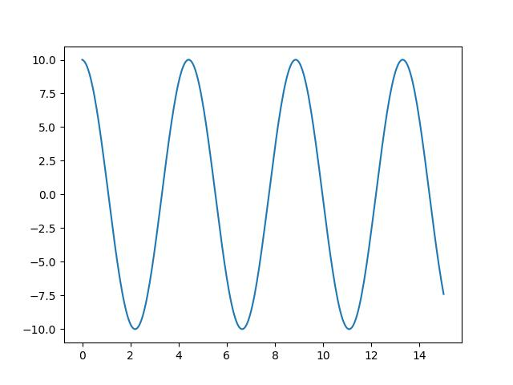

#+options: ':nil *:t -:t ::t <:t H:3 \n:nil ^:t arch:headline
#+options: author:t broken-links:nil c:nil creator:nil
#+options: d:(not "LOGBOOK") date:t e:t email:nil expand-links:t f:t
#+options: inline:t num:t p:nil pri:nil prop:nil stat:t tags:t
#+options: tasks:t tex:t timestamp:t title:t toc:t todo:t |:t
#+Title: Computational Modeling for Psychology Students
#+author: Britt Anderson
#+date: Winter 2026
#+email: britt@uwaterloo.ca
#+language: en
#+select_tags: export
#+exclude_tags: noexport
#+creator: Emacs 30.2 (Org mode 9.7.11)
#+cite_export:

* Welcome to Psych 420
** Introductions
1. Who am I? 
2. Who are you?
   Send me an email (britt@uwaterloo.ca) right now (from your uwaterloo address) with
   1. Your name (and any pronounciation tips).
   2. Area of concentration,
   3. Year of study,
   4. Programming language you are most capable in (and your level of competency),
   5. Reason you took this course.
3. What you will need: A functioning computer that you know how to use.
   What to do now:
   - Update your operating system.
   - Verify you know how to find a file on your computer (e.g. do you know the name of your home directory)?
   - Confirm you know how to install software on your computer.
   - You know (or will know by next week) what ~git~ is and how to use it, and that you will have an ~IDE~ installed.

** What is computational cognitive (neuro)science?
  1. Form teams of two (or three if odd number).
  2. Go to the following web site: [[https://2025.ccneuro.org/poster-sessions/?view=all][2025 Posters Cognitive Computational Neuroscience meeting]].
     1. Pick a poster.
	Note it's label (letter-number; on the left)
     2. Be ready with a two sentence summary.
     3. Tell us why it is a good example of computational modelling of either mind or brain.
     4. Why you chose it.
** Syllabus Review
#+INCLUDE: "syl-2026.org" :lines "11-"
** A look ahead -- what we will code
   1. Turing Machine
   2. Integrate and Fire Neuron
   3. Hodgkin-Huxley Neuron
   4. Perceptron
   5. Hopfield Net
   6. Agent Based Model
   7. And possibly more
** A look ahead -- what we talk about
   1. What is cognition?
   2. What is a cognitive model?
   3. What is the relationship between cognition and neuroscience?
   4. All of which will benefit from better understanding what is a theory.
** What is Cognition?
   Groups of three. No two members should be the same as the last group.
   [[https://doi.org/10.1016/j.cub.2019.05.044][What is Cognition?]]
   Each group gets an opinion (want three of four groups)
   Brainard/Byrne/Heyes/Suddendorf
   20 minutes to read and discuss to make sure they understand.
   Then rotate the groups so that each group has only one member/opinion.
   15 minutes to explain the opinions to each other.
   General discussion.
** Is a mathematical formula a model?
*** Forgetting Curve --- Ebbinghaus
#+Name: forgetting-curve
#+caption: By The original uploader was Icez at English Wikipedia.
[[file:./images/Forgetting_curve_decline.svg.png]]
*** A Mathematical Function
#+begin_src haskell :dir . :session :results file graphics :file ./images/expdecay.png :exports both
      import Graphics.Gnuplot.Simple
      plotFunc [PNG "./images/expdecay.png"]
      (linearScale 100 (1,6))
      ((\x -> exp (1.0/x)) :: Double -> Double)
#+end_src

#+Name: exponential-function
#+Caption: Plot of \( e^{\frac{1}{x}} \).
#+RESULTS:
[[file:./images/expdecay.png]]

*** What can we infer
    from the similarity between Figure [[forgetting-curve]] and Figure [[exponential-function]] ?
*** Generate your own plot of the exponential function.

* Warming Up: Action Potentials
  Our goals:
  1. Understand what we are trying to model: the action potential.
  2. Learn some of the prior work.
  3. Understand the mathematical background for an action potential.
     1. Simple electronics.
     2. Simple differential equations.
  4. Make ourselves familiar with the basic notation of these two background areas.
  5. Implement simple computational versions of spiking neurons.
     If you cannot code it, you do not understand it. 
** What is an action potential?
   1. Draw one.
   2. Explain what ions account for the different parts of the curve.
   3. Why is an action potential like a flush toilet?
   4. Why did/do people use the action potential to argue that brains are like digital computers?
   5. Who were [[https://en.wikipedia.org/wiki/A_Logical_Calculus_of_the_Ideas_Immanent_in_Nervous_Activity][McCulloch and Pitts]] and why are they relevant?
   6. Who developed the first detailed biophysical model of the action potential and what became of them?
   7. Why would we want to write a program to simulation a spiking neuron?
   8. Why might we want a simpler version?
   9. What maths are important for modeling spiking neurons?
** Notation
   The mathematician's interest in being concise often means that simple ideas get translated to unfamiliar symbols. \
   Just because the notation is unfamiliar does not mean the idea is complicated. 
   What does \( \sum_{\forall x \in \left\{ 1 , 2 , 3 \right \}} x = 6 \) mean?

   Different mathematical and computational traditions have their own preferences, thus the same idea can have different notations. To a mathematician the \(\sqrt{-1} = \) =i=. To the engineer it is =j=.
   \(\frac{dx}{dt}\) \(\dot{x}\) \(x{'}\) \(f{'}(x)\) are all different ways of talking about derivatives. 
** Differential Equations
   1. What is a differential equation (aka de)?
   2. What is a derivative?
   3. What is the *definition* of a derivative?
      \( \frac{dx}{dy} = \frac{f(x + \Delta x) - f(x)}{x+\Delta x - x} \)
   4. What is a slope of a line?
   5. Of a curve?
   6. Provide examples of phenomena in psychology or neuroscience (other than the action potential) that might be good candidates for this mathematical technique. 

#+begin_src haskell :dir . :session :results file graphics :file ./images/derivExample.png :exports both
    plotFuncs [PNG "./images/derivExample.png"] (linearScale 1000 (-3 , 3 ) )
      [(\x -> x ** 3) :: Double -> Double
      , (\x -> 12 * x - 16) :: Double -> Double ]
#+end_src

#+RESULTS:
[[file:./images/derivExample.png]]
*** Using a DE
    In computational neuroscience (or psychology) we don't typically " solve DEs. We use them. We use them to help us move forward in time to understand a process by virtue of what we know about its rate of change. We will see that in a couple of short examples, and then some simple scenarios for you to play with. 
*** Using DEs to compute a square root
#+INCLUDE: "./code/sqrt.hs" src haskell -n 

Now let's test it:
#+begin_src haskell :results output :exports both
:load "./code/sqrt.hs"
getCubeRoot 27 1 0.001
getCubeRoot 8 1 0.001
getCubeRoot 125 1 0.001
#+end_src

#+RESULTS:
: [1 of 2] Compiling Main             ( code/sqrt.hs, interpreted )
: Ok, one module loaded.
: 3.0000005410641766
: 2.000004911675504
: 5.000000000287929

IAMHERE

*** Practice Simulating With DEs

**** Frictionless Springs

We want to code neurons, but to get there we should feel comfortable with the underlying tool or we won't be able to adapt it or re-use it for some new purpose. We will start with a very simple and concrete example: the frictionless spring.

\( \frac{d^2 s}{dt^2} = -P~s \)

where 's' refers to space, 't' refers to time, and 'P' is a constant, often called the spring constant, that indicates how stiff or springy the spring is. 

Imagine that you knew this derivative. It would tell you how much space the spring head would move for a given, very small, increment of time. We could then just add this to our current position to get the new position and repeat. This method of using a derivative to iterate forward is sometimes called the [[https://en.wikipedia.org/wiki/Euler_method][Euler method]].

Returning to our definition of the derivative:

\( \frac{s(t + \Delta t) - s(t)}{\Delta t} = velocity \approx \frac{d s}{d t} \)

But our spring equation is not given in terms of the velocity it is given in terms of the acceleration which is the second derivative. Therefore, to find our new position we need the velocity, but we only have the acceleration. However, if we knew the acceleration and the velocity we could use that to calculate the new velocity. Unfortunately we don't know the velocity, unless ... , maybe we could just assume something. Let's say it is zero because we have started our process where we have stretched the spring, and are holding it, just before letting it go. We have asserted an /initial value/.

How will our velocity change with time?

\( \frac{v(t + \Delta t) - v(t)}{\Delta t} = acceleration \approx \frac{d v}{d t} = \frac{d^2 s}{d t^2} \)

And we have a formula for this. We can now bootstrap our simulation.

Note the similarity of the two functions. You could write a helper function that was generic to this pattern of /old value + rate of change times the  time step/, and just used the pertinent values.

How do we know the formula for acceleration? We were given it!

#+begin_src python :session *spring* :results graphics output file :file ./images/spring.jpg :exports both
  import localcode.spring as s
  s.plot_spring()
#+end_src

#+Name: oscillator-plot
#+Caption: Spring constant of 2 with a starting position of 10.
#+RESULTS:

***** Now You Try
*Damped Oscillators*

Provide the code and a plot for the damped oscillator. It has the formula of

\( \frac{d^2 s}{dt^2} = -P~s(t) - k~v(t) \)

* What is computation and what is its role in cognitive science?
  [[https://link.springer.com/content/pdf/10.1007/978-3-642-41375-9_1][Chapter 1 of Physical Computation in Cognitive Science]] by Nir Fresco

** What do you think?
   1. Computational modeling of cognition and neural systems is/is-not the same as programming.
   2. What else could computational modeling be?
   3. What are we losing when we treat our computational model as a programmatic black box?
   4. Is the computation that is cognitive the same as the computation that takes place in digital computers?
   5. If so, why is there more than one programming language?
   6. Might our choice of programming language based on features actually influence what we can conceive for a computational model?
   7. What does it mean for something to be a model?
   8. Is simulation good enough?
   9. Is prediction good enough?
   10. Do we want a model to /explain/ something? And then of course what constitutes explanation?
** What do we need to know?
   1. We need to know the facts of the matter, neurally and cognitively.
   2. We need to have a clear question.
   3. We need to have a theoretical committment that leads to clear predictions, and guides our evaluation of what to do.
   4. Which of course means we need to know what a theory is and how to build one.
   5. We need to know the facts of the matter mathematically and programmatically
      1. We need to be able to read the maths.
      2. We need to be conversant in symbols and notations.
      3. We need to know how to express in symbols what we can say in words.
      4. We need to know how to express in code what we can write in symbols.

We need to be concerned with all the levels: mind and brain, theory, math, and code.
We can abbreviate these as MTMC: mind → theory → math → code; the arrows indicating  an ordering on our development.

* 
* Theory
These are just place holders for now.
#+begin_quote
I have been wondering about the concept of explanation. I don't know if there is an agreed upon definition in this context. How do we know that an observation is "explained" other than that it is predicted by a theory? Or is the mathematics the same, and is explanation synonymous with post-diction? -- [[https://www.youtube.com/watch?v=jYUyd51MJDM&list=PLsSR5xGtg8fWd3sc_0tjzFj4GyRhezkTd&index=3&t=3s][Joachim Vanderkerckhove]] 
#+end_quote

Is the ability to predict the tides a theory of the tides? Is it an explanation of the tides?

[[https://psycnet.apa.org/fulltext/2020-82366-001.pdf][Formalizing Verbal Theories. A tutorial by dialogue.]]

[[https://journals.physiology.org/doi/epdf/10.1152/jn.00195.2021][Forms of explanation and understanding for neuroscience and artificial intelligence]]

[[https://smaldino.com/wp/wp-content/uploads/2018/01/Smaldino2017-ModelsAreStupid.pdf][Models are Stupid, and We Need More of Them]]

[[https://psycnet.apa.org/fulltext/2025-04988-001.pdf][Productive Explanation: A framework for evaluating explanations in psychological science]]

[[https://journals.sagepub.com/doi/pdf/10.1177/1745691620969647][Theory Construction Methodology: A practical framework for building theories in psychology]]

* Math and Code
We will group these two by subdomains to keep the connections fresh.

* Footnotes

[fn:3] see David Marr's *Vision*. 
[fn:2] The limits of my language means the limits of my world. -- Ludwig Wittgenstein (proposition 5.6 Tractatus Logico-Philosophicus) 

