#+options: ':nil *:t -:t ::t <:t H:3 \n:nil ^:t arch:headline
#+options: author:t broken-links:nil c:nil creator:nil
#+options: d:(not "LOGBOOK") date:t e:t email:nil expand-links:t f:t
#+options: inline:t num:t p:nil pri:nil prop:nil stat:t tags:t
#+options: tasks:t tex:t timestamp:t title:t toc:t todo:t |:t
#+Latex_header: \usepackage{svg}
#+latex_header: \usepackage{amsmath}
#+Title: Computational Modeling for Psychology Students
#+author: Britt Anderson
#+date: Winter 2026
#+email: britt@uwaterloo.ca
#+language: en
#+select_tags: export
#+exclude_tags: noexport
#+creator: Emacs 30.2 (Org mode 9.7.11)
#+bibliography: /home/britt/gitRepos/masterBib/bayatt.bib
#+cite_export: csl /home/britt/gitRepos/brittsite/assets/chicago-fullnote-bibliography.csl

* Welcome to Psych 420
** Introductions :assignment:
1. Who am I? 
2. Who are you?
   Send me an email (britt@uwaterloo.ca) right now (from your uwaterloo address) with
   1. The subject line must be exactly P420Intro; nothing more; nothing less. Capitalization matters.
   2. Your name (and any pronounciation tips).
   3. Area of concentration,
   4. Year of study,
   5. Programming language you are most capable in (and your level of competency),
   6. Reason you took this course.
3. What you will need: A functioning computer that you know how to use.
   What to do now:
   - Update your operating system.
   - Verify you know how to find a file on your computer (e.g. do you know the name of your home directory)?
   - Confirm you know how to install software on your computer.
   - You know (or will know by next week) what ~git~ is and how to use it, and that you will have an ~IDE~ installed.
** What I am assuming you know or will learn on your own.
   1. Your computer is up to date.
   2. You know what a directory is and how to find files on your computer.
   3. You know how to install software.
   4. You have at least beginner level programming experience in one course.
   5. You know what git/github are.
*** What if you don't?
    You will have to learn on your own or with a small group. You can consult the course notes for Psych 390 which does cover some of this material. Here is a link to the [[https://brittanderson.github.io/uwlooP390/][wiki]].

*** Git Clone and Github Acct :assignment:
    An early home work will be a screen shot of your github homepage showing you forked or cloned the course repository. And the screen shot should be done using a program and not your phone. [[https://github.com/brittAnderson/compNeuroIntro420][Course Webpage]] . That is the course content. If you want to view a web viewable form you can go to this link: [[https://brittanderson.github.io/compNeuroIntro420/][course notes]].

** Some recommendations.
   You will want an IDE. I personally use emacs. Experience has taught me that only about 3 in a 100 of you will share my opinion. Thus, I recommend VS Code if you have no other preference. It is becoming a sort of de facto standard.

   
*** IDE Installed :assignment:
    Send me a screen shot of the IDE you intend to use installed on your laptop. *No* phone cameras. Use the screenshot functionality of your computer. 

** What is computational cognitive (neuro)science?
  1. Form groups of two (or three if odd number).
  2. Go to the following web site: [[https://2025.ccneuro.org/poster-sessions/?view=all][2025 Posters Cognitive Computational Neuroscience meeting]].
     1. Pick a poster.
	Note it's label (letter-number; on the left)
     2. Be ready with a two sentence summary.
     3. Tell us why it is a good example of computational modelling of either mind or brain.
     4. Why you chose it.
** Syllabus Review
#+INCLUDE: "syl-2026.org" :lines "11-"
** A look ahead -- what we will code
   1. Turing Machine
   2. Integrate and Fire Neuron
   3. Hodgkin-Huxley Neuron
   4. Perceptron
   5. Hopfield Net
   6. Agent Based Model
   7. And possibly more
** A look ahead -- what we talk about
   1. What is cognition?
   2. What is a cognitive model?
   3. What is the relationship between cognition and neuroscience?
   4. All of which will benefit from better understanding what is a theory.
** What is Cognition?
   Groups of three. I prefer you not have the same people in your group as last time. We want to promote meeting people. It makes it easier for you to help each other, find people at your own learning level to study and work with, gauge your own skill level, develop informal networks that may be of use outside of this class.
   [[https://doi.org/10.1016/j.cub.2019.05.044][What is Cognition?]]
   Each group gets an opinion (want three of four groups)
   Brainard/Byrne/Heyes/Suddendorf
   20 minutes to read and discuss to make sure they understand.
   Then rotate the groups so that each group has only one member/opinion.
   15 minutes to explain the opinions to each other.
   General discussion.
** Is a mathematical formula a model?
*** Forgetting Curve --- Ebbinghaus
#+Name: forgetting-curve
#+caption: By The original uploader was Icez at English Wikipedia.
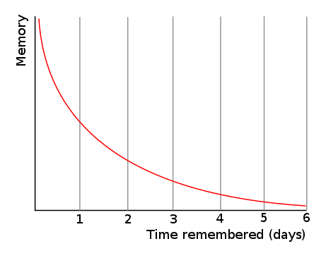
*** A Mathematical Function
#+begin_src haskell :dir . :session :results file graphics :file ./images/expdecay.png :exports both
  import Graphics.Gnuplot.Simple
  plotFunc [PNG "./images/expdecay.png"]
  (linearScale 100 (1,6))
  ((\x -> exp (1.0/x)) :: Double -> Double)
#+end_src

#+Name: exponential-function
#+Caption: Plot of \( e^{\frac{1}{x}} \).
#+RESULTS:
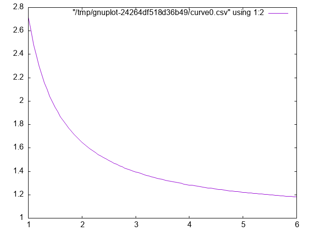


**** A digression on code
     The above example is coded in [[https://www.haskell.org/][Haskell]]. If any of you feel like python or R are getting a bit stale and you would like to learn a new language I encourage you to consider Haskell. I picked it for use here because,
     a) I like it and want to get better at using it,
     b) I did not think many (or any) of you would know it,
     c) And therefore I could talk about coding a particular algorithm without ruining your opportunity to practice coding it yourself.

     But what about Large Language Models (LLMs)? They are great, and you should definitely use them, *but* use them deliberately and after reflection.
     1) Do /not/ use them to do an exercise for you. You may learn something about LLMs, but you will /not/ learn how to code that algorithm or very much about the programming language you want to master.
     2) /Do/ use them to help your learning and understanding.
	- You have written some code yourself and it is not working, and you can't figure out why. Ask your llm to find the bug /and/ explain it.
	- You want to know if your code is idiomatic. Ask your llm for a critique and comment on working code.
     3) If you have no idea how to get started /do/ ask an LLM to architect without asking it to code.
     4) Do /not/ live in the web/browser app. Get yourself an api key and access the LLM from your chosen IDE. Two tools that I use often are [[https://aider.chat/][aider]] and [[https://openrouter.ai/][openrouter]]. The latter will give you access to free models. Aider will allow you to call the LLM from the terminal. In Emacs I find *gptel* extremely convenient. 

     This course is not to teach you how to use LLMs or set them up, but since many of us will be making use of them we should talk about the pros and cons of particular use cases and outputs. Treat your LLM usage like a citation. Say when and where you used it.
*** What can we infer
    from the similarity between Figure [[forgetting-curve]] and Figure [[exponential-function]] ?
*** Generate your own plot of the exponential function. :assignment:

* Neurally Inspired Models 1: The cellular level
** Action Potentials
  Our goals:
  1. Understand what we are trying to model: the action potential.
  2. Learn some of the prior work.
  3. Understand the mathematical background for an action potential.
     1. Simple electronics.
     2. Simple differential equations.
  4. Make ourselves familiar with the basic notation of these two background areas.
  5. Implement simple computational versions of spiking neurons.
     If you cannot code it, you do not understand it. 
** What is an action potential?
   1. Draw one.
   2. Explain what ions account for the different parts of the curve.
   3. Why is an action potential like a flush toilet?
   4. Why did/do people use the action potential to argue that brains are like digital computers?
   5. Who were [[https://en.wikipedia.org/wiki/A_Logical_Calculus_of_the_Ideas_Immanent_in_Nervous_Activity][McCulloch and Pitts]] and why are they relevant?
   6. Who developed the first detailed biophysical model of the action potential and what became of them?
   7. Why would we want to write a program to simulation a spiking neuron?
   8. Why might we want a simpler version?
   9. What maths are important for modeling spiking neurons?
** Notation
   The mathematician's interest in being concise often means that simple ideas get translated to unfamiliar symbols. \
   Just because the notation is unfamiliar does not mean the idea is complicated. 
   What does \( \sum_{\forall x \in \left\{ 1 , 2 , 3 \right \}} x = 6 \) mean?

   Different mathematical and computational traditions have their own preferences, thus the same idea can have different notations. To a mathematician the \(\sqrt{-1} = \) =i=. To the engineer it is =j=.
   \(\frac{dx}{dt}\) \(\dot{x}\) \(x{'}\) \(f{'}(x)\) are all different ways of talking about derivatives. 
** Differential Equations
   1. What is a differential equation (aka de)?
   2. What is a derivative?
   3. What is the *definition* of a derivative?
      \( \frac{dx}{dy} = \frac{f(x + \Delta x) - f(x)}{x+\Delta x - x} \)
   4. What is a slope of a line?
   5. Of a curve?
   6. Provide examples of phenomena in psychology or neuroscience (other than the action potential) that might be good candidates for this mathematical technique. 

#+begin_src haskell :dir . :session :results file graphics :file ./images/derivExample.png :exports both
    plotFuncs [PNG "./images/derivExample.png"] (linearScale 1000 (-3 , 3 ) )
      [(\x -> x ** 3) :: Double -> Double
      , (\x -> 12 * x - 16) :: Double -> Double ]
#+end_src

#+RESULTS:
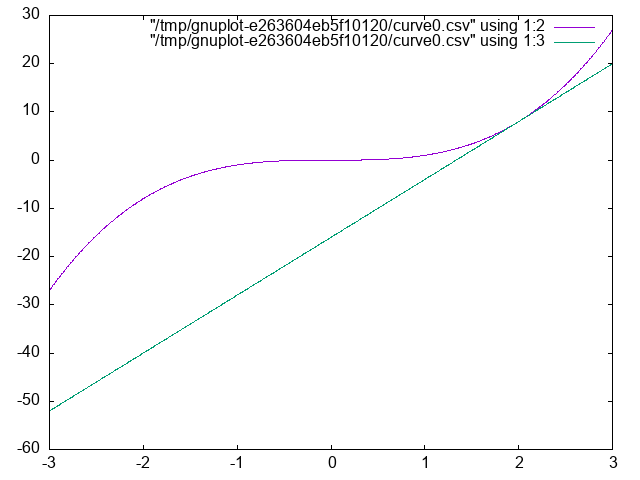
** Using a DE
    In computational neuroscience (or psychology) we don't typically " solve DEs. We use them. We use them to help us move forward in time to understand a process by virtue of what we know about its rate of change. We will see that in a couple of short examples, and then some simple scenarios for you to play with. 
** Using DEs to compute a square root
#+INCLUDE: "./src/Sqrt.hs" src haskell -n 

Now let's test it:
#+begin_src haskell :results output :exports both
  import Sqrt
  getCubeRoot 27 1 0.001
  getCubeRoot 8 1 0.001
  getCubeRoot 141 1 0.001
#+end_src

#+RESULTS:
: <interactive>:4:1-3: error: [GHC-58481] parse error on input ‘--:’
: 3.0000005410641766
: 2.000004911675504
: 5.204827869200383


** Using DEs - Practicing with Springs

Our Hodgkin-Huxley model will be will require us to use several different equations. And though the intergrate and fire neuron only requires one, a neuron is still rather abstract as a computational entity. Therefore, we will begin our DE coding practice with a simple, idealized spring. 

Our differential equation is \( \frac{d^2 position}{dt^2} = -P~position \). 

where 'position' refers to the location in space of the unattached end of our spring (we assume one end is anchored to a wall or something), 't' refers to time, and 'P' is a constant, often called the spring constant, that indicates how springy the spring is. 

If we knew where the spring was now, we could use this equation to tell us where it would be a little bit into the future; just as you can use your velocity on the highway to estimate your location in the future. The smaller the time step the more accurate will be our estimate. This simple [[https://en.wikipedia.org/wiki/Euler_method][Euler method]] often works quite well for smooth functions that don't change very much.

Unfortunately the spring equation is for the *second* derivative of location relative to time. This is called acceleration. Thus we need a two step process. From our current location and this equation estimate our velocity. From our present location and our velocity estimate our location. And repeat. 

#+INCLUDE: "./src/Spring.hs" src haskell -n 


#+begin_src haskell :dir . :session :results file graphics :file ./images/spring.png :exports both
  import Spring
  --    :load "./src/Spring.hs"
  plotList [PNG "./images/spring.png"]
        $ map (\s -> sLoc s) $ releaseSpring 2000
#+end_src

#+Name: friclessSpring
#+Caption: Frictionless Springs Oscillate
#+RESULTS:
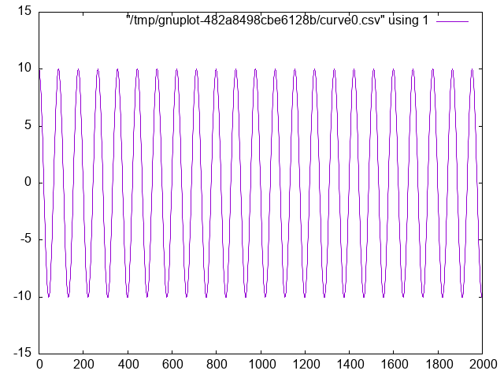


*** Now You Try with a *Damped Oscillator*
The changes to whatever code you have for the frictionless spring should require very little alteration to work with the following DE:

\[ \frac{d^2 s}{dt^2} = -P~s(t) - k~v(t) \]


** Solving DEs

   There are many well established methods for solving systems of differential equations. If you really need one you can look it up. As a psychologist /using/ a DE you will almost never have to solve, which means in this context to compute an analytical solution (analytical means using symbols). If you decide you must, just guess, and guess an exponential. Most of the differential equations we will see, and that you will see in biology or psychology, have the dependent variable present both on the left and right sides of your differential equation. The exponential is almost always in there somewhere as \( e^x \), since the derivative of \( \frac{d e^x}{dx} = e^x \).

   Try this with the undamped oscillator. We know that the second derivative of how position changes with time will eventually be a function of current position so we guess that \( s(t) = e^{rt} \). Why the "r"? I know that the answer will have to be more than just \( e^x \) so I throw in "r" for now assuming I can figure out the details later. Now, we act on our guess. If

   \begin{align}
     s(t) &= e^{rt}  & \text{then}\\
     \frac{d~s(t)}{dt} &= r~e^{rt}  & \text{and thus}\\
     \frac{d^2 s(t)}{dt} &= r^2 e^{rt}  & \text{now plugging in our guess to our known formula we have }\\
     r^2 e^{rt} &= -P~e^{rt}  & \text{moving the right side to the left and factoring,} \\
     e^{rt} ( r^2 + P) &= 0  & \text{we only need to worry about the right hand side so r must be,} \\
     r &= \pm i \sqrt{P}  & \text{ which means that are solution is,} \\
     s(t) &= e^{it} + e^{-it}  & \text{ and, thanks to Euler's}~~e^{i\Theta} = cos \Theta + i~sin \Theta \text{ and simplifying we have,} \\
     s(t) &= 2 cos~t
   \end{align}
     
   

** Integrate and Fire Neuron
#+begin_quote
Is the integrate and fire model used much in modeling in the present time? [[https://scholar.google.com/scholar?as_ylo=2020&q=%22integrate+and+fire%22+neuron&hl=en&as_sdt=7,39][answer]]
#+end_quote
*** Historical Notes
***** Louie La Pique
[[https://link.springer.com/article/10.1007/s00422-007-0190-0][Modern Commentary on Lapique's Neuron Model]]

#+Name: lapiqueLab
#+Caption: La Pique Laboratory at the Sorbonne Paris


[[https://doi.org/10.1007/s00422-007-0189-6][Original Lapique Paper (translated)]]
[[https://fr.wikipedia.org/wiki/Louis_Lapicque][Brief Biographical Details of Lapicque]]
***** Lord Adrian 
#+begin_quote
1. When was the action potential demonstrated?
2. What was the experimental animal used by Adrian?
[[https://www.nobelprize.org/prizes/medicine/1932/adrian/lecture/][Adrian's Nobel Lecture]]
[[https://www.jstor.org/stable/769841][Hodgkin's Memoir of Adrian]]
#+end_quote

*** Formula I and F

\(\tau \frac{dV(t)}{dt} = -V(t) + R~I(t) \)

Why is this the formula?
***** Simple Electronics
The following questions are the ones we need to answer to derive our integrate and fire model.

#+begin_quote
1. What is Ohm's Law?
2. What is Kirchoff's Point Rule?
3. What is Capacitance?
4. What is the relation between current and charge?
#+end_quote
****** Answers :noexport:
1. *Ohm's Law* (empirically observed): $V = IR$

   What is the relationship between current and charge?
Current: The derivative of charge with respect to time, $$I = \frac{dQ}{dt}$$

2. What is *Kirchoff's Point Rule*

   Current sums to zero: All the current sources going to a node in a circuit must sum to zero.

3. What is capacitance?

   Capacitance is a source of current. A capacitor is a sandwich of two conducting surfaces with a non-conducting body in between. If you a charge to one side, the electrons gather there. They can't leap the gap, so they exert an attraction for particles of the opposite charge on the other side of the gap. If you suddenly stop the charge then charge races around and you discharge a current.

4. Explain the relationship, mathematically, between capacitance, charge, and voltage.

   $C = Q/V$ The volume of charge, per unit area, divided by the voltage that produces this imbalance in charge.

   What happens when you differentiate this equation with respect to time and treat the capacitance as a constant?
 $C \frac{dV}{dt} = \frac{dQ}{dt} = I$


***** Deriving the IandF Equation

#+begin_quote
Can you tell why, looking at the integrate and fire equation, if we don't reach the firing threshold, we see an exponential decay?
#+end_quote


\begin{align*}
I &= I_R + I_C & (a) \\
&= I_R + C\frac{dV}{dt} & (b)\\
&= \frac{V}{R} + C\frac{dV}{dt} & (c)\\
RI  &= V + RC\frac{dV}{dt} & (d) \\
\frac{1}{\tau} (RI-V)  &= \frac{dV}{dt} & (e)\\
\end{align*}

a: Kirchoff's point rule,

b: the relationship between current, charge, and their derivatives

c: Ohm's law

d: multiply through by R

e: rearrange and define \(\tau\)

*** Coding up the Integrate and Fire Neuron

Approach this with the same ideas as the spring example. You have a certain initial value, and you update that using your differential equation that relates how much voltage changes as a function of time and current voltage.

Unlike real neurons the Integrate and Fire neuron model does not have a natural threshold and spiking behavior. You pick a threshold and everyone time your voltage reaches that threshold you designate a spike and reset the voltage.

*Additional Activities* (if that goes too quickly):

- Add a refractory period to the Integrate and Fire model.
- Alter the input current
- Change the form of the input current

#+INCLUDE: "./src/IandF.hs" src haskell -n 
#+begin_src haskell :dir . :session :results file graphics :file ./images/iandf.png :exports both
  import IandF
--  :load ./src/IandF.hs
    let run200 = iterate oneRunIandF initialStrut !! 200
          vs = voltages run200
          cs = currents run200
          ts = time run200
          tv = zip ts vs
          tc = zip ts cs
    plotPaths [PNG "./images/iandf.png"] [tv,tc]
#+end_src

#+RESULTS:
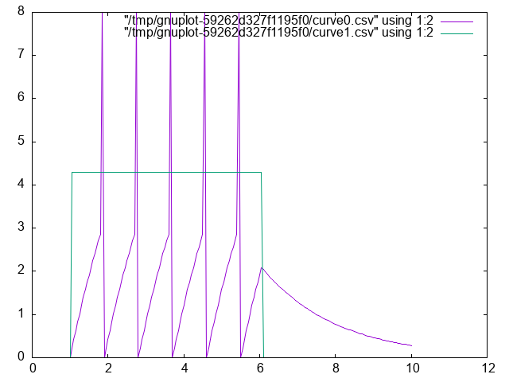

** Integrate and Fire Homework

The Integrate and Fire homework has two components. One practical and one theoretical.

Practically, submit an integrate and fire program. Do something to show that you had something to do with the coding and you understand what is happening.

Theoretically, look at [[https://redwood.berkeley.edu/wp-content/uploads/2018/08/mainen-sejnowski.pdf][this article (pdf)]] and tell me how you feel our integrate and fire model compares to these actual real world spiking data when both are give constant input. What are the implications for using the integrate and fire model as a model of neuronal function? 


** Hodgkin and Huxley Model
*** Who were Hodgkin and Huxley
*** Biographical Sources :noexport:
Nobel Prize biographies:
  [[https://www.nobelprize.org/prizes/medicine/1963/hodgkin/biographical/][Hodgkin]]
  [[https://www.nobelprize.org/prizes/medicine/1963/huxley/biographical/][Huxley]]

Nice summary [[https://www.ncbi.nlm.nih.gov/pmc/articles/PMC3424716/pdf/tjp0590-2571.pdf][article (pdf)]]

[[https://youtu.be/k48jXzFGMc8?si=C1oZhWaRQ0j1osb8][Video]] of the method
 
*** Model Description
Gerstner's (free) [[https://lcnwww.epfl.ch/gerstner/SPNM/node14.html#table-HH1][book's chapter]] on the HandH model.

**** Comments and Steps in Coding the Hodgkin Huxley Model
 
Some introductory reminders and admonitions:
 
The current going in to the cell is intended to represent what an electrophysiologist would inject in their laboratory setting, or what might be changed by the input from other neurons. 
The total current coming out of the neuron is the sum of the capacitance (due to the lipid bilayer), and the resistance (due to the ion channels).
This is *Kirchoff's* rule implemented in the Hodgkin and Huxley model.

Unlike the Integrate and Fire model, which lumps all the ionic currents together, the HandH model decomposes the conductance into three parts.
You have a resistance /for each ion channel/.
The rule for currents in parallel is to apply Kirchoff's and Ohm's laws realizing that they all experience the same voltage, thus the currents sum. The Hodgkin and Huxley model has components for Sodium (Na), Potassium (K), and negative anions (still lumped as "leak" l).

\( \sum_i I_R(t) = \bar{g}_{Na} m^3 h l(V(t) - E_{Na}) + \bar{g}_{K} n^4 (V(t) - E_{K}) + \bar{g}_{L} (V(t) - E_{L})\)

\( I_{tot} = I_r + I_C \)


\( I_{tot} = \bar{g}_{Na} m^3 h (V(t) l- E_{Na}) + \bar{g}_{K} n^4 (V(t) - E_{K}) + \bar{g}_{L} (V(t) - E_{L}) + c~\frac{dV}{dt} \)

If you rearrange terms you can get the \(\frac{dV}{dt}\) on one side of the equation by itself.

\(c~\frac{dV}{dt} = I_{tot} - (\bar{g}_{Na} m^3 h (V(t) - E_{Na}) + \bar{g}_{K} n^4 (V(t) - E_{K}) + \bar{g}_{L} (V(t) - E_{L})) \)

You cannot program what you don't understand. Don't start writing code too soon. Writing code won't make a poorly understood idea clearer. Though it can reveal that you don't understand what you thought you understood. It is often best to start sketching ideas on paper or a blackboard before you open up your IDE.

For instance,

- What are the \( \bar{g}_*\) terms?
- What are the \( E_{*} \) terms?
- What do m, n, and h represent?
- Where did these equations come from?
   
*Remember, it is differential equations all the way down.*
You can use the same Euler method to patiently update each of your terms and then repeatedly loop between them.
But recognize there are DEs at multiple levels.
Each of the /m/, /n/, and /h/ terms are also changing and regulated by a differential equation.
They are dependent on voltage, too.
For example, \( \dot{m} = \alpha_m (V)(1 - m) - \beta_m (V) m \).

*Recognize that*
- Each of the m, n, and h terms have their own equation of exactly the same form, but with their unique alphas and betas (that is what the subscript means).
- What does the V in parentheses mean?
- When the proteins of the ion channels were finally sequenced (decades later), what do you think was the number of sub-units that the sodium and potassium channels were found to have?

*Initial Assumptions*

If you allow \( t \rightarrow \infty \mbox{, then } \frac{dV}{dt}=? \)
- You assume that it goes to zero; that is, you reach steady state. Then you can solve for some of the constants.
- Where do the constants come from?
- They come from experiments, and you use what you are given.
- Assume the following constants - they are set to assume a resting potential of **zero** not -70 mV (why doesn't this matter)?
- These constants also work out to enforce a capacitance of 1.

The "infinity" or "long time resting state" of the $m$, $n$, and $h$ values (that I refer to as $m_{inf}$ in my code and these notes)
is of the form \( (m/n/h)_{inf}= alpha(m/n/h)(v) / (alpha(m/n/h)(v) + beta(m/n/h)(v)) \)

**** Constants
Several different sets of constants are used for this model in published versions. They are all, in one sense, the same, but this set make the programming easier. For the moment, ignore the units and use these numbers.

#+Name: hh-constants
#+Caption: Constant Values to Use for our Hodgkin-Huxley Model
| *Constant* | *Value* |
|------------+---------|
| ena        |     115 |
| gna        |     120 |
| ek         |     -12 |
| gk         |      36 |
| el         |    10.6 |
| gl         |     0.3 |


**Warning**
These constants are adjusted to make the resting potential 0 and the capacitance 1.0. 

**** Alpha and Beta Formulas

\[ \alpha_n(V_m) = \frac{0.01 (10 - V_m)}{\exp\left( \frac{10 - V_m}{10} \right) - 1} \]


\[ \alpha_m(V_m) = \frac{0.1(25 - V_m)}{\exp\left( \frac{25 - V_m}{10} \right) - 1} \]

\[ \alpha_h(V_m) = 0.07 \exp\left( \frac{-V_m}{20} \right) \]

\[ \beta_n(V_m) = 0.125 \exp\left( \frac{-V_m}{80} \right) \]

\[ \beta_m(V_m) = 4 \exp\left( \frac{-V_m}{18} \right) \]

\[ \beta_h(V_m) = \frac{1}{\exp\left( \frac{30 - V_m}{10} \right) + 1} \]

**** Demonstrating the Hodgkin-Huxley Model

#+INCLUDE: "./src/HandH.hs" src haskell -n 

#+begin_src haskell :dir . :session :results file graphics :file ./images/handh.png :exports both
  import HandH
  let myData = take 5000 $ iterate
        (updNeuron healthyNeuron pSet1 )
        initialState 
      vs = map vns myData
      cs = map ic myData
      ts = map neuTime myData
      tv = zip ts vs
      tc = zip ts cs
      plotPaths [PNG "./images/handh.png"] [tv,tc]
#+end_src

#+RESULTS:
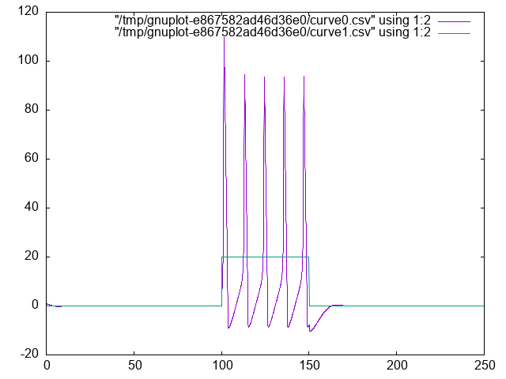

**** More hints on programming the Hodgkin-Huxley model.
1. Work inside out
   By this I mean that you start with small functions that you know you will need and only later build out to chaining them altogether. It is easier to test individual functions. 
2. Keep it working
   This means you test your code changes frequently and often. You don't want to miss a typo that breaks your code after two hours of all sorts of other changes.
3. Use the terminal
   The way to test is to write your code so that you can source it (or import it) as you work and test your code in your interpreter. This is a lite-version of what is called a REPL: read-eval-print-loop. 
4. Use git (or something)
   By committing often you can more easily jump back to a working version if you break things horribly.
5. Test with numbers where you know the answer. If you inject no current your voltage should not change. Because of small numerical imprecisions there may be some small non-zero numbers, especially early in your run, but you should definitely not drift off to larger positive or negative numbers.
6. Code in a way that makes it easy to visualize variables
   We are often better at seeing what is going on when we look at a plot rather than a long list of numbers. By writing in a style that allows you to plot your variables you may be better able to debug errors.
7. Expect that you will misplace a decimal.
   That is, don't get too discouraged. We all do this. At this stage I encourage you /not/ to use a large language model to help you figure out the logic of your code, but if you think you have nailed the logic and just have a small typo or syntactic error somewhere, then by all means let the eagle eye of the chat bot help you find it. The more specific you are with your prompt, the better will the chat bot be able to educate. Don't say: "Why doesn't this work?". Do say: "I think there is a bug somewhere in the xyz function. Do you see a typo or similar bug in there?"


**** Hodgkin and Huxley Homework

Your homework will require you to write the code for a Hodgkin-Huxley Neuron and then modify it.  You will provide at least two plots in addition to your code. You will need to adapt the model to fit this paper[cite:@Hafez_2020]. These authors analyzed a series of inherited channelopathies (where ion channels are altered due to mutation) via simulation. In these conditions empirical measurements had been made on actual patients. The authors adapted the Hodgkin and Huxley model to permit them to explore the effects of such altered conductance on neuronal excitability. For this home work you will need to adapt the /n/ equation to be as follows:

\( \frac{dn}{dt} = \gamma_\tau (\gamma_\alpha \alpha_n (v - \Delta V)(1 - n) - \gamma_\beta \beta_n (v- \Delta V)n) \)

Then you must select one of the sets of \gamma from their [[https://link.springer.com/article/10.1007/s10827-020-00766-1/tables/1][Table 1]] and plot the neuronal activity.

To start with after you have implemented the new /n/ channel function set all the \gamma s to 1. This should work exactly like the old model. Generate a plot showing that it does. For the second plot generate the same plot with your altered $\gamma$ values.


* What is computation and what is its role in cognitive science?
We will be having a discussion on this. It only works if you have read the material that we want to discus. You need to read several sections of the [[https://plato.stanford.edu/entries/computational-mind/][The Computational Theory of Mind]] *before* class. These are all of section 3, 4.4, and all of 5 and 7. Feel free to read more. Can you answer the following questions after your reading? These are the sort of things we will be discussing. 
** What do you think?
   1. Computational modeling of cognition and neural systems is/is-not the same as programming.
   2. What else could computational modeling be?
   3. What are we losing when we treat our computational model as a programmatic black box?
   4. Is the computation that is cognitive the same as the computation that takes place in digital computers?
   5. If so, why is there more than one programming language?
   6. Might our choice of programming language based on features actually influence what we can conceive for a computational model?
   7. What does it mean for something to be a model?
   8. Is simulation good enough?
   9. Is prediction good enough?
   10. Do we want a model to /explain/ something? And then of course what constitutes explanation?
** What do we need to know? :noexport:
   1. We need to know the facts of the matter, neurally and cognitively.
   2. We need to have a clear question.
   3. We need to have a theoretical committment that leads to clear predictions, and guides our evaluation of what to do.
   4. Which of course means we need to know what a theory is and how to build one.
   5. We need to know the facts of the matter mathematically and programmatically
      1. We need to be able to read the maths.
      2. We need to be conversant in symbols and notations.
      3. We need to know how to express in symbols what we can say in words.
      4. We need to know how to express in code what we can write in symbols.

We need to be concerned with all the levels: mind and brain, theory, math, and code.
We can abbreviate these as MTMC: mind → theory → math → code; the arrows indicating  an ordering on our development.

** Computing in Minds and Computers

One definition of whether something is computable is whether there exists a Turing Machine that can compute it. Although most of us learned the name "Turing" in the context of whether a computer has human intelligence, the so-called /Turing test/, the model of Turing computability emerged from thinking about humans computing[cite:@Turing_2004]

** What is a Turing machine? Some Background and Details
[[https://turingarchive.kings.cam.ac.uk/publications-lectures-and-talks-amtb/amt-b-12][Turing machines]] are quite simple implements. While one can build a [[https://www.youtube.com/watch?v=E3keLeMwfHY][physical Turing machine]], the more usual sense of the term is for a hypothetical computer that is comprised of:
  1. a finite alphabet,
  2. a finite set of states,
  3. the capacity to read and write to a single location in memory, and the ability to adjust the memory location immediately left or right or to make no move at all, and
  4. a set of instructions (or "machine table") that translates the combination of the current state and the current symbol to a new state and one of the acceptable actions.

*** Classroom Activity
Let's develop pseudo-code for the implementing a Turing Machine. It may help you when you do have to program a Turing machine. 

** Programming a Turing Machine: the Busy Beaver

In my experience the only way to really come to grips with what a Turing machine is is to program one yourself. For this exercise we will program a Turing machine to solve an elementary version of the Busy Beaver problem. This is a famous problem, because it is easy to state and woefully difficulty to answer. In fact it is [[https://jeremykun.com/2012/02/08/busy-beavers-and-the-quest-for-big-numbers/][incomputable]].

The following is a slightly formatted version of the [[https://en.wikipedia.org/wiki/Turing_machine#Description][Wikipedia description of a Turing machine]].
1. A Turing machine has n "operational" states plus a Halt state, where n is a positive integer, and one of the n states is distinguished as the starting state.
2. The machine uses a single two-way infinite (or unbounded) tape.
3. The tape alphabet is {0, 1}, with 0 serving as the blank symbol.
4. The machine's transition function takes two inputs:
   1. the current non-Halt state,
   2. the symbol in the current tape cell,
   3. and produces three outputs:
      1. a symbol to write over the symbol in the current tape cell (it may be the same symbol as the symbol overwritten),
      2. a direction to move (left or right@";" that is, shift to the tape cell one place to the left or right of the current cell), and
      3. a state to transition into (which may be the Halt state).

We will use it to guide us to write a simple instance that computes a solution to the Busy Beaver problem. A n-state Turing machine has \( (4n + 4)2n \)states. The formula is (symbols × directions × (states + 1))(symbols × states). The transition function (how to figure out where to go next may be seen as a finite look-up table. Each row of the table is a 5-tuple: (current state, current symbol, symbol to write, direction of shift, next state). Our goal with the Busy Beaver problem is to run our machine to produce as long a series of uninterrupted ones as we can and then *halt*.

What it means to "run" a Turing machine is to start in the starting state with the current tape cell being any cell of a blank (all-0) "tape", and then iterate the transition function. If the Halt state is entered then the number of 1s remaining on the tape is called the machine's score. Different transition rules will give us different outputs, so we can score our machine based on its performance. 

To restate in a more general way, the n-state busy beaver (BB-n) game is a contest to find an n-state Turing machine having the largest possible score — the largest number of 1s on its tape after halting. A machine that attains the largest possible score among all n-state Turing machines is called an n-state busy beaver, and a machine whose score is merely the highest so far attained (perhaps not the largest possible) is called a champion n-state machine.

*** A Busy Beaver Warm-Up

A simple version of the Busy Beaver problem, and one you can do by hand with pencil and paper, is the n=2 version. Create a Turing Machine with the following transition rules:

Here is the transition table for our machine:

| Machine Tuple In | Machine Tuple Out |
|----------------+------------------|
| a0             | b1r              |
| a1             | b1l              |
| b0             | a1l              |
| b1             | h1r              |

*** Busy Beaver Problem Demo Code
#+INCLUDE: "./src/BusyBeaver.hs" src haskell -n 

#+begin_src haskell :dir . :session :output :exports both
import BusyBeaver
--:load ./src/BusyBeaver.hs
let d = iterate updTM initialTM 
tape $ d !! 7
#+end_src

#+RESULTS:
: fromList [(-2,One),(-1,One),(0,One),(1,One)]

**** Busy Beaver Homework
See Dropbox on Learn

** The Lambda Calculus

Turing machines are probably the most common framework used for asserting that cognition is computation, but there are others. Another widely used construction, especially in theoretical computer science, is the *lambda calculus*. Although these two constructions appear quite different on the surface, it has been shown that any thing that can be computed in one can be computed by the other. They are equivalent. This has led to a /conjecture/ that anything computable can be computed by a Turing Machine or the Lambda Calculus (and some other additional, equivalent constructions).

*** Why should a psychology student care?

    Because if this is true: than anything computable can be computed by the lambda calculus; /and/ that the mind is basically a computation, then the mind can be computed by the lambda calculas. Everything that is mental can be accomplished by this single construct of the function and application. 

*** Lambda Notation Basics

The lambda calculus is built entirely from functions.

1) Syntax
   1. =\x.x= means "a function that takes input x and returns x" (the identity function)
      How might we right this in python?
      =def f (x): x=
      Note that the lambda calculus version is anonymous. It does not have an f. So, we really should write
      =(lambda x : x) (5)=
   2. =\x.y= means "a function that takes input x and returns y" (a constant function)
   3. Application: =(\x.x) 5= means "apply the identity function to 5", which gives us =5=
    
   Try evaluating these by hand:
   1. =(\x.x) 7= evaluates to =7=
   2. =(\x.5) 9= evaluates to =5= (the input 9 is ignored). 
   3. =(\x.x x) 3= evaluates to =3 3= (we apply 3 to itself... which doesn't make sense, but syntactically this is what happens)
2) The Basic Combinators
   - I - Identity :: =I = \x.x=
     Takes its input and returns it unchanged.
     Example: =I 5 → 5=
   - K - Constant (Kestrel [fn:1]) :: =K = \x.\y.x=
     Takes two inputs and returns the first, ignoring the second.
     Example: =K a b → a=
     Think of this as "pick the first argument."
   - S - Substitution (Starling) :: =S = \x.\y.\z.(x z)(y z)=
     This one is trickier. It takes three inputs and applies the first to the third, then applies the second to the third, then applies those results to each other.
     Example trace for =S K K x=:
     1. =S K K x=
     2. =(K x)(K x)= (by definition of S)
     3. =x= (because K x returns a function that ignores its input and returns x, so (K x)(anything) = x)
     Notice: we just built the identity function I from K and S!
3) A Non-Terminating Example
   Here's something interesting: =(\x.x x)(\x.x x)=

   Try to evaluate it:
   1. =(\x.x x)(\x.x x)=
   2. Applying the left function to the right: =(\x.x x)(\x.x x)=
   3. We're back where we started!
   
   This is an infinite loop, but we got it using only function application. No =while= loops, no recursion keyword - just functions.

   Why might this be psychologically instructive? Can you think of any psychological or cognitive processes that might map on to this? Rumination? Sustained attention? Flow?
   
4) Write a python or R implementation of each of I, K, and S. Try running this code. Verify that:
   - =I(5)= returns =5=
   - =K(3)(7)= returns =3=
   - =S(K)(K)(5)= returns =5= (it acts like the identity function)


*** Haskell Implementation :noexport:

Let's make these combinators concrete by implementing them in Haskell:

#+BEGIN_SRC haskell :session *lambdademo* :exports both :results output
  :set -w
    --The three basic combinators

  i = \x -> x
  k = \x -> \y -> x
  s = \x -> \y -> \z -> x z $ y z

    -- # Test them out
  putStrLn("I(5) = " ++ (show $ i 5))
  putStrLn("K(3)(7) = " ++ (show $ k 3 7))
  putStrLn("S(K)(K)(5) = " ++ (show $ s k k 5))
  putStrLn("S(K)(K)(42) behaves like I(42): " ++ (show $ s k k 42))
#+END_SRC

#+RESULTS:
: I(5) = 5
: K(3)(7) = 3
: S(K)(K)(5) = 5
: S(K)(K)(42) behaves like I(42): 42

** The Church-Turing Thesis
   The two combinators (K, S) are sufficient to compute *anything* that your Turing machine can compute (but first, why don't I need to include I in this list?).
   
   You can build:
   - Numbers
   - Arithmetic operations
   - Conditional logic
   - Recursion
   - All computable functions

   How would you use these /things/ to make numbers?

*** Church Numerals

   [[https://en.wikipedia.org/wiki/Church_encoding#Church_numerals][Church numerals]] show how numbers emerge from pure function structure—nothing but lambdas.

**** The Encoding

A number n is represented as a function that applies some function f to an argument x exactly n times:

0 = λf.λx. x
1 = λf.λx. f x
2 = λf.λx. f (f x)
3 = λf.λx. f (f (f x))

Big woop? or Big woop!

Everything is "just" functions. Even numbers. If the brain (mind) is just a computation are numbers merely an encoding of how many times to do something?

*** Computing with the Lambda Calculus

Can you figure out what addition with Church Numerals looks like?

**** Arithmetic emerges structurally :noexport:

Addition becomes:

~ADD = λm.λn.λf.λx. m f (n f x)~

This says: apply f n times, then apply f m more times. No arithmetic axioms—just function composition.

**** The Human Combinator Game

***** Overview :noexport:

Students form groups of 5-6 and physically act out combinator reductions. Each group receives a target output and must determine what input sequence and combinator arrangement produces it.

***** Materials Needed :noexport:

- Index cards in three colors (suggest: green for S, red for K, yellow for I)
- Blue index cards for data values (labeled a, b, c, etc.)
- Instruction cards for each combinator role
- Challenge cards with target problems
- Scratch paper for groups to plan

***** Setup 
Groups of 3-6. Each group designates:

- One S person (green card)
- One K person (red card)  
- One I person (yellow card)
- Two or three Data people (blue cards with letters)

Distribute [[file:lambda-instruction-cards.org][role instruction]] cards. Ask each group member with a colored card to write down their "role" on the back legibly (so I can re-use them in a future year).

***** Warmup Round :noexport:

****** Evaluate I a

- I person stands ready
- Data person with "a" card approaches I
- I takes card, holds it up, says "I returns a"
- Result: a

****** Evaluate K a b

- K person stands ready
- Data person "a" approaches, then data person "b"
- K takes both, discards b (that person sits), holds up a
- K says "K keeps a, discards b"
- Result: a

****** Evaluate S K I a

This requires careful sequencing. Walk through slowly:

1. S receives three inputs: K, I, and a
2. S says "I distribute a to both K and I"
3. Left pile: K applied to a (K waits for second input)
4. Right pile: I applied to a (I returns a immediately)
5. Now left pile (K with a) receives right pile result (a)
6. K now has two inputs: a and a
7. K keeps first a, discards second
8. Result: a


***** Challenge Rounds
****** Round 1

TARGET OUTPUT: b

YOU HAVE: data values a and b

TASK: Arrange combinators and data so the final 
result is b (not a).

******* HINT :noexport:
One combinator is enough. Which one?
What order do you feed inputs?

**Solution:** K b a → b (K keeps first input)

****** Round 2

TARGET OUTPUT: a

YOU HAVE: data values a

TASK: Use at least two combinators, but still 
end up with just a.

******* HINT :noexport:
Can you make something that "does nothing
the long way"?

**Solution:** I (I a) → I a → a, or K a b for any b they invent

****** Round 3

TARGET OUTPUT: a

YOU HAVE: combinators S, K, I and data value a

TASK: Achieve the same result as (I a) but 
using only S and K—no I.

******* HINT :noexport:
Remember that I can be BUILT from S and K.
The expression S K K behaves like I.

**Solution:** S K K a → K a (K a) → a

Groups must trace through:
1. S gets K, K, a
2. Left pile: K a (waiting for second input)
3. Right pile: K a (waiting for second input)
4. Left pile applied to right pile: (K a)(K a)
5. K a receives (K a) as second input, discards it, returns a

****** Round 4

TARGET OUTPUT: b a

YOU HAVE: data values a and b, which can 
themselves act like functions

TASK: Produce "b applied to a" as your result.

******* HINT :noexport:
You need something that takes two things
and flips their order.

HARDER HINT: The flip combinator can be built 
as S (K (S I)) K, but try S K first with 
clever data arrangement.

**Solution:** This is genuinely hard. The flip combinator is:

λx.λy.y x

Groups may not solve this fully. That is acceptable. Discuss afterward as a class why some operations need more complex combinator arrangements.

****** Round 5

TARGET OUTPUT: a a

YOU HAVE: data value a

TASK: Duplicate your input—end with two copies 
of a applied to each other.

******* HINT :noexport:
S can duplicate because it sends the
third input to TWO places.

EXPRESSION TO TRY: S I I a
```

**Solution:** S I I a
1. S receives I, I, a
2. Left: I a → a
3. Right: I a → a
4. Left applied to right: a a

This demonstrates self-application, connecting to the ω combinator discussion.

***** Debrief :noexport:

- Which combinator felt most confusing to execute? (Usually S)
- What does K "feel like" cognitively? (Selective attention? Ignoring distractions?)
- What does S "feel like"? (Distributing context? Applying background knowledge to multiple items?)
- Did anyone discover a shorter solution than expected?
- Did any group get stuck in a loop or undefined state?

Key point to emphasize: These three simple operations suffice for any computation. The complexity comes from arrangement, not from hidden sophisticated parts.

*** Lambda Calculas Homework

**** HW 1: Computational Analogy Essay

Choose one psychological process from the list below (or propose your own with instructor approval):

- Memory retrieval
- Selective attention
- Emotional regulation
- Decision-making under uncertainty
- Language comprehension
- Habit formation
- Cognitive dissonance resolution

Write an essay exploring this question: **If this psychological process were built from combinator-like primitives, what might those primitives be doing?**

**** HW 2:Build a Mental Operation :noexport:
Choose one simple cognitive or logical operation from this list:

- **Negation** (turning true to false, or rejecting a proposition)
- **Conjunction** (combining two things with "and")
- **If-then** (conditional application)
- **Comparison** (determining which of two items is greater/better/preferred)
- **Recall cue** (using one item to retrieve an associated item)

Attempt to express this operation using lambda calculus or SKI combinators.

You will need a way to represent true and false for some of the choices. The standard [[https://en.wikipedia.org/wiki/Church_encoding#Church_Booleans][Church encoding]] is:

TRUE  = λx.λy. x    (equivalently: K)
FALSE = λx.λy. y    (equivalently: K I)

For others the Church numerals we discussed(discussed in class). Comparison is surprisingly complex—do not be discouraged if you cannot complete it.

For recall you will need a notion of pairs. Can you build a structure that holds two items and releases one when prompted?

*To make you feel better*

The founders of computer science—Church, Turing, Curry—struggled with these ideas for years. You are being asked to engage with material that shaped the twentieth century's understanding of mind and mechanism. Confusion is not failure. Frustration is not failure. Only disengagement is failure.

IAMHERE also

** Two Completely Different Models

| Turing Machine                | Lambda Calculus              |
|-------------------------------+------------------------------|
| Tape, head, states            | Functions only               |
| Symbols and movement          | Application and substitution |
| Physical/mechanical intuition | Abstract/mathematical        |
| *Same computational power*    | *Same computational power*   |

This equivalence is one of the deepest results in computer science. It suggests that "computation" is a fundamental concept that transcends any particular implementation.

** Implications
   If anything that is computable can be computed by one of these systems,

   and if thinking *is* computation,

   then you can think with a Turing machine, and since Turing Machines can be built from non-biological parts then thinking is not just for people anymore.

   
   
* Neurally Inspired Models 2: The network effect
** Neural Networks
   - What is a neural network?
   - What mathematics are needed to build a neural network?
   - How can neural networks help us understand cognition?
*** Cellular Automata
**** Drawing Exercise
1. Pick a number between 0 and 255 inclusive. Tell it to me when I ask.
2. Compute your rule. You write the configurations on top, and you write the base two representation of your number below. Like this for rule number 110.
   
   | 111 | 110 | 101 | 100 | 011 | 010 | 001 | 000 |
   |-----+-----+-----+-----+-----+-----+-----+-----|
   |   0 |   1 |   1 |   0 |   1 |   1 |   1 |   0 |
3. Using your rule and your piece of graph paper start implementing your rule after coloring a single square in the middle of the top row "black" (equals 1).
4. Drop down one row and working from left to right color in the squares based on the three squares in the row above them.
5. The idea is something like this:
   #+Name: fig-grid
   #+Caption: An illustration of which three squares in the row above influence the coloring of your grid. 
   
6. Do this for several rows. 

*What you probably noticed*

This process is tedious and mistake prone. One good reason for translating your theoretical ideas into code is so that you are not tripped up by such rote errors. Another thing to notice is that your "rule" is like a computer function. There is an input (the colors of the three squares above), processing, and an output of what color. In addition to this mechanical intuition a function can also be conceived as a set of pairs. The first element of the pair is the input, and the second element of the pair is the output.

#+Name: 30-hs-png
#+Caption: Invocation of Haskell Code for Generating a PNG file of Rule 30
#+begin_src haskell :session :results file graphics :file ./images/rule30.png :exports both
  import Automata
  drawAutomata 30 128 5 "./images/rule30.png"
#+end_src


#+Name: r30-png
#+Caption: Rule 30
#+RESULTS: 30-hs-png


*Lessons Learned*
- Repetitive actions are hard. We (humans) make mistakes following even simple rules for a large number of repeated steps. Better to let the computer do it since that is where its strengths lie.
- Complex global patterns can emerge from local actions. Each neuron is only responding to its immediate right and left yet global structures emerge.
- These characteristics seem similar to brain activity. Each neuron in the brain is just one of many. Whether a neuron spikes or not is a consequence of its own state and its inputs (like the neighbors in the grid example).
- From each neuron making a local computation, global patterns of complex activity can emerge.
- Maybe by programming something similar to this system we can get insights into brain activity.


#+Begin_quote
 There are [[file:~/gitRepos/compNeuroIntro420/codeLib/cl/cellular-automata.lisp][common lisp]], [[file:~/gitRepos/compNeuroIntro420/codeLib/rkt/ca.rkt][racket]], versions of this code. Can you write your own? Can you write code to automate your rule?
#+End_quote

*** More Lessons from Cellular Automata

Complex entities may have simple representations if the right language for expression can be found. Concision and repeatability are by-products. 

There are also more dynamic versions of this idea. The "[[https://en.wikipedia.org/wiki/Conway%27s_Game_of_Life][Game of Life]]" is one of the more famous.

Following up on the analogy to neurons, one humanity's most brilliant examples: John von Neumann, was working on a [[https://complexityexplorer.s3.amazonaws.com/supplemental_materials/5.6+Artificial+Life/The+Computer+and+The+Brain_text.pdf][book]] (see also the [[http://www.ams.org/bull/1958-64-03/S0002-9904-1958-10214-1/S0002-9904-1958-10214-1.pdf][commentary]]) about automata and the brain at the time of his death.


*** John Hopfield
To motivate our learning, and to put a human face on the project these two links give you a glimpse of Hopfield talking about his work at the 2024 Nobel Prize lectures, and a nice long podcast that gives a slow, throurough, tutorial discussion of what it is all about. We will come back to this later, but for now start listening. There is an associated homework. 

**** Nobel Prize
[[https://youtu.be/8SffhDk4mdU?feature=shared][John Hopfield's Nobel Lecture]]

**** Podcast on the Hopfield Network
This [[https://theoreticalneuroscience.no/thn22/][theoretical neuroscience podcast]] gives a nice long look at the Hopfield Network. It works up to its creation, its abstraction, and it social impact on shaping the field of computational neuroscience. It is long, but, if you make your way through it you will have a good overview of the model before you start coding it.

*** Linear Algebra
Show me the math!


The math at the heart of neural networks and their computer implementation is *linear algebra*. For us, the section of linear algebra we are going to need is mostly limited to vectors, matrices and how to add and multiply them.

#+begin_quote
*Discussion Question:*

What makes linear algebra linear?
#+end_quote

**** Important Objects and Operations
  - Vectors
  - Matrices
  - Scalars
  - Addition
  - Multiplication (scalar and matrix)
  - Transposition
  - Inverse

#+begin_quote
*Class Activity*

Give a definition or description of each of these objects and operations.
#+end_quote

Most programming languages have specialized functions for defining and operating on matrices. I am using lists for ease and clarity, but for programming on larger, non-trivial, instances you will want to use your languages optimized linear algebra libraries.

#+INCLUDE: "./src/MyMats.hs" src haskell -n 

#+caption: Adding Two Matrices
#+begin_src haskell :dir . :session :exports both :results output                 
    import MyMats                                                                   
    putStrLn $ "a = "
    putStr $ prettyMat mata
    putStrLn $ "\nb = "
    putStr $ prettyMat matb
    putStrLn $ "\na + b = "
    putStr $ prettyMat $ add2SimpMats mata matb
#+end_src

#+RESULTS:
: a =
: [1,2,3]
: [4,5,6]
: b =
: [-1,-2,-3]
: [4,5,6]
: a + b =
: [0,0,0]
: [8,10,12]

#+caption: Multiplying Two Matrices
#+begin_src haskell :dir . :session :exports both :results output
  putStrLn $ "c = "
  putStr $ prettyMat matc
  putStrLn $ "\nd = "
  putStr $ prettyMat matd
  putStrLn $ "\nc * d ="
  putStr $ prettyMat $ multSimpMats matc matd
#+end_src

#+RESULTS:
#+begin_example
c =
[1,2]
[3,4]
[5,6]
d =
[7,8,9]
[10,11,12]
c * d =
[27,30,33]
[61,68,75]
[95,106,117]
#+end_example

Classroom Exercise
#+begin_quote
Can you give the answer for $$ d \cdot c$$?
#+end_quote

Classroom Exercise
#+Begin_quote
Can you demonstrate that matrix multiplication is not commutative?
#+End_quote

**** Thinking Abstractly
There are in fact many ways to think about what a vector is. It can be thought of as a column (or row of numbers). More abstractly it is an object (arrow) with magnitude and direction. Most abstractly it is anything that obeys the requirements of a [[https://en.wikipedia.org/wiki/Vector_space][vector space]]. 

For particular circumstances one or another of the different definitions may serve our purposes better. In application to neural networks we often just use the first definition, a column of numbers, but the second can be more helpful for developing our geometric intuitions about what various learning rules are doing and how they do it.  

Similarly, we may consider a matrix as a collection of vectors or it may be more convenient to think of it as a rectangular array of numbers.

Classroom Exercise
#+Begin_quote
What is the library or packge in the programming language that you will use for this course that has vectors and matrix functions?
#+End_quote

**** Common Notational Conventions for Vectors and Matrices

Vectors tend to be notated as /lower case/ letters, often in bold, such
as \textbf{a}. They are also occasionally represented with little
arrows on top such as \( \overrightarrow{\textbf{a}} \).

Matrices tend to be notated as /upper case/ letters, typically in bold,
such as \( \mathbf{M} \).

Good things to know: what is an inner product? How does it differ from a scalar product. Can you write code in your preferred language for the inner product?

*** Neural Networks Redux

*** What is a Neural Network?

What is a Neural Network? It is a brain inspired computational approach
in which "neurons" compute functions of their inputs and pass on a
/weighted/ proportion to the next neuron in the chain.

#+name:nn
#+caption: Simple schematic of the basics of a neural network. This is an image for a single neuron. The input has three elements and each of these connects to the same neuron ("node 1"). The activity at those nodes is filtered by the weights, which are specific for each of the inputs. These three processed inputs are combined to generate the output from this neuron. For multiple layers this output becomes an input for the next neuron along the chain.


**** Non-linearities
The spiking of a biological neuron is non-linear. You will see this in both the integrate and fire and Hodgkin and Huxley models you're going to program. For our neural networks we will usually use a /threshold/. When the threshold exceeds a certain value our activity will jump (or step) to a new value.

\begin{equation}
\mbox{if } I_1 \times w_{1,1} + I_2 \times w_{2,1} + I_3 \times w_{3,1} > \Theta \mbox{ then } Output = 1
\end{equation}

What this equation shows is that Inputs ("I"'s) are passed to a neuron (also called a node or sometimes unit). Those inputs have something like a synapse. That is designated by the w's for weights. Those weights are how tightly the input and internal activity of our artificial neuron are coupled. The reason for all the subscripts is to try and help you see the similarity between this equation and the inner product and matrix multiplication rules you just worked on programming. The activity of the neuron is a sort of internal state, and then, based on the comparison of that activity to the threshold, you can envision the neuron spiking or not, meaning it has value 1 or 0. Mathematically, the weighted sum is fed into a threshold function that compares the value to a threshold ( \( \Theta \) ), and passes on the value 1 if it is greater than the threshold and 0 (sometimes -1) for the inactive state.

To prepare you for the next steps in writing a simple perceptron (the earliest form of artificial neural network), you should try to answer the following questions.

Classroom Questions
#+Begin_quote
- What, geometrically speaking, is a plane?
- What is a hyperplane?
- What is linearly separability and how does that relate to planes and hyperplanes?
#+End_quote

One of our first efforts will be to code a /perceptron/ to solve the XOR problem. In order for this to happen you should know a bit about /Boolean/ functions and what an XOR problem actually is. 

***** Examples of Boolean Functions and How They Map onto our Neural Network Intuitions

- The "AND" Operation/Function ::
  #+Name: and
  #+caption: The /and/ operation is true when both its inputs are true.
  #+begin_src gnuplot :var data="and.txt" :file ./images/my-and.png
    reset
    set nokey
    set nocolorbox
    set palette model RGB defined ( 0 "red", 1 "green" )
    set xrange[-0.25:1.25]
    set yrange[-0.25:1.25]
    plot data u 1:2:3 with points ps 7 pt 7 lc palette variable
#+end_src

#+RESULTS: and
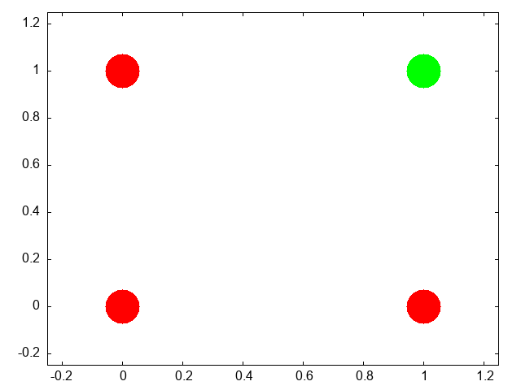

- The "OR" Operation/Function ::
  #+Name: or
  #+caption: The /or/ operation is true when either or both of its inputs are true.
  #+begin_src gnuplot :var data="or.txt" :file ./images/my-or.png
    reset
    set nokey
    set nocolorbox
    set palette model RGB defined ( 0 "red", 1 "green" )
    set xrange[-0.25:1.25]
    set yrange[-0.25:1.25]
    plot data u 1:2:3 with points ps 7 pt 7 lc palette variable
#+end_src

#+RESULTS: or
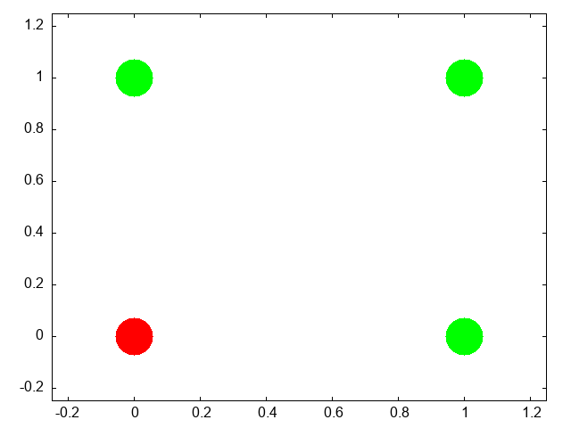

- The "XOR" Operation/Function ::
  #+Name: xor
  #+caption: The /xor/ operation one and only one of its inputs are true.
  #+begin_src gnuplot :var data="xor.txt" :file ./images/my-xor.png
    reset
    set nokey
    set nocolorbox
    set palette model RGB defined ( 0 "red", 1 "green" )
    set xrange[-0.25:1.25]
    set yrange[-0.25:1.25]
    plot data u 1:2:3 with points ps 7 pt 7 lc palette variable
#+end_src

#+RESULTS: xor
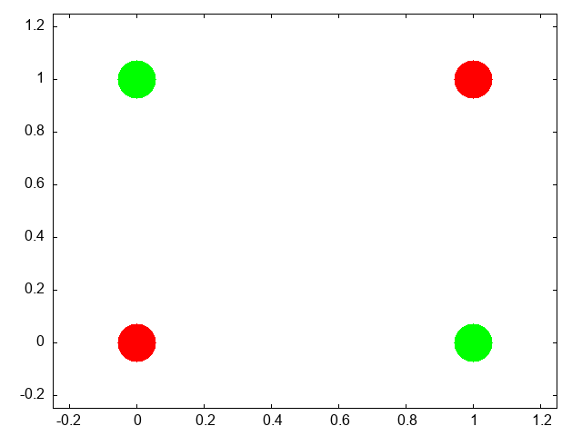

#+Begin_quote
Can you draw the truth tables that match each of these graphs?
#+End_quote

This short [[https://doi.org/10.1038/nbt1386][article]] provides a nice example of linear separability and some basics of what a neural network is. 


**** Exercise XOR

  Using only *not*, *and*, and *or* operations draw the diagram that allows you to compute in two steps the *xor* operation. You will need this logic to code up a perceptron.

**** Connections
Can neural networks encode logic? Is the processing zeros and ones enough to capture the richness of human intellectual activity?

There is a long tradition of representing human thought as the consequence of some sort of calculation of two values (true or false). If you have two values you can swap out 1's and 0's for the true and false in your calculation. They even seem to obey similar laws. The conjunction (AND) of two true things is only true when both are true. If you take T = 1, then T AND T is the same as \( 1~\times~1 \).

  We will next build up a simple threshold neural unit and try to calculate some of these truth functions with our neuron. We will build simple neurons for truth tables (like those that follow), and string them together into an argument. Then we can feed values of T and F into our network and let it calculate the XOR problem.


**** Boolean Logic
George Boole, Author of the /Laws of Thought/.

[[https://archive.org/details/investigationofl00boolrich]]
[[https://plato.stanford.edu/entries/boole/#LifWor]]

****  First Order Logic - Truth Tables
An example *Or*


| First | Second | Truth |
|-------+--------+-------|
|     0 |      0 | FALSE |
|     0 |      1 | TRUE  |
|     1 |      0 | TRUE  |
|     1 |      1 | TRUE  |

*** Our First Neural Network: The Perceptron

In many ways the Perceptron can be regarded as the first neural network ever.

The perceptron (see Figure [[mark1]]) was the invention of a psychologist, [[http://dspace.library.cornell.edu/bitstream/1813/18965/2/Rosenblatt_Frank_1971.pdf][Frank Rosenblatt (pdf)]].  He was not a computer scientist. Though he obviously had a bit of the mathematician in him.

#+Name: mark1
#+caption: The Mark I computer for computing the perceptron's activity. Details can be found on [[https://en.wikipedia.org/wiki/Perceptron][Wikipedia's page]].
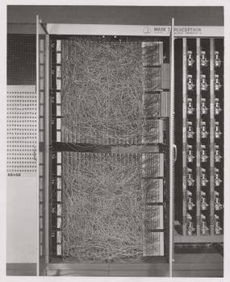

For those of you interested in a very interesting, very long, reading might his 600 page [[https://babel.hathitrust.org/cgi/pt?id=mdp.39015039846566&view=1up&seq=9][Principles of Neurodynamics]] or this more accessible [[https://link.springer.com/book/10.1007/978-3-642-70911-1][historical review]].

But a good intuition for Rosenblatt's frame of mind with this research can be gained just from the foreword:

#+begin_quote
For this writer, the perceptron program is not primarily concerned with the invention of devices for "artificial intelligence", but rather with investigating the physical structures and neurodynamic principles which under lie "natural intelligence". A perceptron is first and fore most a brain model, not an invention for pattern recognition. As a brain model, its utility is in enabling us to determine the physical conditions for the emergence of various psychological properties.
#+end_quote


**** The Perceptron Rules
The algorithm the perceptron follows is simple enough to be done by hand. But before doing that take a minute to think what is trying to do. It is trying to go from one set of "weights" to another set of "weights". If you think of all the weights as coordinates in a Cartesian graph then you can visualize each cycle of updating as adding another point to the graph. Squint your eyes and the dots merge to a path. A path through the weight /space./ This is a dynamic process. A theme that we return to in a later Chapter (add link here).

In short, the perceptron "rules" are the equations that characterize what a perceptron should do when it gets some input, computes and output and learns if its guess is right or wrong. It revises its behavior based on this feedback, and thus can be said to learn. A lot can be done with these simple equations.

\( I = \sum_{i=1}^{n} w_i~x_i \)

If \( I \ge T \) then \( y = +1 \) else if \( I < T \) then \( y = -1 \)

If the answer was correct, then \( \beta = +1 \), else if the
answer was incorrect then \( \beta = -1 \).

The "T" in the above equation refers to the threshold. This is a user defined value that is usually set to zero for convenience. 

Updating is done by \( \mathbf{w_{new}} =
\mathbf{w_{old}} + \beta y \mathbf{x} \)

**** Be The Perceptron

This is a pencil and paper exercise. Before coding it is often a good idea to try and work the basics out by hand. This may be a flow chart or a simple hand worked example. This both gives you a simple test case to compare your code against, but more importantly makes sure that you understand what you are trying to code. Let's make sure you understand how to compute the perceptron learning rule, but doing a simple case by hand.

Beginning with an input of 0.3 0.7

And an initial set of weights of
-0.6 0.8

and a class of 1.

Compute the value of the new weight vector with pen and paper.

#+begin_src haskell :dir . :session :results output :exports both
  updWeight0 ([[0.3,0.7]],1) [[-0.6,0.8::Double]]
#+end_src

#+RESULTS:
: [[-0.3,1.5]]

*Next steps.* Consider this as the data matrix where the first two elements in a row are the two inputs and the third element in a row is the "class" of the output.

\(\begin{bmatrix}
0.3 & 0.7 & 1.0 \\
-0.5 & 0.3 & -1.0 \\
0.7 & 0.3 & 1.0 \\ 
-0.2 & -0.8 & -1.0
\end{bmatrix} \)

using the starting weight -0.6 0.8 try a few cycles through the data by hand and then move on to writing the perceptron rule into code so that you can automate the updating step. Haskell code for some of these functions can be found [[https://github.com/brittAnderson/compNeuroIntro420/blob/9cb94028a9f1c53c49cce26b77e633cf5c9f050f/w2026/src/Perceptron.hs][here]].


#+begin_src haskell :dir . :session :results output :exports both
  :set -Wno-name-shadowing
  putStrLn $ unlines $ map show testData
  putStr "\n\n\n"
  newwt = last $ oneRound myw testDataFs
  checkWt newwt testData
  putStr "\n\n"
  newwt2 = last $ oneRound newwt testDataFs
  checkWt newwt2 testData
#+end_src

#+RESULTS:
: ([[0.3,0.7]],1.0)
: ([[-0.5,0.3]],-1.0)
: ([[0.7,0.3]],1.0)
: ([[-0.2,-0.8]],-1.0)
: 
: [(1.0,1.0),(1.0,-1.0),(1.0,1.0),(-1.0,-1.0)]
: 
: [(1.0,1.0),(-1.0,-1.0),(1.0,1.0),(-1.0,-1.0)]


***** More Abstract Thinking
Each time through the perceptron rule new weights are computed. Imagine these two weights as coordinates for the head of a vector with its base at the origin of a Cartesian plane. Imagine as you iterate that you are rotating your weight vector around an origin.

The decision plane for your network is perpendicular to the vectors and is anchored at the bottom of the arrow. If you could compare this plane to the location of the data points you would see that the rule is learning to find the decision plane that puts all of one class on one side of the line and all of the other class on the other side. That is why it is limited to problems that are linearly separable.

****** Bias is a Good Thing (at least here it is)

These data were selected such that the base of the vector could separate them while anchored at zero. However, for many data sets you not only need to learn what direction to point the vector, but you also need to learn where to anchor the vector. This is done by including a @bold{bias weight}. Add an extra dimension to your weight vector and your inputs. For the inputs it will just be a constant value of 1.0, but this extra, bias weight, will also be learned and allows you to achieve, effectively, a translation away from the origin to be able to separate points that are more heterogeneously scattered. 


****** Geometrical Thinking
- What is the relation between the inner product of two vectors and the cosine of the angle between them?
- What is the *sign* for the cosine of angles less than 90 degrees and those greater than 90 degrees?
- How do these facts help us to answer the question above?
- Why does this reinforce the advice to think /geometrically/ when thinking about networks and weight vectors?

*** The Delta Rule - Homework

The *Delta Rule* is another simple learning rule that is a minimal variation on the perceptron rule. It is used more frequently, and it has the spirit of Hebbian learning, which we will learn more about soon. The homework asks you to write code to test and train an artificial neuron using the delta learning rule. 


- For an easy start create some pseudo random linearly separable points on a a sheet of paper. Label one population as *1* and the other population as *-1*.
- For a more challenging set-up create the data programmatically using random numbers and some method that allows you to vary how close or distant the points are to the line of separation, and how many points there are to train on.
- The Delta Learning rule is: \( \Delta~w_i = x_i~\eta(desired - observed) \)
- Submit your code that has your test data in it. Start with an initial random weight and use the delta rule to learn the correct weighting to solve all your training examples. Then test on a new set of points that you did not test on but that are classified according to the same rule. Your code should assess how well the trained rule classifies the test data.


*** Not all Networks are the Same: Hopfield

- Feedforward
- Recurrent
- Convolutional
- Multilevel
- Supervised
- Unsupervised

The Hopfield network [cite:@Hopfield_1982] has taught many lessons, both practical and conceptual. Hopfield showed physicists a new realm for their skills and added recurrent (i.e. feedback) connections to network design (output becomes input). He changed the focus from network architecture to that of a dynamical system. Hopfield showed that the network could remember and it could do some error correction, it could reconstruct the "right" answer from faulty input.

#+Name: hopfield-image
#+Caption: Illustration of a Hopfield Network's Connection Pattern With Four Nodes
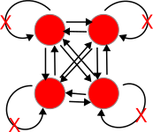


**** How a Hopfield Network Operates
- Each node has a value.
- Each of those arrowheads has an associated weight.
- The line with the "x" indicates that there are no self connections.
- All other connections for all other units are present and go in both directions, and are typically the same in both directions.

#+begin_quote
*Test Your Understanding*

- What does the input for a network like this with four nodes look like when framed in the linear algebra terms we just learned?
- A weight is a number associated to each connection. Tell me what the weights should look like in terms of the linear algebra constructs.
- How might we conceive of "running" the network for one cycle in terms of the above?
#+end_quote

**** A Worked Example

Inputs can be thought of as vectors. Although I have drawn the network like a square that shape is really independent of the structure of data flow. Each node needs an input and each node will need a weighted contact to all the other nodes. Consider the following two input patterns and the following weight matrix.  

\( \overrightarrow{a} = \left[1, 0, 1, 0\right]^T \)

\( \overrightarrow{b} = \left[0, 1, 0, 1\right]^T \)

\( weights =  \begin{bmatrix}
 0 & 3 & -3 & 3 \\
 3 & 0 & 3 & -3 \\
 -3 & 3 & 0 & 3 \\
 3 & -3 & 3 & 0 \\
\end{bmatrix}
\)

How do you compute the output? Which comes first: the matrix or the input vector and why?

#+begin_src haskell :dir . :session :exports both :results output
  hopa = [[1,0,1,0]] :: SimpMat Integer
  hopb = [[0,1,0,1]] :: SimpMat Integer
  outProda = multSimpMats (binary2Bipolar (rotateLList hopa)) $ binary2Bipolar hopa
  outProdb = multSimpMats (binary2Bipolar (rotateLList hopb)) $ binary2Bipolar hopb
  outProdBoth = add2SimpMats outProda outProdb
  noSelfConnections  = zeroDiagonal outProdBoth
  learnRate = scalarMultiply 1 noSelfConnections
  putStr $ prettyMat learnRate
#+end_src

#+RESULTS:
: [0,-2,2,-2]
: [-2,0,-2,2]
: [2,-2,0,-2]
: [-2,2,-2,0]

Hopfield networks use a threshold rule. This non-linearity is, at least metaphorically, like the threshold that says whether a neuron in the brain or in our integrate and fire model fires. For the Hopfield network our threshold rule says:

\( output(t)=\begin{array}{c} 1~\mbox{if } t \geq \Theta\\
0~\mbox{if } t < \Theta \end{array} \)


\Theta represents the value of our threshold and for now set it to zero.

#+Begin_Quote
*In Class Activity*

- Calculate the output to each of the two input patterns.
- Then to test your intuition, you should guess what output you would get for an input of  $\left[1,0,0,0\right]^T$.
- Calculate it.
- Is A or B is *closer* to this test input?
- What does it means, in this context, for one vector to be "closer" to another? 

#+End_quote


***** An Aside Distance Metrics

Metrics relate to measurement. For some operation to be a distance metric it should meet three intuitive requirements and one that is maybe not as obvious. To measure the distance between two things we need an operation that is binary. That is, it takes two inputs. In this case that would be our two vectors. It's result should always be *non-negative*. A negative distance would clearly be meaningless. Our output should be *symmetric*. Meaning that $d(A,B)=d(B,A)$. The distance from Waterloo to Toronto ought to come out as the same as going from Toronto to Waterloo. Our metric should be *reflexive*. The distance from anything to itself ought to be zero. Lastly, to be a distance metric, our operation must obey the [[https://en.wikipedia.org/wiki/Triangle_inequality][triangle inequality]].

The familiar distance measure of everyday life is the Euclidean. A distance measure calculated as the number of mismatched bits is the /Hamming/ distance. 


For perceptrons we talked about how the weight vector moved the direction it pointed. Here we don't have the weight vector moving, but you can visualize what is happening as updating a point in space. When we first input our four element vector we have a location in 4-D space. We multiply the first row of our weight matrix against our column of the input vector and we see, in effect, what is the effect on our first element (node) of all the other weighted inputs coming in to it. We then "update" that location. Maybe we flip it from a 1 to a zero (or vice versa). Then we try the next row of the weight matrix to see what happens to the second element. As we change the values of our nodes we are creating new points. The sequence of points is a trajectory that we are tracing in the input space. In this simple situation here we only require one pass to reach the final location, but in other settings we might not. In that case we just keep repeating the process until we do. One of the wonderful insights that Hopfield had was that by conceptualizing this process as an "energy" he could mathematically prove that the process would always reach a resting place.

**** Hebb's [[https://en.wikipedia.org/wiki/Outer_product][Outer Product]] Rule

#+Begin_quote
*Ask yourself*

Why is this learning rule called "Hebb's"? Who was the Hebb it is named after?

#+end_quote

The strength of a change in a connection is proportionate to the product of the input and outputs, i.e. \( \Delta A[i,j] = \eta f[j]g[i] \) and \( g[i] = \sum_j~A[i,j]~f[j] \) therefore, \( \vec{g} = \mathbf{Af} \).[fn:4]

#+Begin_Quote
*You will want to know*

- What is an outer product?
- How do you compute it in your programming language of choice?

#+End_quote

*** Hopfield Homework Description: Robustness to Noise (this might take awhile).
Overview of the steps to take:
- Create a small set of random data for input patterns.
- Generate the weights necessary to properly decode the inputs.
- Conceive of a way to randomly corrupt the inputs. Perhaps by flipping some bits and show that your network does correctly decode the uncorrupted inputs.
- Report the accuracy of the output. Explore how the length of the input vector and the number of bits your "flip" impact performance.

More detailed instructions:
- Make the input patterns 2-d, square and of size "n".
- Use a bipolar system and have, roughly, equal numbers of +1s and -1s in your patterns.
- Make a few of them and store them in some sort of data structure.
- Using those patterns, compute the weight matrix with the following equation:
   \( w_{ij} =\frac{1}{N} \sum_{\mu} value^\mu_i \times value^\mu_j \)
   Where N is the size of the patterns, that is how many "neurons". $\mu$ is an index for each of the patterns, and $i$ and $j$ refer to the neurons in the pattern.
- Program an *asynchronous* updating rule, run your network until it stabilizes, and then show that you get back what you put in.
- Then do the same for at least one disrupted pattern (where you flipped a couple of bits around.)

* Theory Creation in the Cognitive and Psychological Sciences

#+begin_quote
I have been wondering about the concept of explanation. I don't know if there is an agreed upon definition in this context. How do we know that an observation is "explained" other than that it is predicted by a theory? Or is the mathematics the same, and is explanation synonymous with post-diction? -- [[https://www.youtube.com/watch?v=jYUyd51MJDM&list=PLsSR5xGtg8fWd3sc_0tjzFj4GyRhezkTd&index=3&t=3s][Joachim Vanderkerckhove]] 
#+end_quote

** Sources for the discussion :noexport:
   can be found in this [[file:~/Nextcloud/admin/univ/teach/grad/theory/][directory]].
   
** What is a scientific theory?
   And how do the notions of prediction and explanation fit into this? Is the ability to predict the tides a theory of the tides? Is it an explanation of the tides?

*** What is prediction?
    And what makes for a good/bad prediction?

*** What is explanation?
    And, again, good v. bad explanations?

** Classroom Activity
   Pick anything you think is an example of a good scientific theory. Be prepared to name it and explain it and to respond to questions that critique it.
    
** Do we have a theory crisis in Psychology [cite:@oberauer2019]?
   You might find these citations relevant for discussion [cite:@guest21_how_comput_model_can_force; @rooij21_theor_befor_test; @Borsboom_2021; @naur85_progr_as_theor_build; @Eronen_2020; @Koch_2025; @Oude_Maatman_2021; @Sanbonmatsu_2025].

** Classroom Activity
   Did you pick a psychological example? Do you agree that there is a theory crisis in Psychology?
   
** What are scientific theories good for? Or, in other words, why should we care?

** What makes a theory a good theory?
   Try to answer this by using positive and negative examples from the theories selected by your classmates.

** What are the first steps towards building a theory?
   - Phenomena
   - Analogies
   - Should we adhere to a deductive-nomological model?
   - Do we want a /causal/ model? What do we mean, really, by A causes B and how can we assess it?

** What should you do next if you think you have a theory?

*** What role should a model play?
    1. Can a model be verbal?
    2. Is it enough to express a model in code or pseudo-code?
    3. Is mathematics necessary?

** Formal Modeling (Advocacy)

*** Advantages
1. Everything must be defined
2. The importance of actual values cannot be avoided
3. Inconsistencies and gaps made obvious
4. Can be run on a computer?
   Is this really an advantage? What are the guarantees that the code we run is a faithful implementation of our ideas?
   It is interesting to me that the example used in the [[https://noahvandongen.com/][notes I am borrowing]] from use Einstein and Eddington's experience with solar eclipses, but this did not use a computer program. Instead it was just math.

** Steps to Formalizing a Model
- Define the phenomena (not the specific experiments, but the phenomena writ large [the larger the better]).
- Are there levels?
- Can you specify processes?
- Be open to emergence.
  Do the automata we programmed show emergence. We only specified the colors of pixels, but patterns appeared.
- Can you find a mathematical form for your process (e.g. exponential)?

** Can you now provide a good example of a psychological theory?


** Some Interesting Reading on this Topic
(In addition to the references listed below).

1. [[https://psycnet.apa.org/fulltext/2020-82366-001.pdf][Formalizing Verbal Theories. A tutorial by dialogue.]]
2. [[https://journals.physiology.org/doi/epdf/10.1152/jn.00195.2021][Forms of explanation and understanding for neuroscience and artificial intelligence]]
3. [[https://smaldino.com/wp/wp-content/uploads/2018/01/Smaldino2017-ModelsAreStupid.pdf][Models are Stupid, and We Need More of Them]]
4. [[https://psycnet.apa.org/fulltext/2025-04988-001.pdf][Productive Explanation: A framework for evaluating explanations in  psychological science]]
5. [[https://journals.sagepub.com/doi/pdf/10.1177/1745691620969647][Theory Construction Methodology: A practical framework for building theories in psychology]]

** Theory Homework
In "Models are Stupid"(see link above) Smaldino write:
   
*Hopfield’s Model of Content-Addressable Memory*

Memory - the ability to store information for later recall—is a
wondrous property of neural networks that makes possible all but the
most rudimentary forms of cognition. By the early 1980s, long-term
potentiation—the process by which Donald Hebb’s theory that “neurons
that fire together wire together” occurs—was relatively well
described. It was believed that the formation of such associations was
intrinsic to more complex forms of memory, such as that by which a
person’s face is encoded and then later recognized, but the mechanism
was unclear. How could a brain possibly use partial information, like
an occluded face, to reconstruct information encoded in memory? To
begin to answer this question, the biophysicist John Hopfield (1982)
constructed a simple model of two-state neurons in a fully connected
network. Edge weights were determined by a process of Hebbian learning
assumed to have already occurred, so that a number of
configurations(or states) of “on” and “off ” neurons were encoded in
the network, with edges assumed to be bidirectionally symmetrical
(i.e., undirected). Using mathematics derived from statistical
physics, Hopfield showed firstly that in such a system, encoded states
would be stable, and secondly that if initialized in a non-encoded
state, the network would self-organize into the encoded state that
most closely matched the initialized state. In other words, he had a
model for how memory retrieval could emerge spontaneously in a simple
neural network. This model is almost absurdly simplistic, even stupid
in its assumptions. Neurons are either on or off, ignoring subtleties
of firing rates or even graded activation. Directionality is also
ignored; links between neurons are equally strong in each direction.
Exactly how the network is presumed to first arrive in its initial
state is left a mystery. Yet analysis of the model showed that
something like biological neural networks could produce
content-addressable memory. Hopfield himself later showed that the
model’s functioning was robust to the relaxation of some of his strict
assumptions (Hopfield, 1984), and the work has laid the foundation
for much subsequent work in understanding the neurobiology of memory.

Your task is to answer the question: Does [[https://www.pnas.org/doi/abs/10.1073/pnas.79.8.2554][Hopfield]] express a theory? Make sure you address the issues of what constitutes a theory that we discussed above and that you include any relevant facts from your own Hopfield model code and experiments.

Is this a theory of memory? Are there room for others? What is missing, if anything?

This is an opportunity for you to think deeply and critically about theory. A good foundation now will make you a wiser, probably more skeptical, consumer of future research so put your back into it and let me see some of your best work. Write clearly, logically, and persuasively. I will leave length up to you. I am not looking for how many words you write, but the completeness of your ideas in the development and defense of your thesis. 


* Final Projects
(also available as a pdf on learn)

** Overview

The goals of the final project are:

1. Active learning
2. Learning through teaching
3. Acquiring important professional skills such as:
   - Presentation development
   - Oral presentation practice
   - Project Planning
   - Group collaboration
   - Technical Writing
   - Coding Relevant to Psychology and Neuroscience Modeling
   - Technical Knowledge

In pursuit of these goals a fair amount of time in the last few weeks will be saved for the group project. Each of you will have been assigned by me to a group. The members of the groups will work on the project collaboratively dividing the responsibilities and workload as jointly decided.

The deliverables will be two. First, there will be on the last course day a 1/2 hour presentation that will:

1. Provide a general introduction to the topic. This will not only be a technical introduction, but will help us understand the history and motivation for using this tool/technique.
2. A tutorial survey of the details. This might include the mathematical underpinnings and derivation as well as any pertinent novel notation.
3. Practical aspects of coding the algorithm. Ideally working code written by the group will be demonstrated. This is expected to be simple and modest in scope. So, it might be appropriate in addition to the group's own code to show off libraries or software written by others and useful for more complicated or realistic demonstrations.

The emphasis of the oral presentation is on learning. Both of us: the audience and the group presenting. This is a time to practice your presentation style and any novel ideas you have about how to give a memorable and instructive presentation. There will be no grade beyond a complete/incomplete.

The goal of the written reports is to provide an opportunity to develop and share a more rigorous and complete idea of the same general scope, but with increased detail and space for explanations. While a written document is expected other materials may make sense as part of the submission. For example, source code is likely to be a part of all projects. In addition, images or movies of simulations and similar materials may be appropriate. That is for the group to decide.

** Evaluation

1. For the oral presentation the evaluation is strictly limited to completion. However, I hope that students will look upon this as an opportunity for practice, and also will be respectful of their peers time. You will be listening much more than speaking so keep that in mind as you plan the quality of your own offering.
2. For the written, final presentation I will be evaluating:
   - Clarity, completeness, and professionalism of the writing.
   - Documentation of the topic should include appropriate citations. I don't care so much about what citation style you use as long as it is consistent and follows some professional standard.
   - The tutorial code provided will be evaluated for style, accuracy, and the ease with which someone else (me for example) can get it working properly. That may mean the inclusion of instructions.
   - The value of any additional materials.
   - A general assessment of the pedagogical value of the presentation as a guide to help others understand the material. Ask yourself if your presentation would be a good guide for me as an instructor to use it as the basis for developing additional units of material to present in this course?

** Project Topics

Each group will be assigned one of the topics below. Send me your groups ordered preference list as soon as possible. I have added some starter references, but those should not be viewed as sufficient in and of themselves. It is just to give a chance to get a better sense of what the topic is about and what kind of resources you might be looking for. 

*** Reinforcement Learning

There is a "classic" textbook available on line, code as well. Reinforcement Learning is a common paradigm and mechanism for explaining a multitude of behaviors. The basic idea is that you do more of whatever it is that gives you a reward. The mapping of dopamine dynamics onto reward delivery has been heralded as one of the great successes of computational neuroscience.

**** Starting References and Resources

- The canonical textbook, freely available online, is Sutton & Barto's /Reinforcement Learning: An Introduction/ (2nd ed.). Both the PDF and code examples are available at: http://incompleteideas.net/book/the-book-2nd.html
- For the neuroscience connection, see the dopamine and reward prediction error [[https://www.sciencedirect.com/science/article/pii/S0022249608001181][review]] cited below.
- A practical Python-focused tutorial series using OpenAI Gym (now Gymnasium) is a good hands-on complement: https://gymnasium.farama.org/

*** Self-organizing Maps (Kohonen Neural Networks)

Ever wonder how we develop those remarkable maps in the brain where there seems to be an organizational principle that puts similar things next to each other? There is an R package for Kohonen maps, and an article that describes it. For more on the idea itself there are many treatments. One possible starting point would be Kohonen himself.

**** Starting References and Resources

- Kohonen, T. (1982). Self-organized formation of topologically correct feature maps. /Biological Cybernetics/, 43(1), 59–69. https://doi.org/10.1007/BF00337288 — the original paper.
- Wehrens, R., & Buydens, L. M. C. (2007). Self- and super-organizing maps in R: The kohonen package. /Journal of Statistical Software/, 21(5). https://doi.org/10.18637/jss.v021.i05 — the primary reference for the R =kohonen= package.
- The R =kohonen= package documentation and vignettes are a practical starting point for coding: https://cran.r-project.org/package=kohonen

*** Morris-Lecar Networks

In order to gain insights into the dynamics of models of neurons it is useful to simplify them from their fully biologically realistic instances. One simplified version is the Morris-Lecar model that has fewer moving parts, but yields rich dynamics. An introduction from a textbook is available on line. Code also can be found all over the internet, and you should have code, but this might also be a good chance to look at this tool widely used by the neural dynamics community. The author of the software also has his own textbook available for download.

**** Starting References and Resources

- Morris, C., & Lecar, H. (1981). Voltage oscillations in the barnacle giant muscle fiber. /Biophysical Journal/, 35(1), 193–213. https://doi.org/10.1016/S0006-3495(81)84782-0 — the original paper.
- Rinzel, J., & Ermentrout, G. B. (1998). Analysis of neural excitability and oscillations. In C. Koch & I. Segev (Eds.), /Methods in Neuronal Modeling/ (2nd ed., pp. 251–291). MIT Press. — a classic chapter situating Morris-Lecar in the broader landscape of neural dynamics. (I found an online copy [[https://www.researchgate.net/publication/237128320_Analysis_of_Neural_Excitability_and_Oscillations][here]])
- Ermentrout, B., & Terman, D. (2010). /Mathematical Foundations of Neuroscience/. Springer. — Ermentrout's [[https://epubs.siam.org/doi/pdf/10.1137/1.9780898718195.fm?download=true][textbook]] is freely downloadable and treats Morris-Lecar in depth; his simulation tool XPPAUT is also widely used: http://www.math.pitt.edu/~bard/xpp/xpp.html or https://sites.pitt.edu/~phase/bard/bardware/xpp/xpp.html.
- The Brian2 simulator provides a Python environment well suited to implementing Morris-Lecar networks: https://brian2.readthedocs.io/

*** Backpropagation

This is the method that revolutionized the world of neural networks. It was a means of transmitting the error to each unit in a multilayer perceptron that would allow for effective quick learning of complex problems. The derivation of the method is complicated in the details, but relatively straightforward in the broad strokes. There are many, many demonstrations of this, but writing your own code to implement the method teaches you a lot.

**** Starting References and Resources

- Rumelhart, D. E., Hinton, G. E., & Williams, R. J. (1986). Learning representations by back-propagating errors. /Nature/, 323, 533–536. https://doi.org/10.1038/323533a0 — the landmark paper.
- Nielsen, M. (2015). /Neural Networks and Deep Learning/. Free online book with worked examples and code in Python: http://neuralnetworksanddeeplearning.com/ — an excellent and readable tutorial treatment of backpropagation from first principles.
- 3Blue1Brown's video series "Neural Networks" on YouTube provides outstanding visual intuition for the algorithm before diving into the mathematics: https://www.youtube.com/playlist?list=PLZHQObOWTQDNU6R1_67000Dx_ZCJB-3pi

*** Agent Based Models

Agent Based Models (ABMs) allow us to simulate how complex, population-level patterns emerge from the local interactions of many individual agents, each following simple rules. They have been applied to problems ranging from the spread of disease to the emergence of social norms and collective neural dynamics.

**** Starting References and Resources

- Axelrod, R. (1997). /The Complexity of Cooperation: Agent-Based Models of Competition and Collaboration/. Princeton University Press. — a foundational text on ABMs in the social and behavioral sciences.
- NetLogo is a widely used, beginner-friendly ABM environment with an extensive model library and its own tutorial: https://ccl.northwestern.edu/netlogo/
- Mesa is the primary Python library for agent-based modeling and a natural choice if you prefer to stay in Python. Documentation and tutorials are at: https://mesa.readthedocs.io/ and the repository is at: https://github.com/projectmesa/mesa
- The Santa Fe Institute's Complexity Explorer offers free online courses and resources that provide good conceptual grounding: https://www.complexityexplorer.org/

*** Linear Ballistic Accumulators

How do we make decisions? We accumulate evidence. That is the idea behind drift diffusion models. And they have been very big over the years, however the math is quite complex and they can be hard to fit. Linear ballistic accumulators are a simplified version. And just as we saw with integrate and fire models simple can sometimes be better, depending on your question. 

**** Starting References and Resources

- Brown, S. D., & Heathcote, A. (2008). The simplest complete model of choice response time: Linear ballistic accumulation. /Cognitive Psychology/, 57(3), 153–178. https://doi.org/10.1016/j.cogpsych.2007.12.002 — the paper that introduced the LBA model.
- Donkin, C., Brown, S. D., & Heathcote, A. (2011). Drawing conclusions from choice response time models: A tutorial using the linear ballistic accumulator. /Journal of Mathematical Psychology/, 55(2), 140–151. https://doi.org/10.1016/j.jmp.2010.10.001 — a tutorial-style companion paper aimed at new users.
- The =rtdists= R package implements the LBA and related evidence-accumulation models and is a practical starting point for coding: https://cran.r-project.org/package=rtdists
- PyDDM is a Python-based simulator for drift-diffusion and accumulator models that can serve as a useful reference implementation: https://pyddm.readthedocs.io/

** Project Deliverables Summarized

*** Presentation

A half hour presentation during the last class session that will provide us all with an overview of your topic to include its background, importance, and application. Then you will need to walk us through how to implement and use your computational offering. Lastly, you should address how it is or could be used for better understanding mental or neural questions about the mechanisms of cognition.

*** Report

Your report should be a paper replete with the usual abstract, intro, methods, code, results of simulations, and references. Figures and analyses should be integrated into the manuscript in order to have a reproducible research project. To the extent that this is not felt to be possible you will have to justify it heavily. Tools that you might find useful include Overleaf and Quarto, though you can probably get close with Rmd/Rstudio since that now supports python. If you elect to use another language you may find they have a suitable language for this (e.g. with Racket it is Scribble).

** General Suggestions

I will make the groups, and I encourage each of you to find the right role for each member to make the project work efficiently. Some may be stronger writers while others are better coders. All research is collaborative with a mix of talents. Finding out how to discover that, and apportion work will be important in your future endeavors.

We will decide together the deadline for the delivery of the final report.

** Some Examples from Last Year

[[file:~/Desktop/PSYCH420 Backpropagation Report-3.pdf]]

https://github.com/sarahgahyun/backpropagation/tree/main

[[file:~/Desktop/PSYCH 420 Final Report.pdf]]

[[https://colab.research.google.com/drive/1ZbZ2MCkY9Wal8BprVKcyaNC1Cl34Wbqu?usp=sharing]]

* Some references
#+print_bibliography: 

* Footnotes

[fn:1] Why the bird names? See [[https://raymondsmullyan.com/books/to-mock-a-mockingbird-and-other-logic-puzzles/][To Mock a Mockingbird]]
[fn:4] Does it matter that the $\mathbf{W}$ comes first?
[fn:2] see David Marr's *Vision*. 
[fn:3] The limits of my language means the limits of my world. -- Ludwig Wittgenstein (proposition 5.6 Tractatus Logico-Philosophicus) 

